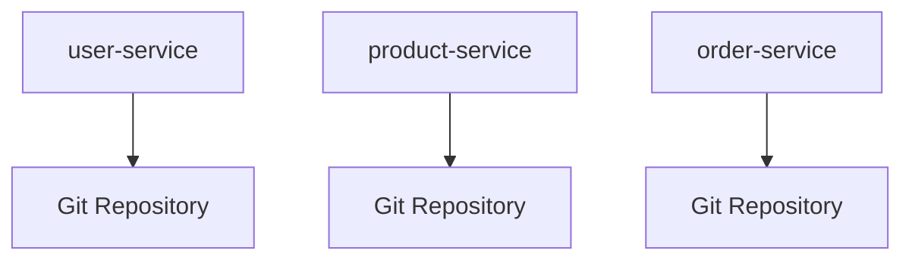

## 介绍

云原生（Cloud Native）是一种构建和运行应用程序的方法，它充分利用了云计算的优势，如弹性、可扩展性和自动化。Git作为最流行的版本控制系统，在云原生开发中扮演着至关重要的角色。本文将深入探讨Git如何与云原生技术结合，帮助开发者更高效地管理代码、协作和实现持续交付。

## Git 在云原生中的核心作用

### 1. 版本控制

在云原生开发中，应用程序通常由多个微服务组成，每个微服务都有自己的代码库。Git为每个微服务提供了独立的版本控制，确保代码的变更可以被追踪和管理。

```bash
# 初始化一个新的Git仓库
git init

# 添加文件到暂存区
git add .

# 提交变更
git commit -m "Initial commit"
```

### 2. 协作开发

云原生开发通常涉及多个团队和开发者。Git的分支和合并功能使得多人协作变得简单而高效。

```bash
# 创建一个新分支
git branch feature-branch

# 切换到新分支
git checkout feature-branch

# 合并分支到主分支
git checkout main
git merge feature-branch
```

### 3. 持续集成与持续交付（CI/CD）

Git与CI/CD工具（如Jenkins、GitLab CI、GitHub Actions）紧密集成，自动化构建、测试和部署流程。

```yaml
# Git Hub Actions 示例
name: CI/CD Pipeline

on:
  push:
    branches:
      - main

jobs:
  build:
    runs-on: ubuntu-latest
    steps:
      - uses: actions/checkout@v2
      - name: Build
        run: ./build.sh
      - name: Test
        run: ./test.sh
      - name: Deploy
        run: ./deploy.sh
```

## 实际案例

### 案例1：微服务架构中的Git管理

假设我们有一个由三个微服务组成的电子商务应用：`user-service`、`product-service`和`order-service`。每个微服务都有自己的Git仓库，团队可以独立开发和部署每个服务。



### 案例2：GitOps实践

GitOps是一种将Git作为单一事实来源的运维模式。通过GitOps，所有的基础设施和应用程序配置都存储在Git仓库中，任何变更都通过Git提交来触发自动化部署。

```bash
# 提交基础设施变更
git add infrastructure.yaml
git commit -m "Update infrastructure configuration"
git push origin main
```

## 总结

Git在云原生开发中是不可或缺的工具，它不仅提供了强大的版本控制和协作功能，还与CI/CD工具紧密集成，支持自动化构建和部署。通过GitOps等实践，Git进一步简化了云原生应用的运维管理。

## 附加资源与练习

- **资源**:
  - [Git官方文档](https://git-scm.com/doc)
  - [云原生计算基金会（CNCF）](https://www.cncf.io/)
  - [GitOps官方指南](https://www.gitops.tech/)

- **练习**:
  1. 创建一个新的Git仓库，并尝试使用分支和合并功能。
  2. 配置一个简单的CI/CD流水线，自动化构建和部署一个简单的应用。
  3. 探索GitOps工具（如ArgoCD），并尝试将基础设施配置存储在Git仓库中。

通过本文的学习，你应该对Git在云原生开发中的重要性有了更深入的理解。继续实践和探索，你将能够更好地利用Git来管理复杂的云原生应用。