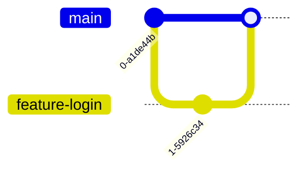

# Git 分支创建

在Git中，**分支**是开发过程中非常重要的概念。它允许你在不影响主代码的情况下进行实验、开发新功能或修复错误。本文将详细介绍如何在Git中创建分支，并通过实际案例帮助你理解分支的作用。

## 什么是Git分支？

Git分支是指向某个提交（commit）的指针。每个分支都代表一条独立的开发线，你可以在分支上进行代码的修改和提交，而不会影响其他分支。默认情况下，Git会创建一个名为 `main` 或 `master` 的主分支。

## 为什么需要创建分支？

- **并行开发**：多个开发者可以在不同的分支上同时工作，互不干扰。
- **功能隔离**：每个新功能或修复可以在独立的分支上开发，完成后合并到主分支。
- **实验性开发**：可以在分支上尝试新想法，如果失败，可以轻松丢弃该分支。

## 如何创建分支？

在Git中，创建分支非常简单。以下是创建分支的基本步骤：

### 1. 查看当前分支

在创建新分支之前，你可以使用以下命令查看当前所在的分支：

```bash
git branch
```

输出示例：

```
* main
  feature-branch
```

`*` 表示当前所在的分支。

### 2. 创建新分支

使用以下命令创建一个新分支：

```bash
git branch <branch-name>
```

例如，创建一个名为 `feature-login` 的分支：

```bash
git branch feature-login
```

### 3. 切换到新分支

创建分支后，你需要切换到新分支才能开始工作。使用以下命令切换分支：

```bash
git checkout <branch-name>
```

例如，切换到 `feature-login` 分支：

```bash
git checkout feature-login
```

你也可以使用以下命令一次性创建并切换到新分支：

```bash
git checkout -b <branch-name>
```

例如：

```bash
git checkout -b feature-login
```

### 4. 查看分支列表

创建并切换分支后，你可以再次使用 `git branch` 命令查看所有分支：

```bash
git branch
```

输出示例：

```
  main
* feature-login
```

`*` 表示当前所在的分支。

## 实际案例

假设你正在开发一个网站，并且需要添加一个新的登录功能。你可以按照以下步骤使用分支进行开发：

1. **创建分支**：创建一个名为 `feature-login` 的分支。

   ```bash
   git checkout -b feature-login
   ```

2. **开发功能**：在 `feature-login` 分支上进行代码修改和提交。

   ```bash
   git add .
   git commit -m "Add login feature"
   ```

3. **合并分支**：当功能开发完成后，切换回 `main` 分支并将 `feature-login` 分支合并进来。

   ```bash
   git checkout main
   git merge feature-login
   ```

4. **删除分支**：合并完成后，可以删除 `feature-login` 分支。

   ```bash
   git branch -d feature-login
   ```

## 分支创建的可视化

以下是一个简单的Mermaid图表，展示了分支创建和合并的过程：



## 总结

通过本文，你学习了如何在Git中创建分支，并了解了分支在开发中的重要性。分支允许你在不影响主代码的情况下进行并行开发、功能隔离和实验性开发。掌握分支管理是成为一名高效开发者的关键技能之一。

## 附加资源

- [Git官方文档](https://git-scm.com/doc)
- [Pro Git 书籍](https://git-scm.com/book/en/v2)

## 练习

1. 在你的本地Git仓库中创建一个新分支，并在该分支上进行一些代码修改。
2. 切换回主分支，并将新分支合并到主分支中。
3. 删除不再需要的分支。

通过练习，你将更加熟悉Git分支的创建和管理。