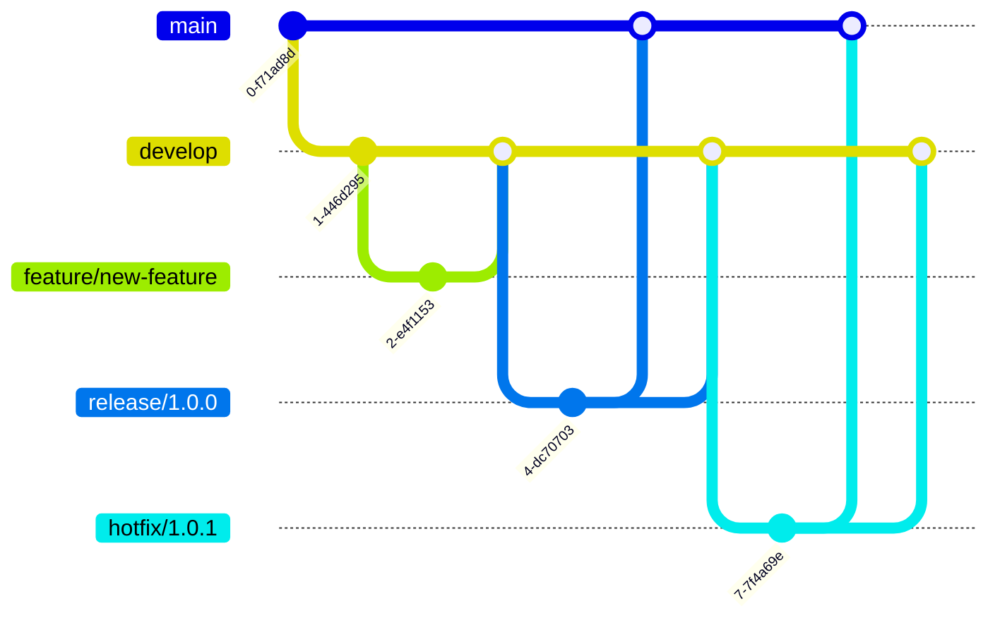

## 介绍

在软件开发中，Git分支管理是一个至关重要的环节。分支策略决定了团队如何协作、如何管理代码库中的不同版本以及如何发布新功能。一个良好的分支策略可以提高开发效率，减少冲突，并确保代码库的稳定性。

本文将介绍几种常见的Git分支策略，并通过实际案例帮助你理解如何选择和应用这些策略。

## 常见的Git分支策略

### 1. 主分支策略（Main Branch Strategy）

主分支策略是最简单的分支策略之一。在这种策略中，`main`（或`master`）分支是唯一的长期分支。所有开发工作都在`main`分支上进行，新功能和修复直接提交到`main`分支。

#### 适用场景
- 小型团队或单人项目
- 开发周期较短的项目

#### 优点
- 简单易用，适合初学者
- 不需要复杂的分支管理

#### 缺点
- 不适合大型团队或长期项目
- 容易导致代码库不稳定

### 2. 功能分支策略（Feature Branch Strategy）

功能分支策略是一种更为复杂的分支策略。在这种策略中，每个新功能或修复都在一个独立的分支上进行开发，完成后合并回`main`分支。

#### 适用场景
- 中大型团队
- 需要并行开发多个功能的项目

#### 优点
- 隔离开发环境，减少冲突
- 便于代码审查和测试

#### 缺点
- 需要更多的分支管理
- 合并冲突的可能性增加

#### 示例
```bash
# 创建新功能分支
git checkout -b feature/new-feature

# 开发完成后合并到main分支
git checkout main
git merge feature/new-feature
```

### 3. Git Flow 策略

Git Flow 是一种流行的分支策略，由 Vincent Driessen 提出。它定义了严格的分支模型，包括`main`、`develop`、`feature`、`release`和`hotfix`分支。

#### 适用场景
- 需要严格版本控制的项目
- 大型团队或长期项目

#### 优点
- 清晰的版本管理
- 适合需要频繁发布的项目

#### 缺点
- 分支管理复杂
- 需要团队熟悉Git Flow流程

#### 示例


### 4. GitHub Flow 策略

GitHub Flow 是一种简化版的分支策略，适用于持续交付的项目。它只有`main`分支和功能分支，所有开发都在功能分支上进行，完成后通过Pull Request合并到`main`分支。

#### 适用场景
- 持续交付的项目
- 需要快速迭代的项目

#### 优点
- 简单易用
- 适合持续集成和持续交付

#### 缺点
- 不适合需要严格版本控制的项目

#### 示例
```bash
# 创建新功能分支
git checkout -b feature/new-feature

# 开发完成后提交Pull Request
git push origin feature/new-feature
```

## 实际案例

假设你正在开发一个电商网站，团队需要同时开发多个功能，如购物车、支付系统和用户评论。在这种情况下，使用功能分支策略或Git Flow策略会更加合适。

### 功能分支策略案例
1. 创建功能分支：
   ```bash
   git checkout -b feature/shopping-cart
   git checkout -b feature/payment-system
   git checkout -b feature/user-reviews
   ```
2. 开发完成后合并到`main`分支：
   ```bash
   git checkout main
   git merge feature/shopping-cart
   git merge feature/payment-system
   git merge feature/user-reviews
   ```

### Git Flow策略案例
1. 创建`develop`分支：
   ```bash
   git checkout -b develop
   ```
2. 创建功能分支：
   ```bash
   git checkout -b feature/shopping-cart
   git checkout -b feature/payment-system
   git checkout -b feature/user-reviews
   ```
3. 开发完成后合并到`develop`分支：
   ```bash
   git checkout develop
   git merge feature/shopping-cart
   git merge feature/payment-system
   git merge feature/user-reviews
   ```
4. 创建`release`分支并发布：
   ```bash
   git checkout -b release/1.0.0
   git checkout main
   git merge release/1.0.0
   git checkout develop
   git merge release/1.0.0
   ```

## 总结

选择合适的分支策略对于项目的成功至关重要。主分支策略适合小型项目，功能分支策略适合中大型团队，Git Flow策略适合需要严格版本控制的项目，而GitHub Flow策略则适合持续交付的项目。

:::tip
建议初学者从主分支策略或功能分支策略开始，逐步掌握更复杂的分支管理方法。
:::

## 附加资源

- [Git官方文档](https://git-scm.com/doc)
- [Git Flow官方指南](https://nvie.com/posts/a-successful-git-branching-model/)
- [GitHub Flow官方指南](https://guides.github.com/introduction/flow/)

## 练习

1. 创建一个新的Git仓库，并尝试使用功能分支策略开发一个小功能。
2. 阅读Git Flow和GitHub Flow的官方指南，理解它们的区别和适用场景。
3. 在团队项目中尝试应用Git Flow策略，并记录遇到的问题和解决方案。