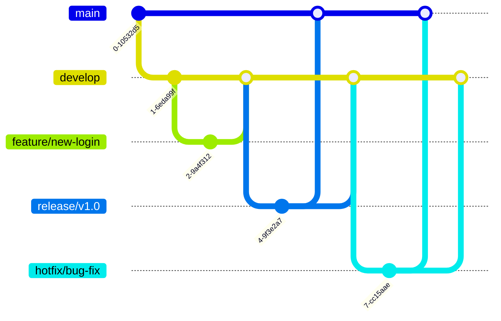

# Git 分支工作流

在软件开发中，Git分支管理是一个非常重要的概念。它允许多个开发者在同一个代码库中并行工作，而不会互相干扰。通过合理使用分支，团队可以更高效地协作、测试新功能以及修复问题。本文将介绍Git分支工作流的基本概念、常见模式以及实际应用场景。

---

## 什么是Git分支工作流？

Git分支工作流是一种基于Git版本控制系统的分支管理策略。它定义了如何创建、合并和管理分支，以便团队成员能够高效地协作开发。不同的团队可能会根据项目需求选择不同的分支工作流，但核心目标都是为了提高开发效率和代码质量。

在Git中，分支是指向某个提交（commit）的指针。默认情况下，Git会创建一个名为`main`（或`master`）的主分支。开发者可以从主分支创建新的分支，用于开发新功能、修复问题或进行实验。

---

## 常见的Git分支工作流

以下是几种常见的Git分支工作流模式：

### 1. 功能分支工作流（Feature Branch Workflow）

功能分支工作流是最常见的分支管理策略之一。它的核心思想是为每个新功能或任务创建一个独立的分支。开发者在完成功能开发后，将分支合并回主分支。

#### 工作流程：
1. 从`main`分支创建一个新分支，例如`feature/new-login`。
2. 在新分支上开发功能。
3. 完成开发后，将分支合并回`main`分支。

```bash
# 创建并切换到新分支
git checkout -b feature/new-login

# 开发完成后，合并到main分支
git checkout main
git merge feature/new-login
```

#### 优点：
- 每个功能独立开发，互不干扰。
- 便于代码审查和测试。

---

### 2. Git Flow

Git Flow是一种更复杂的分支工作流，适用于需要严格版本控制的项目。它定义了多个长期存在的分支，例如`main`、`develop`、`feature`、`release`和`hotfix`。

#### 工作流程：
1. `main`分支用于存储稳定的发布版本。
2. `develop`分支用于集成开发中的功能。
3. 每个新功能从`develop`分支创建`feature`分支。
4. 发布时，从`develop`分支创建`release`分支。
5. 紧急修复时，从`main`分支创建`hotfix`分支。



#### 优点：
- 适用于需要严格版本管理的项目。
- 支持并行开发和紧急修复。

---

### 3. GitHub Flow

GitHub Flow是一种简化的工作流，适用于持续交付的项目。它的核心思想是`main`分支始终保持可发布状态，所有新功能都通过拉取请求（Pull Request）合并到`main`分支。

#### 工作流程：
1. 从`main`分支创建一个新分支。
2. 在新分支上开发功能。
3. 提交拉取请求，进行代码审查和测试。
4. 合并到`main`分支并部署。

```bash
# 创建并切换到新分支
git checkout -b feature/new-login

# 提交拉取请求
git push origin feature/new-login
```

#### 优点：
- 简单易用，适合小型团队和持续交付的项目。
- 强调代码审查和自动化测试。

---

## 实际应用场景

### 场景1：开发新功能

假设你正在开发一个登录功能。你可以按照以下步骤操作：
1. 从`main`分支创建新分支：`git checkout -b feature/new-login`。
2. 在新分支上开发登录功能。
3. 完成开发后，提交拉取请求并合并到`main`分支。

### 场景2：修复紧急问题

假设生产环境发现了一个严重问题。你可以按照以下步骤操作：
1. 从`main`分支创建新分支：`git checkout -b hotfix/bug-fix`。
2. 在新分支上修复问题。
3. 完成修复后，合并到`main`分支并部署。

---

## 总结

Git分支工作流是团队协作开发的重要工具。通过合理使用功能分支、Git Flow或GitHub Flow，团队可以更高效地管理代码、减少冲突并提高代码质量。选择适合团队和项目需求的工作流是关键。

---

## 附加资源与练习

- **练习1**：尝试在本地Git仓库中创建一个功能分支，开发一个小功能并合并到主分支。
- **练习2**：模拟一个紧急修复场景，使用`hotfix`分支修复问题并合并到主分支。
- **推荐阅读**：
  - [Git官方文档](https://git-scm.com/doc)
  - [Git Flow工作流详解](https://nvie.com/posts/a-successful-git-branching-model/)

:::tip
如果你对Git分支工作流有任何疑问，欢迎在评论区留言，我们会尽快为你解答！
:::