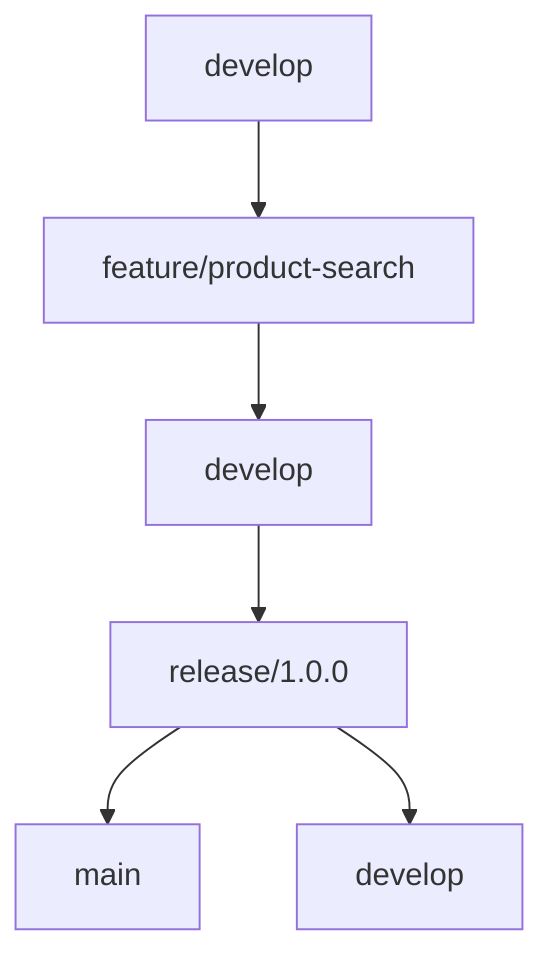

# Git 工作流概述

Git工作流是指在团队协作开发中，使用Git进行版本控制的一套流程和规范。它定义了如何创建分支、合并代码、发布版本等操作，以确保团队成员能够高效协作，同时保持代码库的整洁和稳定。

## 为什么需要Git工作流？

在团队开发中，如果没有统一的工作流，可能会导致以下问题：
- 代码冲突频繁，难以解决。
- 版本管理混乱，难以追踪问题。
- 发布流程不明确，导致生产环境出现问题。

通过定义清晰的Git工作流，团队可以更好地协作，减少冲突，提高开发效率。

## 常见的Git工作流

以下是几种常见的Git工作流，每种工作流都有其适用场景和优缺点。

### 1. 集中式工作流（Centralized Workflow）

集中式工作流是最简单的Git工作流，适合小型团队或初学者。它的核心思想是只有一个中央仓库（通常是`main`或`master`分支），所有开发者都直接在这个分支上进行开发。

#### 工作流程：
1. 开发者从中央仓库克隆代码。
2. 在本地进行开发并提交更改。
3. 将更改推送到中央仓库。

#### 示例：
```bash
# 克隆中央仓库
git clone https://github.com/your-repo.git

# 在本地进行开发
git add .
git commit -m "完成功能开发"

# 推送更改到中央仓库
git push origin main
```

:::caution
集中式工作流虽然简单，但在多人协作时容易产生冲突，尤其是在频繁提交的情况下。
:::

### 2. 功能分支工作流（Feature Branch Workflow）

功能分支工作流是集中式工作流的扩展，适合中小型团队。它的核心思想是为每个新功能或修复创建一个独立的分支，开发完成后将分支合并回主分支。

#### 工作流程：
1. 从主分支创建一个新的功能分支。
2. 在功能分支上进行开发。
3. 开发完成后，将功能分支合并回主分支。

#### 示例：
```bash
# 创建功能分支
git checkout -b feature/new-feature

# 在功能分支上进行开发
git add .
git commit -m "实现新功能"

# 切换回主分支并合并功能分支
git checkout main
git merge feature/new-feature
```

:::tip
功能分支工作流可以有效隔离不同功能的开发，减少冲突，适合需要并行开发多个功能的团队。
:::

### 3. Gitflow工作流（Gitflow Workflow）

Gitflow工作流是一种更复杂的工作流，适合中大型团队或需要严格版本控制的项目。它定义了明确的分支模型，包括`main`、`develop`、`feature`、`release`和`hotfix`分支。

#### 工作流程：
1. `main`分支用于存储稳定的生产代码。
2. `develop`分支用于集成所有功能开发。
3. 每个新功能在`feature`分支上开发，完成后合并到`develop`分支。
4. 发布时，从`develop`分支创建`release`分支，测试通过后合并到`main`和`develop`分支。
5. 紧急修复在`hotfix`分支上进行，完成后合并到`main`和`develop`分支。

#### 示例：
```bash
# 创建功能分支
git checkout -b feature/new-feature develop

# 开发完成后合并到develop分支
git checkout develop
git merge --no-ff feature/new-feature

# 创建发布分支
git checkout -b release/1.0.0 develop

# 发布完成后合并到main和develop分支
git checkout main
git merge --no-ff release/1.0.0
git checkout develop
git merge --no-ff release/1.0.0
```

:::note
Gitflow工作流适合需要严格版本控制和发布流程的项目，但它的复杂性也增加了学习成本。
:::

### 4. Forking工作流（Forking Workflow）

Forking工作流常用于开源项目，每个开发者都有自己的远程仓库（fork），开发者在自己的仓库中进行开发，然后通过Pull Request（PR）将更改提交到主仓库。

#### 工作流程：
1. 开发者fork主仓库到自己的远程仓库。
2. 在本地克隆自己的远程仓库。
3. 在本地进行开发并提交更改。
4. 将更改推送到自己的远程仓库。
5. 创建Pull Request，请求将更改合并到主仓库。

#### 示例：
```bash
# 克隆自己的远程仓库
git clone https://github.com/your-username/your-repo.git

# 在本地进行开发
git add .
git commit -m "完成功能开发"

# 推送更改到自己的远程仓库
git push origin main

# 创建Pull Request（通常在GitHub或GitLab上操作）
```

:::tip
Forking工作流适合开源项目，因为它允许贡献者在自己的仓库中进行开发，而不需要直接访问主仓库。
:::

## 实际案例

假设你正在开发一个电商网站，团队决定使用Gitflow工作流。以下是一个典型的工作流程：

1. 从`develop`分支创建一个新的功能分支`feature/product-search`。
2. 在`feature/product-search`分支上开发产品搜索功能。
3. 开发完成后，将`feature/product-search`分支合并到`develop`分支。
4. 准备发布时，从`develop`分支创建`release/1.0.0`分支，进行测试和修复。
5. 测试通过后，将`release/1.0.0`分支合并到`main`和`develop`分支，并打上版本标签。



## 总结

Git工作流是团队协作开发中不可或缺的工具。通过选择合适的工作流，团队可以更高效地管理代码，减少冲突，并确保代码库的稳定性。对于初学者来说，建议从集中式工作流或功能分支工作流开始，逐步掌握更复杂的工作流。

## 附加资源

- [Git官方文档](https://git-scm.com/doc)
- [Gitflow工作流详解](https://nvie.com/posts/a-successful-git-branching-model/)
- [GitHub Pull Request指南](https://docs.github.com/en/pull-requests)

## 练习

1. 尝试在本地仓库中使用功能分支工作流开发一个小功能，并将其合并到主分支。
2. 使用Gitflow工作流模拟一个发布流程，包括创建`release`分支和合并到`main`分支。
3. 在GitHub上fork一个开源项目，创建一个Pull Request，体验Forking工作流。