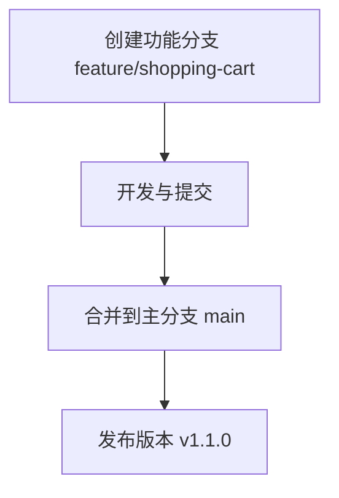

# Git 项目管理

Git 是一个分布式版本控制系统，广泛用于软件开发中管理代码的变更。通过 Git，团队可以高效协作，跟踪代码的历史记录，并轻松管理项目的不同版本。本文将介绍 Git 项目管理的核心概念，帮助你掌握如何在实际项目中使用 Git。

## 1. Git 分支策略

在 Git 中，分支是项目管理的核心工具之一。通过分支，你可以在不影响主代码的情况下进行开发、测试和修复。

### 1.1 主分支（Main/Master）

主分支是项目的稳定版本，通常命名为 `main` 或 `master`。所有发布版本的代码都应来自主分支。

```bash
git checkout main
```

### 1.2 功能分支（Feature Branch）

功能分支用于开发新功能。每个新功能都应在一个独立的分支上开发，完成后合并回主分支。

```bash
git checkout -b feature/new-feature
```

### 1.3 修复分支（Hotfix Branch）

修复分支用于紧急修复生产环境中的问题。修复完成后，应合并回主分支和开发分支。

```bash
git checkout -b hotfix/bug-fix
```

:::tip
使用分支策略可以帮助团队更好地管理代码，避免冲突和混乱。
:::

## 2. 合并与冲突解决

在 Git 中，合并是将一个分支的更改应用到另一个分支的过程。合并时可能会遇到冲突，需要手动解决。

### 2.1 合并分支

假设你完成了 `feature/new-feature` 分支的开发，现在需要将其合并到 `main` 分支：

```bash
git checkout main
git merge feature/new-feature
```

### 2.2 解决冲突

如果合并时发生冲突，Git 会提示你哪些文件存在冲突。你需要手动编辑这些文件，解决冲突后标记为已解决：

```bash
# 编辑冲突文件
git add <conflicted-file>
git commit
```

:::caution
解决冲突时，务必仔细检查代码，确保不会引入新的问题。
:::

## 3. 版本控制与标签

Git 允许你为重要的提交打上标签（Tag），通常用于标记发布版本。

### 3.1 创建标签

```bash
git tag -a v1.0.0 -m "Release version 1.0.0"
```

### 3.2 推送标签到远程仓库

```bash
git push origin v1.0.0
```

:::note
标签可以帮助你快速定位到项目的特定版本，便于管理和发布。
:::

## 4. 实际案例

假设你正在开发一个电商网站，以下是使用 Git 进行项目管理的典型流程：

1. **创建功能分支**：你需要在网站上添加一个购物车功能，因此创建了一个新的功能分支 `feature/shopping-cart`。
2. **开发与提交**：在 `feature/shopping-cart` 分支上进行开发，并定期提交代码。
3. **合并到主分支**：开发完成后，将 `feature/shopping-cart` 分支合并到 `main` 分支。
4. **发布版本**：为 `main` 分支打上标签 `v1.1.0`，表示新版本的发布。



## 5. 总结

Git 是一个强大的工具，能够帮助团队高效管理项目代码。通过合理使用分支策略、合并与冲突解决、版本控制等功能，你可以确保项目的稳定性和可维护性。

## 6. 附加资源与练习

- **练习**：尝试在一个小型项目中使用 Git 分支策略，模拟开发、合并和发布流程。
- **资源**：
  - [Pro Git 书籍](https://git-scm.com/book/en/v2)
  - [Git 官方文档](https://git-scm.com/doc)
  - [GitHub Guides](https://guides.github.com/)

通过不断实践和学习，你将能够熟练使用 Git 进行项目管理，提升团队协作效率。