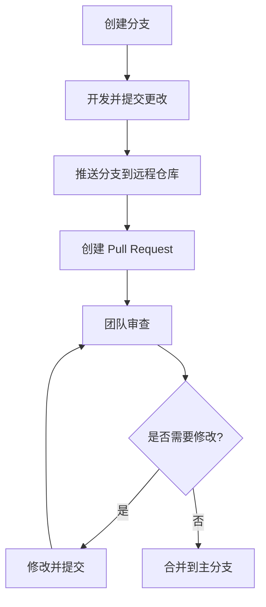

## 什么是 Git Pull Request？

Git Pull Request（简称 PR）是 Git 工作流中的一个重要概念，尤其是在团队协作开发中。它允许开发者将自己的代码变更提交给团队，并请求将这些变更合并到主分支（如 `main` 或 `master`）中。Pull Request 不仅是一个代码合并的请求，还是一个代码审查的工具，团队成员可以在合并之前对代码进行讨论和改进。

:::note
Pull Request 是 GitHub、GitLab 和 Bitbucket 等代码托管平台提供的功能，而不是 Git 本身的功能。
:::

## 为什么需要 Pull Request？

1. **代码审查**：通过 Pull Request，团队成员可以查看代码变更，提出建议或发现问题。
2. **协作开发**：多个开发者可以同时工作在不同的分支上，通过 Pull Request 将代码合并到主分支。
3. **自动化测试**：许多平台支持在 Pull Request 中运行自动化测试，确保代码质量。
4. **记录历史**：每个 Pull Request 都会记录讨论和修改过程，便于后续追溯。

## 如何创建 Pull Request？

以下是创建 Pull Request 的基本步骤：

1. **创建分支**：在本地创建一个新分支，用于开发新功能或修复问题。
   ```bash
   git checkout -b feature/new-feature
   ```
2. **提交更改**：在新分支上进行开发并提交更改。
   ```bash
   git add .
   git commit -m "Add new feature"
   ```
3. **推送分支**：将本地分支推送到远程仓库。
   ```bash
   git push origin feature/new-feature
   ```
4. **创建 Pull Request**：在代码托管平台（如 GitHub）上，找到你刚刚推送的分支，点击 "New Pull Request" 按钮。
5. **填写信息**：填写 Pull Request 的标题和描述，说明你的更改内容和目的。
6. **请求审查**：选择团队成员作为审查者，等待他们的反馈。

## Pull Request 的实际案例

假设你正在开发一个简单的计算器应用，你需要添加一个乘法功能。以下是具体步骤：

1. **创建分支**：
   ```bash
   git checkout -b feature/add-multiplication
   ```
2. **编写代码**：在 `calculator.js` 中添加乘法功能。
   ```javascript
   function multiply(a, b) {
     return a * b;
   }
   ```
3. **提交更改**：
   ```bash
   git add calculator.js
   git commit -m "Add multiplication function"
   ```
4. **推送分支**：
   ```bash
   git push origin feature/add-multiplication
   ```
5. **创建 Pull Request**：在 GitHub 上，选择 `feature/add-multiplication` 分支，点击 "New Pull Request"，填写标题和描述，例如：
   - 标题：`Add multiplication function`
   - 描述：`This PR adds a new function to perform multiplication.`

6. **等待审查**：团队成员会审查你的代码，可能会提出改进建议。你可以根据反馈进行修改，并再次提交。

## Pull Request 的工作流程

以下是一个典型的 Pull Request 工作流程：



## 总结

Git Pull Request 是团队协作开发中不可或缺的工具。它不仅帮助开发者将代码变更合并到主分支，还提供了一个代码审查和讨论的平台。通过 Pull Request，团队可以确保代码质量，减少错误，并记录开发历史。

## 附加资源

- [GitHub Pull Request 文档](https://docs.github.com/en/pull-requests)
- [GitLab Merge Request 文档](https://docs.gitlab.com/ee/user/project/merge_requests/)
- [Bitbucket Pull Request 文档](https://support.atlassian.com/bitbucket-cloud/docs/create-a-pull-request/)

## 练习

1. 在你的 GitHub 仓库中创建一个新分支，添加一个简单的功能（如打印 "Hello, World!"），并创建一个 Pull Request。
2. 邀请一位朋友或同事审查你的 Pull Request，并根据反馈进行修改。
3. 尝试在 Pull Request 中运行自动化测试（如果配置了 CI/CD 工具）。

通过实践，你将更好地理解 Pull Request 的工作流程和重要性。