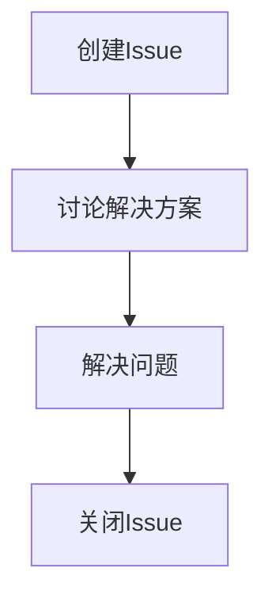

# Git Issue跟踪

## 介绍

在软件开发过程中，任务管理是一个至关重要的环节。Git Issue跟踪功能是Git平台（如GitHub、GitLab等）提供的一种工具，用于帮助开发者记录、管理和跟踪项目中的任务、问题和改进建议。通过Git Issue，团队成员可以清晰地了解当前的工作进展，分配任务，讨论问题，并最终解决问题。

## 什么是Git Issue？

Git Issue是一个用于记录项目中的任务、问题或改进建议的条目。每个Issue通常包含以下信息：

- **标题**：简要描述问题或任务。
- **描述**：详细说明问题或任务的背景、原因和期望的解决方案。
- **标签**：用于分类和筛选Issue，如“bug”、“enhancement”、“question”等。
- **里程碑**：用于将Issue与项目的某个阶段或版本关联。
- **指派**：指定负责解决该Issue的团队成员。
- **评论**：团队成员可以在Issue下进行讨论，提出建议或提供解决方案。

## 如何创建Git Issue？

在Git平台上创建Issue非常简单。以下是一个在GitHub上创建Issue的示例：

1. 打开项目的GitHub页面。
2. 点击“Issues”选项卡。
3. 点击“New Issue”按钮。
4. 填写Issue的标题和描述。
5. 选择适当的标签、里程碑和指派人员。
6. 点击“Submit new issue”按钮。

```markdown
# 示例Issue

**标题**: 修复登录页面样式问题

**描述**: 
登录页面的按钮样式在移动设备上显示不正确，需要调整CSS以适应不同屏幕尺寸。

**标签**: bug, css

**里程碑**: v1.2.0

**指派**: @username
```

## Git Issue的生命周期

一个Git Issue通常会经历以下几个阶段：

1. **创建**：Issue被创建并分配给相关人员。
2. **讨论**：团队成员在Issue下进行讨论，提出解决方案。
3. **解决**：Issue被标记为“已解决”或“已完成”。
4. **关闭**：Issue被关闭，表示问题已解决或任务已完成。



## 实际应用场景

假设你正在开发一个Web应用，并且发现了一个关于用户登录的bug。你可以通过以下步骤使用Git Issue来管理这个问题：

1. **创建Issue**：在GitHub上创建一个新的Issue，标题为“修复用户登录失败的问题”，并详细描述问题的表现和复现步骤。
2. **分配任务**：将Issue分配给负责登录功能的开发人员。
3. **讨论解决方案**：团队成员在Issue下讨论可能的解决方案，并提出修复建议。
4. **解决问题**：开发人员根据讨论结果修复问题，并将修复代码提交到代码库。
5. **关闭Issue**：在确认问题已解决后，关闭Issue。

## 总结

Git Issue跟踪功能是项目管理中不可或缺的工具，它帮助团队有效地记录、分配和解决问题。通过合理使用Git Issue，团队可以更好地协作，确保项目顺利进行。

## 附加资源与练习

- **练习**：在你的GitHub或GitLab项目中创建一个新的Issue，并尝试使用标签、里程碑和指派功能。
- **资源**：
  - [GitHub Issues Documentation](https://docs.github.com/en/issues)
  - [GitLab Issues Documentation](https://docs.gitlab.com/ee/user/project/issues/)

通过本文的学习，你应该已经掌握了Git Issue的基本概念和使用方法。继续实践，你将能够更熟练地使用Git Issue来管理你的项目。