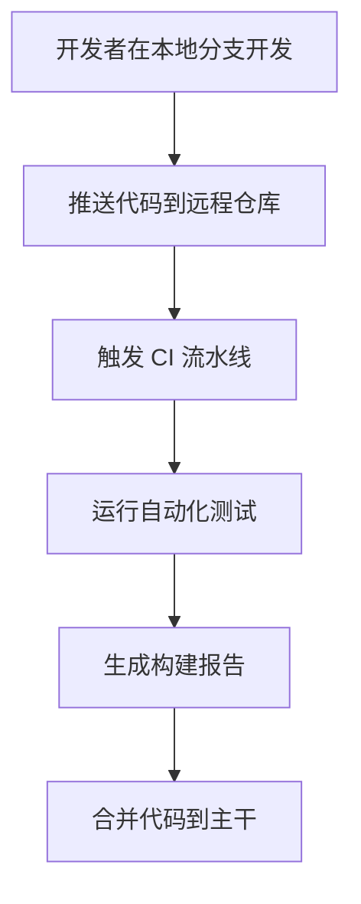

# Git 持续集成

## 介绍

持续集成（Continuous Integration，简称 CI）是一种软件开发实践，开发人员频繁地将代码变更集成到共享的主干（通常是 `main` 或 `master` 分支）中。每次集成都会通过自动化的构建和测试流程来验证代码的正确性，从而尽早发现并修复问题。

Git 持续集成结合了 Git 版本控制系统和 CI 工具，帮助团队更高效地协作开发。通过 Git 持续集成，开发者可以确保代码库始终处于可部署状态，减少集成冲突，并提高代码质量。

## Git 持续集成的工作流程

Git 持续集成的核心思想是：每次代码提交都会触发自动化构建和测试流程。以下是 Git 持续集成的典型工作流程：

1. **开发者在本地分支上开发功能**：开发者在本地 Git 仓库中创建新分支，编写代码并提交更改。
2. **推送代码到远程仓库**：开发者将本地分支推送到远程 Git 仓库（如 GitHub、GitLab 等）。
3. **触发 CI 流水线**：远程仓库配置了 CI 工具（如 Jenkins、GitHub Actions、GitLab CI 等），当代码被推送到特定分支时，CI 工具会自动触发构建和测试流程。
4. **运行自动化测试**：CI 工具会运行单元测试、集成测试等，确保代码变更不会引入新的问题。
5. **生成构建报告**：CI 工具会生成构建报告，显示测试结果、代码覆盖率等信息。
6. **合并代码到主干**：如果所有测试通过，开发者可以将代码合并到主干分支（如 `main` 或 `master`）。



## 实际案例

假设你正在开发一个简单的 Python 项目，并使用 GitHub 作为远程仓库。以下是如何配置 GitHub Actions 来实现 Git 持续集成的示例。

### 1. 创建 GitHub Actions 配置文件

在项目的根目录下创建一个 `.github/workflows/ci.yml` 文件，内容如下：

```yaml
name: CI Pipeline

on:
  push:
    branches:
      - main
  pull_request:
    branches:
      - main

jobs:
  build:
    runs-on: ubuntu-latest

    steps:
      - name: Checkout code
        uses: actions/checkout@v2

      - name: Set up Python
        uses: actions/setup-python@v2
        with:
          python-version: '3.9'

      - name: Install dependencies
        run: |
          python -m pip install --upgrade pip
          pip install -r requirements.txt

      - name: Run tests
        run: |
          python -m pytest
```

### 2. 推送代码并触发 CI

当你将代码推送到 `main` 分支或创建 Pull Request 时，GitHub Actions 会自动运行上述配置的 CI 流水线。流水线会执行以下步骤：

1. 检出代码。
2. 设置 Python 环境。
3. 安装项目依赖。
4. 运行测试。

如果所有测试通过，流水线会显示成功状态；否则，流水线会失败，并提示错误信息。

:::tip
你可以通过 GitHub 的 Actions 页面查看详细的构建日志和测试报告。
:::

## 总结

Git 持续集成是现代软件开发中不可或缺的一部分。通过将 Git 与 CI 工具结合，团队可以更高效地协作开发，确保代码库始终处于可部署状态。对于初学者来说，掌握 Git 持续集成的基本概念和工作流程是迈向高效开发的重要一步。

## 附加资源

- [GitHub Actions 官方文档](https://docs.github.com/en/actions)
- [GitLab CI/CD 官方文档](https://docs.gitlab.com/ee/ci/)
- [Jenkins 官方文档](https://www.jenkins.io/doc/)

## 练习

1. 在你的 GitHub 仓库中配置一个简单的 CI 流水线，运行单元测试。
2. 尝试在 CI 流水线中添加代码覆盖率检查。
3. 研究如何在 CI 流水线中集成代码质量检查工具（如 `flake8` 或 `black`）。
