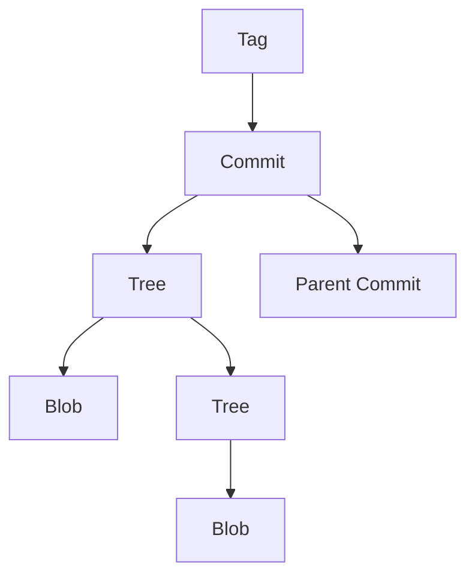

# Git 对象模型

Git是一个分布式版本控制系统，其核心是一个强大的对象模型。理解Git对象模型是掌握Git高级操作的关键。本文将带你深入了解Git对象模型，包括其组成部分及其工作原理。

## 什么是Git对象模型？

Git对象模型是Git用来存储和管理项目历史记录的基础结构。它由四种主要对象组成：**blob**、**tree**、**commit**和**tag**。这些对象共同构成了Git版本控制的核心。

### 1. Blob对象

Blob（Binary Large Object）是Git中最基本的对象类型，用于存储文件内容。每个文件在Git中都被表示为一个blob对象，blob对象只包含文件的内容，而不包含文件名或其他元数据。

```bash
$ echo "Hello, World!" > hello.txt
$ git add hello.txt
$ git hash-object hello.txt
2aae6c35c94fcfb415dbe95f408b9ce91ee846ed
```

在上面的例子中，`hello.txt`文件的内容被存储为一个blob对象，其SHA-1哈希值为`2aae6c35c94fcfb415dbe95f408b9ce91ee846ed`。

### 2. Tree对象

Tree对象用于表示目录结构。它包含一组指向blob对象或其他tree对象的引用，每个引用都包含一个文件名和对应的SHA-1哈希值。

```bash
$ git write-tree
100644 blob 2aae6c35c94fcfb415dbe95f408b9ce91ee846ed    hello.txt
```

在上面的例子中，`git write-tree`命令生成了一个tree对象，它包含了对`hello.txt`文件的引用。

### 3. Commit对象

Commit对象用于表示项目的一个快照。它包含一个指向tree对象的引用（表示项目的目录结构）、一个指向父commit对象的引用（如果有的话）、作者信息、提交信息以及提交时间戳。

```bash
$ git commit -m "Initial commit"
[master (root-commit) 1a2b3c4] Initial commit
 1 file changed, 1 insertion(+)
 create mode 100644 hello.txt
```

在上面的例子中，`git commit`命令生成了一个commit对象，它包含了对tree对象的引用以及提交信息。

### 4. Tag对象

Tag对象用于标记特定的commit对象，通常用于标记版本发布。Tag对象包含一个指向commit对象的引用、标签名称、标签信息以及标签创建者的信息。

```bash
$ git tag -a v1.0 -m "Version 1.0"
```

在上面的例子中，`git tag`命令生成了一个tag对象，它指向当前的commit对象，并标记为`v1.0`。

## Git 对象模型的工作原理

Git对象模型通过SHA-1哈希值来唯一标识每个对象。这些对象存储在Git的`.git/objects`目录中，Git通过哈希值来查找和引用这些对象。



在上面的图表中，我们可以看到Git对象模型的基本结构。Commit对象指向Tree对象，Tree对象指向Blob对象或其他Tree对象，Tag对象指向Commit对象。

## 实际应用场景

假设你正在开发一个项目，并且需要回滚到之前的某个版本。通过理解Git对象模型，你可以轻松地找到对应的commit对象，并使用`git checkout`命令回滚到该版本。

```bash
$ git log --oneline
1a2b3c4 Initial commit
$ git checkout 1a2b3c4
```

在上面的例子中，`git log`命令显示了项目的commit历史，`git checkout`命令将工作目录回滚到指定的commit对象。

## 总结

Git对象模型是Git版本控制的核心，理解它对于掌握Git的高级操作至关重要。通过本文，你已经了解了Git对象模型的四个主要组成部分：blob、tree、commit和tag对象，以及它们如何协同工作来管理项目的历史记录。

## 附加资源

- [Pro Git Book](https://git-scm.com/book/en/v2) - 深入讲解Git的各个方面。
- [Git Internals](https://git-scm.com/book/en/v2/Git-Internals-Plumbing-and-Porcelain) - 了解Git的内部工作原理。

## 练习

1. 创建一个新的Git仓库，并添加一些文件。使用`git hash-object`命令查看这些文件的blob对象。
2. 使用`git write-tree`命令生成一个tree对象，并查看其内容。
3. 创建一个commit对象，并使用`git log`查看commit历史。
4. 创建一个tag对象，并使用`git show`查看tag信息。

通过完成这些练习，你将更深入地理解Git对象模型的工作原理。