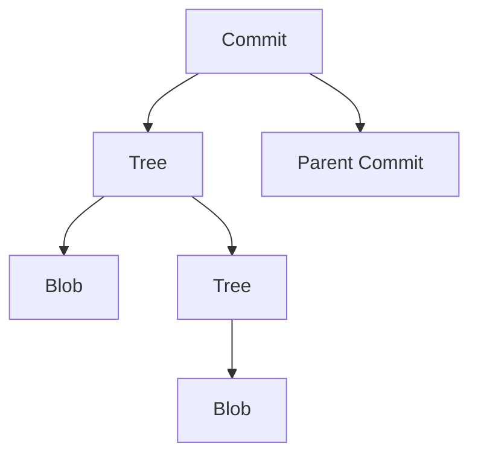

# Git 内部命令

Git是一个强大的分布式版本控制系统，它的核心功能是通过一系列底层命令实现的。虽然我们通常使用高级命令（如`git add`、`git commit`等），但了解Git的内部命令可以帮助我们更深入地理解Git的工作原理。

## 什么是Git内部命令？

Git内部命令是Git底层操作的直接接口。它们通常以`git`命令的子命令形式存在，例如`git hash-object`、`git cat-file`等。这些命令直接操作Git的对象存储，允许我们查看和修改Git的内部数据结构。

:::note
Git内部命令通常用于调试或高级操作，日常开发中很少直接使用。但对于理解Git的工作原理非常有帮助。
:::

## Git 对象模型

在深入了解内部命令之前，我们需要先了解Git的对象模型。Git的核心是一个内容寻址的文件系统，它存储了四种类型的对象：

1. **Blob**：存储文件内容。
2. **Tree**：存储目录结构，包含指向Blob和其他Tree的引用。
3. **Commit**：存储提交信息，包含指向Tree的引用和父提交。
4. **Tag**：存储标签信息，通常指向某个Commit。

这些对象通过SHA-1哈希值进行唯一标识。



## 常用Git内部命令

### 1. `git hash-object`

`git hash-object`命令用于计算文件内容的SHA-1哈希值，并将其存储到Git的对象数据库中。

```bash
$ echo "Hello, Git!" | git hash-object --stdin
8ab686eafeb1f44702738c8b0f24f2567c36da6d
```

:::tip
`--stdin`选项表示从标准输入读取内容，而不是从文件读取。
:::

### 2. `git cat-file`

`git cat-file`命令用于查看Git对象的内容。它可以显示Blob、Tree、Commit和Tag的详细信息。

```bash
$ git cat-file -p 8ab686eafeb1f44702738c8b0f24f2567c36da6d
Hello, Git!
```

:::caution
`-p`选项表示以可读的格式显示对象内容。如果不加此选项，Git会显示对象的原始二进制数据。
:::

### 3. `git update-index`

`git update-index`命令用于更新Git的索引（也称为暂存区）。它可以将文件添加到索引中，或者修改文件的权限。

```bash
$ git update-index --add --cacheinfo 100644 8ab686eafeb1f44702738c8b0f24f2567c36da6d hello.txt
```

:::warning
`--cacheinfo`选项用于指定文件的模式、SHA-1哈希值和文件名。模式`100644`表示普通文件。
:::

### 4. `git write-tree`

`git write-tree`命令用于将当前的索引内容写入一个Tree对象，并返回该对象的SHA-1哈希值。

```bash
$ git write-tree
4b825dc642cb6eb9a060e54bf8d69288fbee4904
```

### 5. `git commit-tree`

`git commit-tree`命令用于创建一个Commit对象。它需要一个Tree对象的SHA-1哈希值和一个提交消息。

```bash
$ echo "Initial commit" | git commit-tree 4b825dc642cb6eb9a060e54bf8d69288fbee4904
f1a5b1e4c8f0b4e0e4e0e4e0e4e0e4e0e4e0e4e0
```

:::note
`git commit-tree`不会自动更新当前分支的引用，你需要手动更新。
:::

## 实际案例

假设我们想要手动创建一个Git提交，而不使用`git add`和`git commit`命令。我们可以按照以下步骤操作：

1. 创建一个文件并计算其SHA-1哈希值：

    ```bash
    $ echo "Hello, Git!" > hello.txt
    $ git hash-object -w hello.txt
    8ab686eafeb1f44702738c8b0f24f2567c36da6d
    ```

2. 将文件添加到索引中：

    ```bash
    $ git update-index --add --cacheinfo 100644 8ab686eafeb1f44702738c8b0f24f2567c36da6d hello.txt
    ```

3. 创建一个Tree对象：

    ```bash
    $ git write-tree
    4b825dc642cb6eb9a060e54bf8d69288fbee4904
    ```

4. 创建一个Commit对象：

    ```bash
    $ echo "Initial commit" | git commit-tree 4b825dc642cb6eb9a060e54bf8d69288fbee4904
    f1a5b1e4c8f0b4e0e4e0e4e0e4e0e4e0e4e0e4e0
    ```

5. 更新当前分支的引用：

    ```bash
    $ git update-ref refs/heads/main f1a5b1e4c8f0b4e0e4e0e4e0e4e0e4e0e4e0e4e0
    ```

现在，我们已经手动创建了一个Git提交！

## 总结

通过了解Git的内部命令，我们可以更深入地理解Git的工作原理。虽然这些命令在日常开发中很少直接使用，但它们对于调试和高级操作非常有帮助。

## 附加资源

- [Git Internals - Git Objects](https://git-scm.com/book/en/v2/Git-Internals-Git-Objects)
- [Git Internals - Plumbing and Porcelain](https://git-scm.com/book/en/v2/Git-Internals-Plumbing-and-Porcelain)

## 练习

1. 使用`git hash-object`命令计算一个文件的SHA-1哈希值，并将其存储到Git的对象数据库中。
2. 使用`git cat-file`命令查看一个Git对象的内容。
3. 手动创建一个Git提交，而不使用`git add`和`git commit`命令。

通过这些练习，你将更好地掌握Git的内部命令和工作原理。