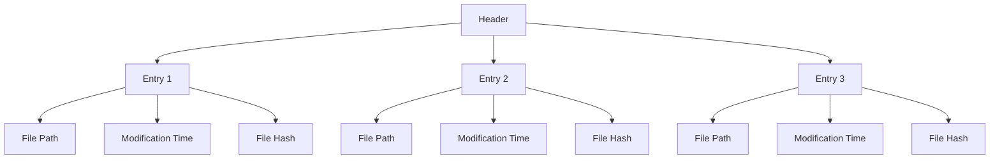

# Git 索引文件

Git索引文件（Index File），也称为暂存区（Staging Area），是Git工作流中的一个关键组成部分。它充当了工作目录和版本库之间的桥梁，记录了当前工作目录中哪些文件将被提交到下一次提交中。理解索引文件的作用和结构，对于掌握Git的内部原理至关重要。

## 什么是Git索引文件？

Git索引文件是一个二进制文件，通常位于 `.git/index` 路径下。它包含了当前工作目录中所有被跟踪文件的状态信息，例如文件的路径、修改时间、文件内容的哈希值等。当你运行 `git add` 命令时，Git会将文件的当前状态保存到索引文件中。

:::tip
索引文件的作用是暂存你希望在下一次提交中包含的更改。它允许你在提交之前选择性地添加文件或部分文件。
:::

## 索引文件的结构

索引文件的结构可以分为以下几个部分：

1. **Header（头部）**：包含索引文件的版本号和条目数量。
2. **Entries（条目）**：每个条目对应一个被跟踪的文件，包含文件的路径、修改时间、文件内容的哈希值等信息。
3. **Extensions（扩展）**：可选部分，用于存储额外的元数据。

以下是一个简化的索引文件结构示意图：



## 索引文件的实际应用

### 1. 暂存文件

当你对工作目录中的文件进行修改后，可以使用 `git add` 命令将更改暂存到索引文件中。例如：

```bash
git add myfile.txt
```

这条命令会将 `myfile.txt` 的当前状态保存到索引文件中。你可以通过 `git status` 查看哪些文件已被暂存。

### 2. 查看索引文件内容

虽然索引文件是二进制格式，但你可以使用 `git ls-files` 命令查看索引文件中的内容：

```bash
git ls-files --stage
```

输出示例：

```
100644 78981922613b2afb6025042ff6bd878ac1994e85 0       myfile.txt
```

这里的输出显示了文件的权限模式、哈希值、暂存编号和文件路径。

### 3. 提交更改

当你运行 `git commit` 时，Git会将索引文件中的内容打包成一个新的提交对象，并将其保存到版本库中。例如：

```bash
git commit -m "Add myfile.txt"
```

这条命令会将索引文件中的所有更改提交到版本库中。

## 实际案例

假设你正在开发一个项目，并且对多个文件进行了修改。你希望只提交其中的一部分更改，而不是全部。这时，索引文件就派上了用场。

1. 修改文件 `file1.txt` 和 `file2.txt`。
2. 使用 `git add file1.txt` 将 `file1.txt` 的更改暂存到索引文件中。
3. 运行 `git status`，你会看到 `file1.txt` 已被暂存，而 `file2.txt` 仍处于未暂存状态。
4. 最后，运行 `git commit -m "Update file1.txt"` 提交 `file1.txt` 的更改。

通过这种方式，你可以精确控制哪些更改将被提交到版本库中。

## 总结

Git索引文件是Git工作流中的一个核心组件，它允许你选择性地暂存和提交更改。通过理解索引文件的作用和结构，你可以更好地掌握Git的内部原理，并在实际开发中更高效地使用Git。

:::note
如果你想深入了解Git索引文件的内部结构，可以阅读Git的官方文档或相关技术文章。
:::

## 附加资源

- [Git官方文档](https://git-scm.com/doc)
- [Pro Git Book](https://git-scm.com/book/en/v2)

## 练习

1. 使用 `git add` 命令将工作目录中的多个文件暂存到索引文件中，然后运行 `git ls-files --stage` 查看索引文件的内容。
2. 尝试修改一个文件，但不将其添加到索引文件中，然后运行 `git commit`，观察Git的行为。
