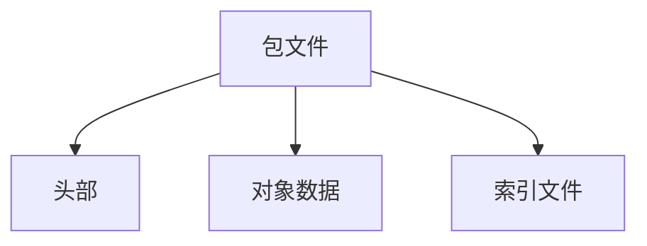

# Git 包文件

Git包文件（Packfile）是Git用于高效存储和管理仓库中对象（如提交、树、blob等）的一种压缩格式。通过将多个对象打包成一个文件，Git能够减少存储空间并提高性能。本文将详细介绍Git包文件的工作原理、结构以及实际应用场景。

## 什么是Git包文件？

在Git中，每个对象（如提交、树、blob等）最初都是单独存储的。然而，随着仓库的增长，单独存储的对象会占用大量磁盘空间。为了优化存储，Git引入了包文件（Packfile）的概念。包文件将多个对象打包成一个文件，并通过压缩算法减少存储空间。

### 包文件的结构

一个Git包文件主要由以下几部分组成：

1. **头部（Header）**：包含包文件的版本号和对象数量。
2. **对象数据（Object Data）**：存储实际的对象数据，通常是经过压缩的。
3. **索引文件（Index File）**：用于快速查找包文件中的对象。



## 包文件的创建与使用

### 创建包文件

Git会在以下情况下自动创建包文件：

- 执行`git gc`（垃圾回收）命令时。
- 执行`git repack`命令时。
- 推送或拉取远程仓库时。

你也可以手动创建包文件：

```bash
git repack -a -d --depth=250 --window=250
```

### 查看包文件内容

你可以使用`git verify-pack`命令查看包文件的内容：

```bash
git verify-pack -v .git/objects/pack/pack-<hash>.idx
```

输出示例：

```
<object-hash> <type> <size> <size-in-packfile> <offset-in-packfile>
```

## 实际应用场景

### 优化仓库大小

当仓库中的对象数量较多时，单独存储的对象会占用大量磁盘空间。通过将对象打包成包文件，Git能够显著减少存储空间的使用。

### 提高性能

包文件不仅减少了存储空间，还提高了Git操作的性能。例如，在克隆仓库时，Git会传输包文件而不是单独的对象，从而减少网络传输时间。

## 总结

Git包文件是Git内部用于高效存储和管理对象的重要机制。通过将多个对象打包成一个文件，Git能够减少存储空间并提高性能。理解包文件的工作原理有助于更好地管理和优化Git仓库。

## 附加资源与练习

- **练习**：尝试在你的本地仓库中手动创建一个包文件，并使用`git verify-pack`命令查看其内容。
- **资源**：阅读Git官方文档中关于[包文件](https://git-scm.com/book/en/v2/Git-Internals-Packfiles)的详细说明。

:::tip
提示：如果你对Git的内部机制感兴趣，可以深入学习Git的对象模型和存储机制，这将帮助你更好地理解包文件的作用。
:::