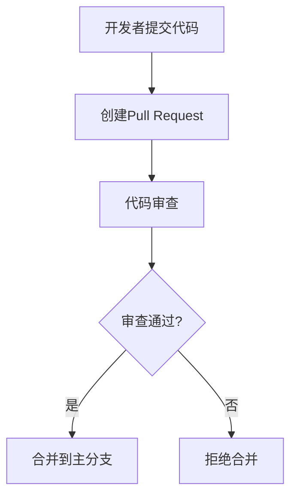

## 介绍

Git 是一个强大的分布式版本控制系统，广泛应用于软件开发中。然而，随着Git的普及，安全问题也日益突出。无论是个人开发者还是团队，都需要了解如何保护代码库免受未经授权的访问、数据泄露和其他潜在威胁。本文将介绍Git安全的基本概念，帮助你构建一个安全的开发环境。

## Git 安全的核心概念

### 1. 访问控制

访问控制是Git安全的基础。通过限制谁可以访问代码库，你可以减少潜在的安全风险。以下是几种常见的访问控制方法：

- **SSH密钥认证**：使用SSH密钥代替密码进行身份验证，可以提高安全性。
- **Git托管平台的权限管理**：例如GitHub、GitLab等平台提供了细粒度的权限控制，允许你设置谁可以读取、写入或管理代码库。

:::tip
建议为每个开发者生成独立的SSH密钥，并定期轮换密钥以增强安全性。
:::

### 2. 代码签名

代码签名是一种验证代码来源和完整性的方法。通过使用GPG（GNU Privacy Guard）签名，你可以确保提交的代码确实来自可信的开发者。

```bash
# 生成GPG密钥
gpg --full-generate-key

# 配置Git使用GPG签名
git config --global user.signingkey <your-gpg-key-id>
git config --global commit.gpgsign true
```

:::note
每次提交代码时，Git会自动使用GPG密钥进行签名，确保提交的完整性。
:::

### 3. 敏感信息管理

在代码库中存储敏感信息（如API密钥、密码等）是非常危险的。以下是几种管理敏感信息的方法：

- **使用环境变量**：将敏感信息存储在环境变量中，而不是直接写入代码。
- **使用.gitignore文件**：确保敏感文件不会被意外提交到代码库。

```bash
# .gitignore 示例
.env
*.key
```

:::caution
永远不要将敏感信息提交到公共代码库，否则可能会导致严重的安全问题。
:::

### 4. 分支保护

分支保护是一种防止未经授权的更改进入主分支的机制。通过设置分支保护规则，你可以确保只有经过代码审查的更改才能合并到主分支。



:::warning
确保主分支受到保护，避免直接推送代码到主分支。
:::

## 实际案例

### 案例1：SSH密钥泄露

某开发者的SSH密钥被泄露，攻击者利用该密钥访问了公司的私有代码库。由于没有及时轮换密钥，攻击者能够持续访问代码库，导致敏感信息泄露。

**解决方案**：定期轮换SSH密钥，并使用双因素认证（2FA）增强安全性。

### 案例2：敏感信息泄露

某开发者在代码库中存储了AWS访问密钥，并将代码库公开。攻击者发现了这些密钥，并利用它们进行了大规模的AWS资源滥用。

**解决方案**：使用环境变量管理敏感信息，并确保.gitignore文件中包含所有敏感文件。

## 总结

Git安全是软件开发中不可忽视的一部分。通过实施访问控制、代码签名、敏感信息管理和分支保护等措施，你可以显著提高代码库的安全性。作为初学者，理解这些基本概念并付诸实践，将为你的开发工作奠定坚实的基础。

## 附加资源

- [Git官方文档](https://git-scm.com/doc)
- [GitHub安全最佳实践](https://docs.github.com/en/github/getting-started-with-github/security-best-practices)
- [GPG签名指南](https://docs.github.com/en/github/authenticating-to-github/managing-commit-signature-verification)

## 练习

1. 生成并配置一个GPG密钥，用于Git提交签名。
2. 创建一个.gitignore文件，确保敏感文件不会被提交到代码库。
3. 在你的Git托管平台上设置分支保护规则，确保主分支受到保护。

通过完成这些练习，你将更好地理解Git安全的重要性，并能够在实际项目中应用这些知识。