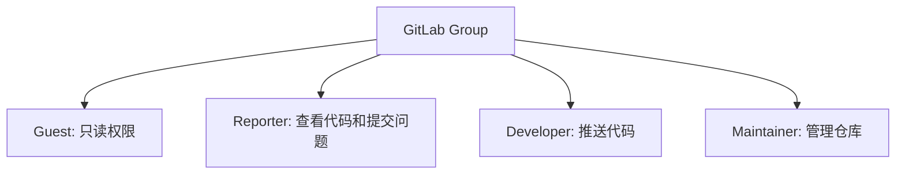

## 介绍

Git访问控制是指通过设置权限和策略，限制谁可以访问、修改或管理Git仓库中的代码。在团队协作中，访问控制是确保代码安全性和项目稳定性的关键。通过合理的访问控制，可以防止未经授权的用户对代码库进行破坏性操作，同时确保团队成员能够高效协作。

## Git 访问控制的基本概念

### 1. 仓库权限级别

在Git中，仓库的访问权限通常分为以下几种级别：

- **只读权限**：用户只能克隆和拉取代码，但不能推送更改。
- **读写权限**：用户可以克隆、拉取和推送代码。
- **管理员权限**：用户拥有完全控制权，可以管理仓库设置、分支、标签等。

### 2. 访问控制实现方式

Git访问控制可以通过以下几种方式实现：

- **SSH密钥认证**：通过配置SSH密钥，限制哪些用户可以访问仓库。
- **HTTPS认证**：通过用户名和密码或令牌进行认证。
- **Git托管服务提供的权限管理**：如GitHub、GitLab等平台提供的权限管理功能。

## 实际案例

### 案例1：使用SSH密钥进行访问控制

假设你有一个Git仓库，并且希望只有特定的用户能够访问它。你可以通过配置SSH密钥来实现这一点。

1. **生成SSH密钥**：
   用户需要在本地生成SSH密钥对：
   ```bash
   ssh-keygen -t rsa -b 4096 -C "your_email@example.com"
   ```
   生成的公钥和私钥将分别存储在 `~/.ssh/id_rsa.pub` 和 `~/.ssh/id_rsa` 中。

2. **添加公钥到Git托管服务**：
   用户需要将公钥添加到Git托管服务（如GitHub）的SSH密钥设置中。

3. **配置仓库权限**：
   在Git托管服务中，设置仓库的访问权限，只允许添加了公钥的用户访问。

### 案例2：使用GitLab的权限管理

GitLab提供了详细的权限管理功能，允许你为不同的用户和组设置不同的权限。

1. **创建组**：
   在GitLab中创建一个组，并将用户添加到该组中。

2. **设置组权限**：
   为组设置不同的权限级别，例如：
   - **Guest**：只读权限。
   - **Reporter**：可以查看代码和提交问题。
   - **Developer**：可以推送代码。
   - **Maintainer**：可以管理仓库。

3. **应用到仓库**：
   将组权限应用到特定的仓库，确保只有组内的用户能够访问和修改代码。

## 代码示例

### 示例1：配置SSH密钥

```bash
# 生成SSH密钥
ssh-keygen -t rsa -b 4096 -C "your_email@example.com"

# 将公钥添加到GitHub
cat ~/.ssh/id_rsa.pub
# 复制输出的公钥，并粘贴到GitHub的SSH密钥设置中
```

### 示例2：GitLab权限管理



## 总结

Git访问控制是确保代码安全性和团队协作效率的重要手段。通过合理配置SSH密钥、使用Git托管服务的权限管理功能，可以有效地控制谁可以访问和修改代码库。在实际应用中，根据团队的需求选择合适的访问控制策略，并定期审查和更新权限设置，以确保代码库的安全性。

## 附加资源

- [Git官方文档](https://git-scm.com/doc)
- [GitHub SSH密钥配置指南](https://docs.github.com/en/authentication/connecting-to-github-with-ssh)
- [GitLab权限管理文档](https://docs.gitlab.com/ee/user/permissions.html)

## 练习

1. 在你的Git托管服务中创建一个新的仓库，并尝试配置SSH密钥进行访问控制。
2. 在GitLab中创建一个组，并为组内的用户设置不同的权限级别，观察权限对用户操作的影响。