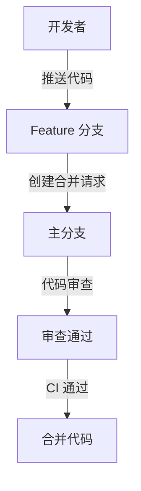

# Git 安全策略

Git 是一个强大的版本控制系统，广泛应用于软件开发中。然而，如果不采取适当的安全措施，可能会导致代码泄露、数据丢失或其他安全问题。本文将介绍一些关键的 Git 安全策略，帮助你保护你的代码库。

## 1. 使用 SSH 密钥进行身份验证

SSH 密钥是一种比密码更安全的身份验证方式。通过使用 SSH 密钥，你可以避免在每次推送或拉取代码时输入密码，同时减少密码泄露的风险。

### 生成 SSH 密钥

```bash
ssh-keygen -t rsa -b 4096 -C "your_email@example.com"
```

### 添加 SSH 密钥到 SSH 代理

```bash
eval "$(ssh-agent -s)"
ssh-add ~/.ssh/id_rsa
```

### 将公钥添加到 Git 服务器

将生成的公钥（通常位于 `~/.ssh/id_rsa.pub`）添加到你的 Git 服务器（如 GitHub、GitLab）的 SSH 密钥设置中。

## 2. 使用 GPG 签名提交

GPG 签名可以确保提交的真实性，防止他人冒充你提交代码。

### 安装 GPG

```bash
sudo apt-get install gnupg
```

### 生成 GPG 密钥

```bash
gpg --full-generate-key
```

### 配置 Git 使用 GPG 签名

```bash
git config --global user.signingkey <your-gpg-key-id>
git config --global commit.gpgsign true
```

## 3. 限制分支权限

通过限制分支的写权限，可以防止未经授权的用户直接推送代码到主分支。

### 设置分支保护规则

在 GitHub 或 GitLab 中，你可以设置分支保护规则，要求代码审查、CI 通过后才能合并代码。



## 4. 定期更新 Git

Git 的更新通常包含安全补丁和性能改进。定期更新 Git 可以确保你使用的是最新、最安全的版本。

### 更新 Git

```bash
sudo apt-get update
sudo apt-get install git
```

## 5. 使用 `.gitignore` 文件

`.gitignore` 文件可以防止敏感文件（如配置文件、密钥文件）被意外提交到代码库中。

### 示例 `.gitignore` 文件

```plaintext
# 忽略所有 .env 文件
.env

# 忽略所有日志文件
*.log

# 忽略 node_modules 目录
node_modules/
```

## 6. 定期审计代码库

定期审计代码库可以帮助你发现潜在的安全问题，如硬编码的密钥、未使用的依赖等。

### 使用工具进行代码审计

```bash
npm audit
```

## 实际案例

假设你正在开发一个开源项目，并且你希望确保只有经过审查的代码才能合并到主分支。你可以通过以下步骤实现：

1. 设置分支保护规则，要求至少一名其他开发者审查代码。
2. 配置 CI 管道，确保所有测试通过后才能合并代码。
3. 使用 GPG 签名提交，确保提交的真实性。

## 总结

通过实施这些 Git 安全策略，你可以显著提高代码库的安全性，减少潜在的安全风险。记住，安全是一个持续的过程，需要定期审查和更新。

## 附加资源

- [Git 官方文档](https://git-scm.com/doc)
- [GitHub 安全最佳实践](https://docs.github.com/en/github/getting-started-with-github/security-best-practices)
- [GitLab 安全指南](https://docs.gitlab.com/ee/security/)

## 练习

1. 生成并配置 SSH 密钥，尝试推送代码到远程仓库。
2. 生成 GPG 密钥并配置 Git 使用 GPG 签名提交。
3. 创建一个 `.gitignore` 文件，忽略常见的敏感文件和目录。
