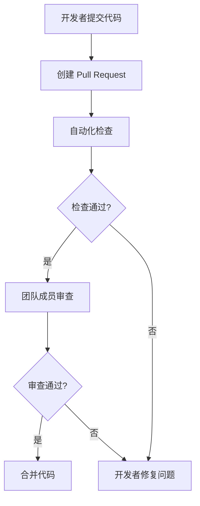

# Git 与代码审查工具

在现代软件开发中，Git 是最常用的版本控制系统之一，而代码审查工具则是确保代码质量的重要环节。本文将介绍如何将 Git 与代码审查工具结合使用，帮助初学者理解这一过程，并通过实际案例展示其应用。

## 什么是代码审查？

代码审查（Code Review）是软件开发中的一个重要环节，旨在通过团队成员之间的协作，发现代码中的潜在问题，提升代码质量。代码审查工具可以帮助团队更高效地完成这一过程，通常与 Git 集成，以便在代码提交时自动触发审查流程。

## Git 与代码审查工具的集成

Git 本身并不直接提供代码审查功能，但可以通过与第三方工具（如 GitHub、GitLab、Bitbucket 等）集成来实现。这些工具通常提供 Pull Request（PR）或 Merge Request（MR）功能，允许开发者在合并代码之前进行审查。

### 1. 创建 Pull Request

在 Git 中，Pull Request 是代码审查的核心机制。以下是一个简单的流程：

1. 开发者在本地完成代码修改并提交到 Git 仓库。
2. 将本地分支推送到远程仓库。
3. 在远程仓库中创建一个 Pull Request，请求将代码合并到主分支。

```bash
# 示例：创建并推送分支
git checkout -b feature-branch
git add .
git commit -m "Add new feature"
git push origin feature-branch
```

### 2. 代码审查流程

创建 Pull Request 后，团队成员可以在工具中查看代码变更，并留下评论或建议。以下是一个典型的代码审查流程：

1. 团队成员查看 Pull Request 中的代码变更。
2. 对代码进行评论，指出潜在问题或改进建议。
3. 开发者根据反馈修改代码，并重新提交。
4. 审查通过后，代码被合并到主分支。

:::tip
在代码审查过程中，尽量保持评论具体且具有建设性，避免模糊的反馈。
:::

### 3. 自动化代码审查

许多代码审查工具支持自动化检查，例如静态代码分析、单元测试等。这些检查可以在 Pull Request 创建时自动运行，帮助团队更快地发现问题。



## 实际案例

假设你正在开发一个简单的计算器应用，并希望添加一个新的功能：计算两个数的乘积。以下是如何使用 Git 和代码审查工具完成这一任务的示例。

### 1. 创建分支并开发功能

```bash
git checkout -b multiply-feature
# 编写代码并提交
git add .
git commit -m "Add multiply function"
git push origin multiply-feature
```

### 2. 创建 Pull Request

在 GitHub 或 GitLab 中，创建一个 Pull Request，描述你的变更：

```
Title: Add multiply function
Description: This PR adds a new function to calculate the product of two numbers.
```

### 3. 代码审查

团队成员在 Pull Request 中查看代码，并留下评论：

```plaintext
Comment: 请确保在函数中添加输入验证，避免除以零的情况。
```

### 4. 修改代码并重新提交

根据反馈，你修改代码并重新提交：

```bash
git add .
git commit -m "Add input validation"
git push origin multiply-feature
```

### 5. 合并代码

审查通过后，代码被合并到主分支，功能正式上线。

## 总结

通过将 Git 与代码审查工具结合使用，团队可以更高效地协作，确保代码质量。本文介绍了代码审查的基本概念、Git 与代码审查工具的集成流程，并通过实际案例展示了这一过程的应用。

## 附加资源

- [Git 官方文档](https://git-scm.com/doc)
- [GitHub Pull Request 指南](https://docs.github.com/en/pull-requests)
- [GitLab Merge Request 指南](https://docs.gitlab.com/ee/user/project/merge_requests/)

## 练习

1. 在 GitHub 或 GitLab 上创建一个新的仓库，尝试使用 Pull Request 进行代码审查。
2. 为你的项目添加一个简单的功能，并使用代码审查工具完成审查流程。
