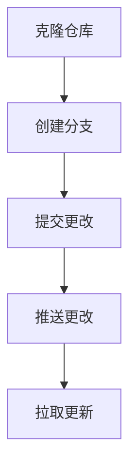

# Git 与Eclipse集成

在现代软件开发中，版本控制是一个不可或缺的工具。Git 是目前最流行的分布式版本控制系统，而 Eclipse 是一个广泛使用的集成开发环境（IDE）。将 Git 与 Eclipse 集成，可以让你在开发过程中轻松管理代码版本，提高工作效率。本文将详细介绍如何在 Eclipse 中集成 Git，并通过实际案例展示其应用场景。

## 什么是 Git 与 Eclipse 集成？

Git 与 Eclipse 集成是指在 Eclipse IDE 中直接使用 Git 进行版本控制操作。通过集成，你可以在 Eclipse 中执行诸如克隆仓库、提交更改、推送代码、拉取更新等操作，而无需离开开发环境。这种集成不仅简化了开发流程，还减少了在不同工具之间切换的时间。

## 在 Eclipse 中安装 Git 插件

在开始之前，你需要确保 Eclipse 中已经安装了 Git 插件。大多数现代版本的 Eclipse 已经默认包含了 Git 插件（EGit）。如果你使用的是较旧的版本，可以通过以下步骤手动安装：

1. 打开 Eclipse。
2. 导航到 `Help` > `Eclipse Marketplace`。
3. 在搜索框中输入 `EGit`，然后点击 `Go`。
4. 找到 `EGit - Git Team Provider`，点击 `Install` 按钮。
5. 按照提示完成安装过程。

安装完成后，重启 Eclipse 以使插件生效。

## 配置 Git 仓库

在 Eclipse 中使用 Git 之前，你需要配置一个 Git 仓库。你可以选择克隆一个现有的远程仓库，或者将本地项目初始化为一个新的 Git 仓库。

### 克隆远程仓库

1. 打开 Eclipse，导航到 `File` > `Import`。
2. 在弹出的对话框中，选择 `Git` > `Projects from Git`，然后点击 `Next`。
3. 选择 `Clone URI`，然后点击 `Next`。
4. 输入远程仓库的 URI、用户名和密码，然后点击 `Next`。
5. 选择要克隆的分支，然后点击 `Next`。
6. 选择本地存储路径，然后点击 `Finish`。

### 初始化本地项目为 Git 仓库

如果你已经有一个本地项目，可以将其初始化为 Git 仓库：

1. 在 Eclipse 的 `Package Explorer` 视图中，右键点击项目。
2. 选择 `Team` > `Share Project`。
3. 在弹出的对话框中，选择 `Git`，然后点击 `Next`。
4. 选择 `Use or create repository in parent folder of project`，然后点击 `Finish`。

## 基本 Git 操作

### 提交更改

在 Eclipse 中，你可以轻松地提交代码更改：

1. 在 `Package Explorer` 视图中，右键点击项目或文件。
2. 选择 `Team` > `Commit`。
3. 在弹出的对话框中，输入提交信息，然后点击 `Commit`。

### 推送更改

提交更改后，你可以将本地更改推送到远程仓库：

1. 在 `Package Explorer` 视图中，右键点击项目。
2. 选择 `Team` > `Push to Upstream`。

### 拉取更新

要从远程仓库拉取最新的更改：

1. 在 `Package Explorer` 视图中，右键点击项目。
2. 选择 `Team` > `Pull`。

## 实际案例

假设你正在开发一个 Java 项目，并且需要与团队成员协作。以下是一个典型的工作流程：

1. **克隆仓库**：你从远程仓库克隆项目到本地。
2. **创建分支**：你创建一个新的分支来开发新功能。
3. **提交更改**：你在本地进行开发，并定期提交更改。
4. **推送更改**：你将本地更改推送到远程仓库。
5. **拉取更新**：你从远程仓库拉取其他团队成员的更改，并解决可能的冲突。

## 总结

通过将 Git 与 Eclipse 集成，你可以在开发过程中轻松管理代码版本，提高工作效率。本文介绍了如何在 Eclipse 中安装 Git 插件、配置 Git 仓库以及执行基本的 Git 操作。我们还通过一个实际案例展示了 Git 与 Eclipse 集成的典型工作流程。

## 附加资源与练习

- **练习**：尝试在 Eclipse 中克隆一个开源项目，并进行一些简单的更改和提交。
- **资源**：阅读 [EGit 官方文档](https://wiki.eclipse.org/EGit/User_Guide) 以了解更多高级功能。

:::tip
如果你在使用过程中遇到问题，可以查看 Eclipse 的 `Error Log` 视图，或者参考 EGit 的官方文档。
:::

:::caution
在推送更改之前，请确保你已经拉取了最新的远程更改，以避免冲突。
:::