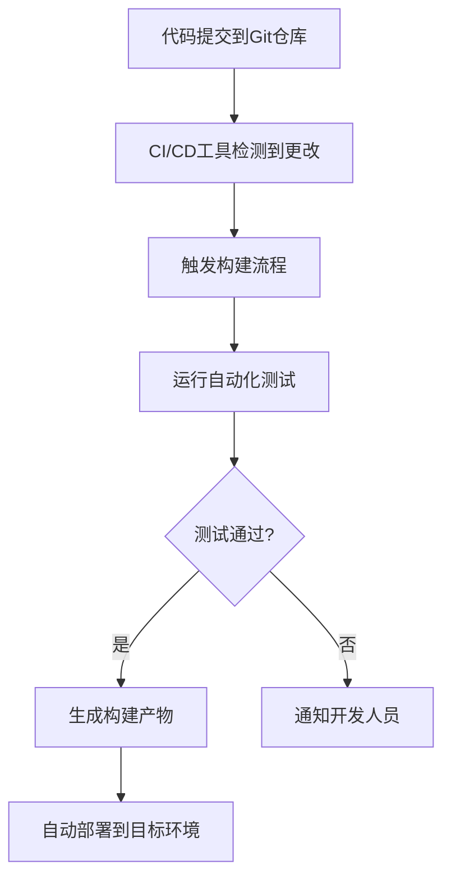

# Git 与CI/CD集成

在现代软件开发中，持续集成（Continuous Integration, CI）和持续交付（Continuous Delivery, CD）是至关重要的实践。它们帮助团队更快地交付高质量的软件，同时减少手动错误。Git作为最流行的版本控制系统，与CI/CD工具的集成是实现这些实践的关键。

## 什么是CI/CD？

持续集成（CI）是指开发人员频繁地将代码更改合并到主分支中，并通过自动化构建和测试来验证这些更改。持续交付（CD）则是在CI的基础上，进一步自动化部署过程，确保代码可以随时部署到生产环境。

通过将Git与CI/CD工具集成，团队可以在每次代码提交时自动触发构建、测试和部署流程，从而确保代码的质量和一致性。

## Git 与CI/CD集成的基本流程

以下是Git与CI/CD集成的基本流程：

1. **代码提交**：开发人员将代码更改推送到Git仓库。
2. **触发构建**：CI/CD工具检测到代码更改，并自动触发构建流程。
3. **运行测试**：构建过程中，自动化测试会被执行以验证代码的正确性。
4. **生成构建产物**：如果测试通过，构建产物（如可执行文件、Docker镜像等）会被生成。
5. **部署**：构建产物被自动部署到目标环境（如测试环境、预生产环境或生产环境）。



## 实际案例：Git与GitHub Actions集成

GitHub Actions是GitHub提供的一个CI/CD工具，它可以与Git仓库无缝集成。以下是一个简单的示例，展示如何使用GitHub Actions在每次代码提交时自动运行测试。

### 1. 创建GitHub Actions工作流文件

在Git仓库的根目录下创建一个名为 `.github/workflows/ci.yml` 的文件，内容如下：

```yaml
name: CI

on:
  push:
    branches:
      - main
  pull_request:
    branches:
      - main

jobs:
  build:
    runs-on: ubuntu-latest

    steps:
    - uses: actions/checkout@v2

    - name: Set up Node.js
      uses: actions/setup-node@v2
      with:
        node-version: '14'

    - name: Install dependencies
      run: npm install

    - name: Run tests
      run: npm test
```

### 2. 解释工作流文件

- **`on`**：定义了触发工作流的事件。在这个例子中，工作流会在 `main` 分支的 `push` 或 `pull_request` 事件时触发。
- **`jobs`**：定义了工作流中的任务。`build` 是任务的名称，`runs-on` 指定了运行环境。
- **`steps`**：定义了任务的步骤。在这个例子中，步骤包括检出代码、设置Node.js环境、安装依赖和运行测试。

### 3. 提交代码并观察结果

当你将代码推送到 `main` 分支或创建一个拉取请求时，GitHub Actions会自动运行定义的工作流。你可以在GitHub的“Actions”选项卡中查看工作流的执行结果。

:::tip
你可以根据需要扩展这个工作流，例如添加代码格式化检查、构建Docker镜像、部署到云平台等。
:::

## 总结

通过将Git与CI/CD工具集成，团队可以实现自动化构建、测试和部署，从而提高开发效率和代码质量。GitHub Actions是一个强大的工具，可以帮助你轻松实现这一目标。

## 附加资源

- [GitHub Actions官方文档](https://docs.github.com/en/actions)
- [Jenkins CI/CD教程](https://www.jenkins.io/doc/tutorials/)
- [GitLab CI/CD文档](https://docs.gitlab.com/ee/ci/)

## 练习

1. 在你的GitHub仓库中创建一个简单的Node.js项目，并配置GitHub Actions工作流以在每次提交时运行测试。
2. 尝试扩展工作流，使其在测试通过后自动构建并推送Docker镜像到Docker Hub。

通过完成这些练习，你将更好地理解Git与CI/CD集成的实际应用。