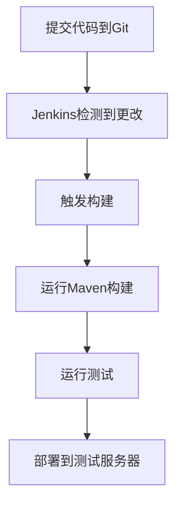

# Git 与Jenkins集成

在现代软件开发中，持续集成（CI）是一个至关重要的实践。它允许开发团队频繁地将代码更改集成到共享存储库中，并通过自动化构建和测试来验证这些更改。Git作为最流行的版本控制系统，与Jenkins这样的持续集成工具集成，可以极大地提高开发效率和代码质量。

本文将逐步介绍如何将Git与Jenkins集成，并通过实际案例展示其应用场景。

## 什么是Git与Jenkins集成？

Git与Jenkins集成是指将Git存储库与Jenkins服务器连接起来，以便在代码提交时自动触发构建和测试过程。这种集成可以帮助开发团队快速发现和修复问题，确保代码库的稳定性。

## 准备工作

在开始之前，请确保你已经具备以下条件：

1. **Git存储库**：一个包含代码的Git存储库。
2. **Jenkins服务器**：一个已安装并配置好的Jenkins服务器。
3. **Jenkins插件**：确保已安装Git插件和Pipeline插件。

## 步骤1：在Jenkins中配置Git

1. **登录Jenkins**：打开Jenkins控制台并登录。
2. **创建新任务**：点击“新建任务”，输入任务名称，并选择“构建一个自由风格的软件项目”。
3. **配置Git**：
   - 在“源码管理”部分，选择“Git”。
   - 输入你的Git存储库URL。
   - 如果需要认证，配置相应的凭据。

```plaintext
Repository URL: https://github.com/yourusername/your-repo.git
Credentials: [选择或添加你的Git凭据]
```

4. **配置构建触发器**：
   - 在“构建触发器”部分，选择“GitHub hook trigger for GITScm polling”或“Poll SCM”以定期检查代码更改。

## 步骤2：创建Jenkinsfile

Jenkinsfile是一个文本文件，定义了Jenkins Pipeline的步骤。它通常存储在Git存储库的根目录中。

```groovy
pipeline {
    agent any

    stages {
        stage('Build') {
            steps {
                echo 'Building...'
                sh 'mvn clean package'
            }
        }
        stage('Test') {
            steps {
                echo 'Testing...'
                sh 'mvn test'
            }
        }
        stage('Deploy') {
            steps {
                echo 'Deploying...'
                sh 'mvn deploy'
            }
        }
    }
}
```

## 步骤3：触发构建

1. **提交代码**：将Jenkinsfile提交到Git存储库。
2. **触发构建**：Jenkins会自动检测到代码更改并触发构建过程。

## 实际案例

假设你正在开发一个Java Web应用程序，并使用Maven进行构建。通过将Git与Jenkins集成，你可以在每次提交代码时自动运行以下步骤：

1. **构建**：使用Maven编译代码。
2. **测试**：运行单元测试和集成测试。
3. **部署**：将构建的应用程序部署到测试服务器。



## 总结

通过将Git与Jenkins集成，你可以实现自动化构建和持续集成，从而提高开发效率和代码质量。本文介绍了如何配置Jenkins以连接到Git存储库，并创建Jenkinsfile来定义构建过程。我们还通过一个实际案例展示了这种集成的应用场景。

## 附加资源

- [Jenkins官方文档](https://www.jenkins.io/doc/)
- [Git官方文档](https://git-scm.com/doc)
- [Maven官方文档](https://maven.apache.org/guides/)

## 练习

1. 在你的Jenkins服务器上配置一个Git存储库，并创建一个简单的Jenkinsfile。
2. 尝试在Jenkinsfile中添加一个新的阶段，例如静态代码分析。
3. 配置Jenkins以在构建失败时发送通知。

通过完成这些练习，你将更深入地理解Git与Jenkins集成的强大功能。