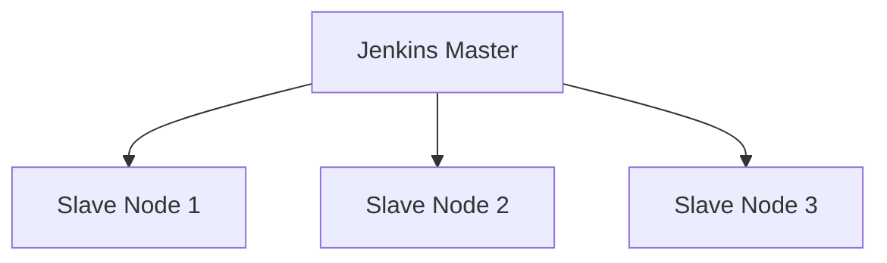

# Jenkins 简介

Jenkins是一个开源的自动化服务器，广泛用于实现持续集成（CI）和持续交付（CD）。它通过自动化构建、测试和部署流程，帮助开发团队更快、更可靠地交付软件。Jenkins的强大之处在于其丰富的插件生态系统，支持与各种工具和技术的集成。

## 什么是持续集成（CI）？

持续集成是一种软件开发实践，开发人员频繁地将代码变更集成到共享的主干（通常是版本控制系统中的主分支）。每次集成都会触发自动化构建和测试，以确保代码的质量和稳定性。

Jenkins作为CI工具的核心，能够自动执行以下任务：
- 从版本控制系统中拉取代码。
- 运行构建脚本（如编译代码）。
- 执行自动化测试。
- 生成构建报告。
- 部署构建结果到目标环境。

## Jenkins 的核心功能

1. **自动化构建**：Jenkins可以配置为在代码提交时自动触发构建任务。
2. **插件支持**：Jenkins拥有超过1500个插件，支持与Git、Docker、Maven、Gradle等工具的集成。
3. **分布式构建**：Jenkins支持在多台机器上并行执行构建任务，以提高效率。
4. **可扩展性**：通过插件和自定义脚本，Jenkins可以适应各种复杂的构建和部署需求。

## Jenkins 的实际应用场景

### 场景1：自动化构建和测试

假设你正在开发一个Java项目，使用Maven作为构建工具。你可以配置Jenkins在每次代码提交到Git仓库时，自动执行以下步骤：
1. 拉取最新代码。
2. 运行 `mvn clean install` 命令进行构建。
3. 执行单元测试。
4. 生成测试报告。

以下是一个简单的Jenkinsfile示例，用于定义上述流程：

```groovy
pipeline {
    agent any
    stages {
        stage('Build') {
            steps {
                sh 'mvn clean install'
            }
        }
        stage('Test') {
            steps {
                sh 'mvn test'
            }
        }
        stage('Report') {
            steps {
                junit 'target/surefire-reports/*.xml'
            }
        }
    }
}
```

### 场景2：持续交付

Jenkins不仅可以用于持续集成，还可以用于持续交付。例如，你可以配置Jenkins在构建成功后，自动将应用程序部署到测试环境或生产环境。

以下是一个简单的部署阶段示例：

```groovy
stage('Deploy') {
    steps {
        sh 'scp target/myapp.jar user@test-server:/opt/myapp/'
        sh 'ssh user@test-server "systemctl restart myapp"'
    }
}
```

## Jenkins 的架构

Jenkins采用主从架构（Master-Slave），主节点负责调度任务，从节点负责执行任务。这种架构可以有效地分配资源，提高构建效率。



## 总结

Jenkins是一个功能强大的自动化工具，能够显著提高软件开发的效率和质量。通过自动化构建、测试和部署流程，Jenkins帮助团队更快地交付高质量的软件。对于初学者来说，掌握Jenkins的基本概念和使用方法，是迈向高效开发的重要一步。

:::tip 提示
如果你想深入学习Jenkins，可以尝试以下练习：
1. 在本地安装Jenkins并配置一个简单的构建任务。
2. 尝试使用Jenkinsfile定义流水线任务。
3. 探索Jenkins插件市场，安装并配置一个你感兴趣的插件。
:::

:::note 附加资源
- [Jenkins官方文档](https://www.jenkins.io/doc/)
- [Jenkins插件市场](https://plugins.jenkins.io/)
- [Jenkins入门教程](https://www.jenkins.io/doc/tutorials/)
:::