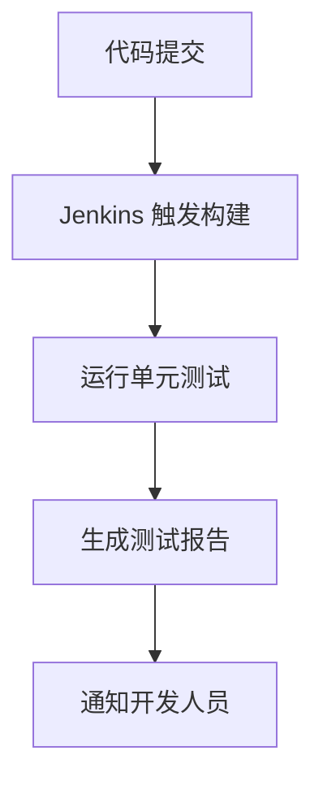
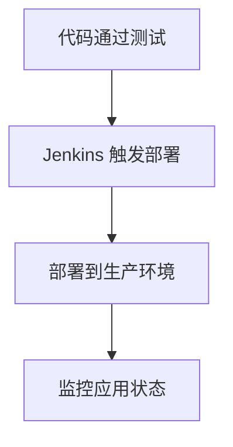

## 介绍

Jenkins 是一个开源的自动化服务器，广泛用于持续集成和持续交付（CI/CD）的软件开发流程中。它帮助开发团队自动化构建、测试和部署软件，从而提高开发效率和软件质量。Jenkins 的历史可以追溯到2004年，它的发展历程反映了现代软件开发工具和流程的演变。

## Jenkins 的起源

Jenkins 最初是由 Kohsuke Kawaguchi 在 Sun Microsystems 工作时开发的，当时它的名字是 **Hudson**。Hudson 是一个用于自动化构建和测试 Java 项目的工具。随着 Hudson 的流行，Kohsuke 决定将其开源，并在2005年发布了第一个版本。

:::note
**Hudson 与 Jenkins 的分裂**  
在2011年，由于 Hudson 项目的商标争议，Kohsuke 和社区决定将项目重命名为 **Jenkins**。从那时起，Jenkins 和 Hudson 成为了两个独立的分支，但 Jenkins 逐渐成为了主流。
:::

## Jenkins 的发展历程

### 1. 早期版本（2005-2010）

在早期版本中，Jenkins 主要专注于 Java 项目的构建和测试。它通过插件系统扩展功能，允许用户根据需要添加新的功能。Jenkins 的插件生态系统是其成功的关键因素之一。

### 2. 持续集成与持续交付（2010-2015）

随着敏捷开发和 DevOps 的兴起，Jenkins 逐渐演变为一个支持持续集成（CI）和持续交付（CD）的工具。它开始支持更多的编程语言和框架，并引入了流水线（Pipeline）功能，允许用户通过代码定义整个构建和部署流程。

```groovy
pipeline {
    agent any
    stages {
        stage('Build') {
            steps {
                echo 'Building...'
            }
        }
        stage('Test') {
            steps {
                echo 'Testing...'
            }
        }
        stage('Deploy') {
            steps {
                echo 'Deploying...'
            }
        }
    }
}
```

### 3. 现代 Jenkins（2015-至今）

近年来，Jenkins 进一步扩展了其功能，支持容器化部署（如 Docker）和云原生应用。Jenkins X 的推出更是将 Jenkins 带入了 Kubernetes 和云原生时代，使其成为现代 DevOps 工具链中的重要一环。

:::tip
**Jenkins X**  
Jenkins X 是一个专为 Kubernetes 设计的 CI/CD 解决方案，它简化了云原生应用的构建和部署流程。
:::

## Jenkins 的实际应用场景

### 1. 持续集成

在持续集成中，Jenkins 可以自动构建和测试代码库中的每一次提交。例如，当一个开发人员提交代码时，Jenkins 会自动触发构建过程，运行单元测试，并生成报告。



### 2. 持续交付

在持续交付中，Jenkins 可以自动化部署流程，将经过测试的代码部署到生产环境。例如，Jenkins 可以配置为在代码通过所有测试后，自动将其部署到云服务器或 Kubernetes 集群中。



## 总结

Jenkins 从最初的 Hudson 项目发展至今，已经成为现代软件开发中不可或缺的工具。它的灵活性和强大的插件生态系统使其能够适应各种开发需求。无论是传统的持续集成，还是现代的云原生应用部署，Jenkins 都提供了强大的支持。

## 附加资源与练习

- **官方文档**: [Jenkins 官方文档](https://www.jenkins.io/doc/)
- **练习**: 尝试在你的本地环境中安装 Jenkins，并配置一个简单的构建流水线。

:::caution
**注意**: 在安装 Jenkins 时，请确保你的系统满足最低要求，并遵循官方安装指南。
:::