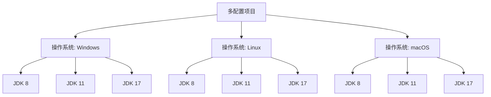

# Jenkins 多配置项目

Jenkins多配置项目（Multi-configuration Project），也称为矩阵项目（Matrix Project），是一种强大的构建类型，允许你在多个配置组合下运行相同的构建任务。它特别适用于需要在不同环境、平台或参数组合下测试代码的场景。

## 什么是Jenkins多配置项目？

Jenkins多配置项目允许你定义一个构建任务，并在多个维度上并行执行。这些维度可以是操作系统、JDK版本、浏览器类型、数据库类型等。通过这种方式，你可以轻松地在不同的配置组合下测试你的代码，确保其兼容性和稳定性。

### 多配置项目的核心概念

1. **轴（Axis）**：轴是多配置项目中的一个维度。每个轴代表一个变量，例如操作系统、JDK版本等。
2. **组合（Combination）**：每个轴的值可以与其他轴的值组合，形成一个配置组合。Jenkins会为每个组合运行一次构建任务。
3. **并行执行**：Jenkins可以并行执行多个配置组合的构建任务，从而加快构建速度。

## 如何创建多配置项目

### 1. 创建多配置项目

在Jenkins中，点击“新建任务”，然后选择“构建一个多配置项目”。输入项目名称并点击“确定”。

### 2. 配置轴

在项目配置页面，找到“配置矩阵”部分。你可以在这里添加多个轴。例如：

- **操作系统**：Windows、Linux、macOS
- **JDK版本**：JDK 8、JDK 11、JDK 17
- **浏览器**：Chrome、Firefox、Safari

### 3. 配置构建步骤

在“构建”部分，添加你需要的构建步骤。例如，你可以添加一个Shell脚本或Windows批处理命令来运行测试。

```bash
echo "Running tests on ${OS} with ${JDK_VERSION} and ${BROWSER}"
```

### 4. 保存并运行

保存配置后，点击“立即构建”来运行多配置项目。Jenkins会为每个配置组合生成一个独立的构建任务。

## 实际案例

假设你正在开发一个跨平台的Java应用程序，并希望在不同的操作系统和JDK版本上测试其兼容性。你可以创建一个多配置项目，定义以下轴：

- **操作系统**：Windows、Linux、macOS
- **JDK版本**：JDK 8、JDK 11、JDK 17

Jenkins会为每个操作系统和JDK版本的组合运行一次构建任务，确保你的应用程序在所有目标环境中都能正常运行。



## 总结

Jenkins多配置项目是一种强大的工具，特别适合需要在多个配置组合下测试代码的场景。通过定义多个轴，你可以轻松地在不同的环境中运行构建任务，确保代码的兼容性和稳定性。

:::tip
**提示**：在实际项目中，你可以结合Jenkins的插件（如Git插件、Maven插件等）来进一步增强多配置项目的功能。
:::

## 附加资源

- [Jenkins官方文档](https://www.jenkins.io/doc/)
- [Jenkins多配置项目教程](https://www.jenkins.io/doc/book/pipeline/multibranch/)

## 练习

1. 创建一个多配置项目，定义两个轴：操作系统（Windows、Linux）和JDK版本（JDK 8、JDK 11）。
2. 在构建步骤中添加一个Shell脚本，输出当前的操作系统和JDK版本。
3. 运行多配置项目，观察每个配置组合的构建结果。

通过完成这些练习，你将更好地理解Jenkins多配置项目的概念和应用。