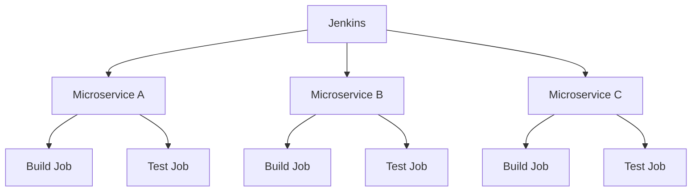

# Jenkins 文件夹项目

Jenkins是一个广泛使用的持续集成和持续交付（CI/CD）工具，它允许开发团队自动化构建、测试和部署流程。随着项目规模的扩大，Jenkins中的任务数量可能会迅速增加，导致管理变得复杂。为了解决这个问题，Jenkins引入了**文件夹项目**的概念。

## 什么是Jenkins文件夹项目？

Jenkins文件夹项目是一种用于组织和分类Jenkins任务的机制。它允许你将相关的任务分组到一个文件夹中，从而简化任务的管理和导航。文件夹项目不仅可以包含任务，还可以包含其他文件夹，形成一个层次化的结构。

:::tip
使用文件夹项目可以帮助你更好地组织任务，特别是在处理多个项目或团队时。
:::

## 为什么使用Jenkins文件夹项目？

1. **任务组织**：通过将相关的任务分组到一个文件夹中，你可以更轻松地找到和管理它们。
2. **权限管理**：文件夹项目支持细粒度的权限控制，允许你为不同的团队或项目设置不同的访问权限。
3. **可扩展性**：随着项目数量的增加，文件夹项目可以帮助你保持任务的结构化，避免混乱。
4. **共享配置**：你可以在文件夹级别共享配置，减少重复设置。

## 创建Jenkins文件夹项目

### 步骤1：登录Jenkins

首先，登录到你的Jenkins实例。

### 步骤2：创建文件夹

1. 在Jenkins主界面，点击左侧的**新建任务**。
2. 在任务名称输入框中，输入文件夹的名称，例如 `MyFolder`。
3. 选择**文件夹**作为任务类型，然后点击**确定**。

### 步骤3：配置文件夹

在文件夹的配置页面，你可以设置文件夹的描述、权限和其他选项。完成后，点击**保存**。

:::note
你可以在文件夹中创建子文件夹，以进一步组织任务。
:::

## 在文件夹中创建任务

### 步骤1：进入文件夹

点击你刚刚创建的文件夹，进入文件夹的页面。

### 步骤2：创建任务

1. 在文件夹页面，点击**新建任务**。
2. 输入任务名称，例如 `MyJob`。
3. 选择任务类型（例如**自由风格项目**），然后点击**确定**。

### 步骤3：配置任务

在任务配置页面，设置任务的构建步骤、触发器和其他选项。完成后，点击**保存**。

## 实际案例

假设你正在管理一个包含多个微服务的项目。每个微服务都有自己的构建和测试任务。你可以为每个微服务创建一个文件夹，并在其中放置相关的任务。

在这个例子中，每个微服务的构建和测试任务都被组织在各自的文件夹中，使得管理更加清晰和高效。

## 总结

Jenkins文件夹项目是一个强大的工具，可以帮助你更好地组织和管理Jenkins任务。通过将相关的任务分组到文件夹中，你可以提高任务的可维护性和可扩展性，特别是在处理多个项目或团队时。

## 附加资源

- [Jenkins官方文档](https://www.jenkins.io/doc/)
- [Jenkins文件夹项目教程](https://www.jenkins.io/doc/book/pipeline/folders/)

## 练习

1. 在Jenkins中创建一个文件夹，并在其中添加一个构建任务。
2. 尝试在文件夹中创建子文件夹，并添加多个任务。
3. 为不同的文件夹设置不同的权限，并测试权限控制的效果。

通过完成这些练习，你将更好地理解Jenkins文件夹项目的使用方法和优势。