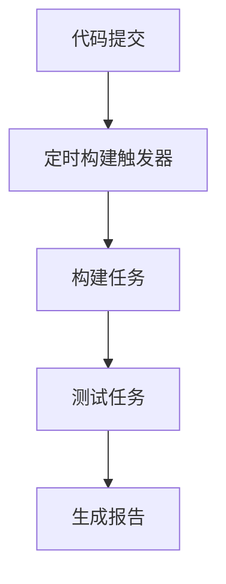

# Jenkins 定时构建

Jenkins是一个广泛使用的持续集成和持续交付（CI/CD）工具，它可以帮助开发团队自动化构建、测试和部署过程。定时构建是Jenkins中的一个重要功能，它允许你按照预定的时间表自动触发构建任务。这对于需要在特定时间执行的任务（如夜间构建、每日构建或每周构建）非常有用。

## 什么是定时构建？

定时构建是指在Jenkins中配置一个任务，使其在指定的时间或时间间隔内自动触发构建。这种构建方式通常用于定期检查代码库的更新、运行测试套件或生成报告。通过定时构建，团队可以确保代码库的稳定性和可靠性，而无需手动干预。

## 如何配置定时构建

在Jenkins中配置定时构建非常简单。你只需要在任务的配置页面中设置一个定时触发器即可。定时触发器的配置使用Cron表达式来定义时间表。

### Cron表达式

Cron表达式是一个字符串，由6或7个字段组成，分别表示秒、分钟、小时、日期、月份、星期和（可选的）年份。Jenkins使用的是简化版的Cron表达式，只包含5个字段：分钟、小时、日期、月份和星期。

以下是一个Cron表达式的示例：

```
H/15 * * * *
```

这个表达式表示每15分钟触发一次构建。`H`表示“哈希”，用于在多个任务之间分散负载，避免所有任务同时触发。

### 配置步骤

1. 打开Jenkins并导航到你的任务页面。
2. 点击“配置”以编辑任务配置。
3. 在“构建触发器”部分，勾选“定时构建”。
4. 在“定时构建”字段中输入Cron表达式。
5. 保存配置。

### 示例

假设你希望每天凌晨2点触发构建，可以使用以下Cron表达式：

```
0 2 * * *
```

这个表达式表示每天的第2小时的第0分钟触发构建。

## 实际应用场景

### 场景1：夜间构建

许多团队会在夜间执行构建和测试，以便在第二天早上查看结果。通过配置定时构建，你可以在每天凌晨2点自动触发构建任务，确保代码库的稳定性。



### 场景2：每日构建

每日构建是指在每天固定的时间执行构建任务。这对于需要频繁检查代码库更新的团队非常有用。你可以配置一个Cron表达式，例如 `0 8 * * *`，表示每天上午8点触发构建。

### 场景3：每周构建

每周构建通常用于在每周的特定时间执行构建任务。例如，你可以配置一个Cron表达式 `0 12 * * 1`，表示每周一的12点触发构建。

## 总结

Jenkins的定时构建功能为开发团队提供了一种自动化构建和测试的方式。通过配置Cron表达式，你可以轻松地设置定时触发器，确保代码库的稳定性和可靠性。无论是夜间构建、每日构建还是每周构建，定时构建都能帮助你节省时间并提高效率。

## 附加资源

- [Jenkins官方文档](https://www.jenkins.io/doc/)
- [Cron表达式生成器](https://crontab.guru/)

## 练习

1. 在Jenkins中创建一个新的任务，并配置一个每天上午10点触发的定时构建。
2. 尝试使用不同的Cron表达式，观察构建任务的触发时间。
3. 配置一个每周五下午5点触发的定时构建，并验证其是否按预期工作。

通过以上练习，你将更好地理解Jenkins定时构建的工作原理，并能够在实际项目中应用这一功能。