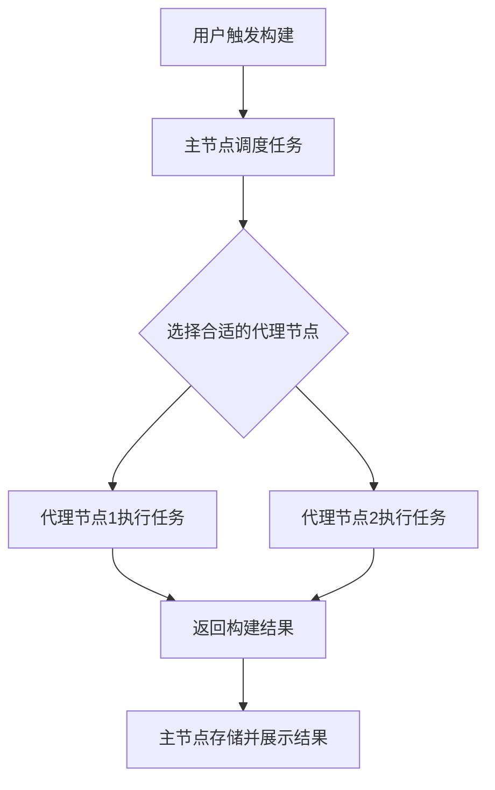

# Jenkins 分布式构建

Jenkins是一个广泛使用的持续集成和持续交付（CI/CD）工具，它能够自动化构建、测试和部署过程。随着项目规模的扩大，单台服务器的构建能力可能无法满足需求。这时，**分布式构建**就成为了一个重要的解决方案。本文将详细介绍Jenkins分布式构建的概念、工作原理以及如何在实际项目中应用。

## 什么是分布式构建？

分布式构建是指将构建任务分配到多台机器上执行，而不是仅仅依赖单台Jenkins服务器。通过这种方式，可以显著提高构建效率，尤其是在大型项目中，构建任务可能需要大量的计算资源。

Jenkins的分布式构建通过**主节点（Master）**和**代理节点（Agent）**来实现。主节点负责调度任务，而代理节点负责执行具体的构建任务。

## 分布式构建的工作原理

Jenkins的分布式构建系统由以下几个关键组件组成：

1. **主节点（Master）**：负责管理任务调度、监控构建状态以及存储构建结果。
2. **代理节点（Agent）**：负责执行具体的构建任务。代理节点可以是物理机、虚拟机或容器。
3. **连接方式**：主节点和代理节点之间通过SSH、JNLP（Java Network Launch Protocol）或其他协议进行通信。

### 分布式构建的流程

1. **任务调度**：当用户触发一个构建任务时，主节点会根据配置的规则将任务分配给合适的代理节点。
2. **任务执行**：代理节点接收到任务后，开始执行构建脚本、运行测试等操作。
3. **结果反馈**：代理节点将构建结果返回给主节点，主节点将结果存储并展示给用户。



## 如何配置分布式构建

### 1. 添加代理节点

在Jenkins中，添加代理节点的步骤如下：

1. 进入Jenkins管理界面，点击 **Manage Jenkins** > **Manage Nodes and Clouds**。
2. 点击 **New Node**，输入节点名称并选择 **Permanent Agent**。
3. 配置节点的详细信息，如远程工作目录、启动方式（SSH、JNLP等）以及标签（用于任务调度）。
4. 保存配置后，Jenkins会自动生成连接命令或密钥，供代理节点使用。

### 2. 配置任务调度

在Jenkins任务配置中，可以通过以下方式指定任务在特定的代理节点上运行：

- **标签表达式**：在任务配置中，使用 `label` 参数指定代理节点的标签。例如，`label == 'linux'` 表示任务将在所有标签为 `linux` 的代理节点上运行。
- **限制并发构建**：可以限制同一时间在某个节点上运行的构建任务数量，以避免资源竞争。

```groovy
pipeline {
    agent {
        label 'linux'
    }
    stages {
        stage('Build') {
            steps {
                sh 'mvn clean install'
            }
        }
    }
}
```

## 实际应用场景

### 场景1：跨平台构建

假设你的项目需要在多个操作系统（如Windows、Linux和macOS）上进行构建和测试。通过分布式构建，你可以在不同的代理节点上配置不同的操作系统环境，并在任务中指定相应的标签来运行构建任务。

```groovy
pipeline {
    agent none
    stages {
        stage('Build on Linux') {
            agent {
                label 'linux'
            }
            steps {
                sh 'mvn clean install'
            }
        }
        stage('Build on Windows') {
            agent {
                label 'windows'
            }
            steps {
                bat 'mvn clean install'
            }
        }
    }
}
```

### 场景2：资源密集型任务

如果你的项目中有一些资源密集型的任务（如大规模测试或编译），可以将这些任务分配到具有更高性能的代理节点上运行，以避免影响其他任务的执行。

```groovy
pipeline {
    agent {
        label 'high-performance'
    }
    stages {
        stage('Run Tests') {
            steps {
                sh './run-tests.sh'
            }
        }
    }
}
```

## 总结

Jenkins分布式构建是一种强大的功能，能够显著提高构建效率，尤其是在大型项目中。通过合理配置主节点和代理节点，你可以轻松实现跨平台构建、资源优化等目标。

:::tip
在实际使用中，建议定期监控代理节点的状态，确保其正常运行。同时，合理分配任务标签，避免资源浪费。
:::

## 附加资源与练习

- **官方文档**：[Jenkins Distributed Builds](https://www.jenkins.io/doc/book/scaling/distributed-builds/)
- **练习**：尝试在你的Jenkins环境中配置一个代理节点，并创建一个跨平台的构建任务。

通过本文的学习，你应该已经掌握了Jenkins分布式构建的基本概念和配置方法。接下来，动手实践是巩固知识的最佳方式！