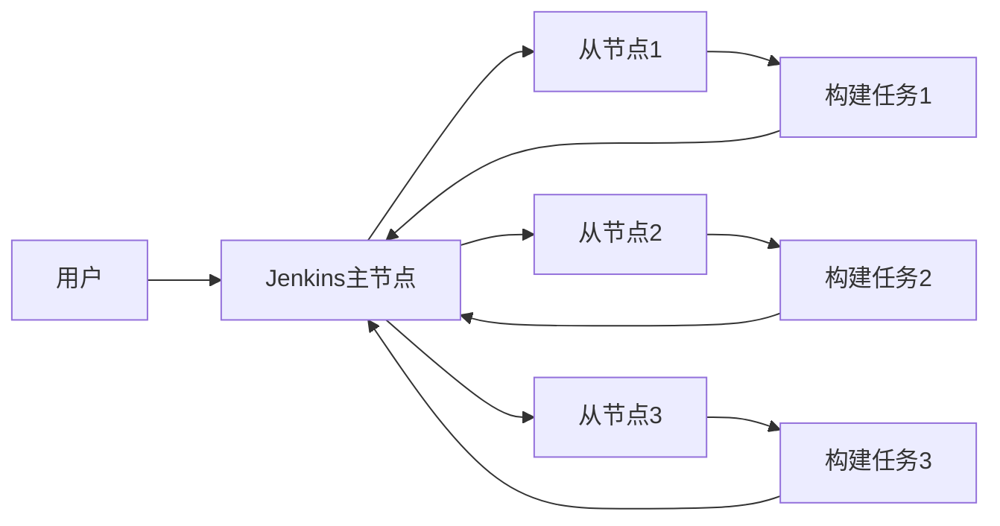

# Jenkins 主从架构

Jenkins是一个广泛使用的持续集成和持续交付（CI/CD）工具，它支持分布式构建，通过主从架构（Master-Slave Architecture）来实现。这种架构允许Jenkins将任务分配到多个节点（从节点）上执行，从而提高构建效率和资源利用率。

## 什么是Jenkins主从架构？

Jenkins主从架构是一种分布式构建模型，其中Jenkins主节点（Master）负责管理和调度任务，而从节点（Slave）负责执行这些任务。主节点通常负责以下工作：

- 管理Jenkins的配置和插件。
- 调度构建任务。
- 监控从节点的状态。
- 存储构建结果和历史记录。

从节点则是执行具体构建任务的机器，它们可以是物理机、虚拟机或容器。从节点可以运行在不同的操作系统上，并且可以根据需要动态添加或移除。

## 主从架构的工作原理

Jenkins主从架构的核心思想是将构建任务分发到多个从节点上执行，从而减轻主节点的负担。以下是主从架构的基本工作流程：

1. **任务调度**：当用户触发一个构建任务时，Jenkins主节点会根据配置的规则将任务分配给合适的从节点。
2. **任务执行**：从节点接收到任务后，开始执行构建脚本或命令。
3. **结果反馈**：从节点将构建结果反馈给主节点，主节点将结果存储并展示给用户。

## 配置Jenkins主从架构

要配置Jenkins主从架构，首先需要在Jenkins主节点上添加从节点。以下是配置步骤：

1. **登录Jenkins**：打开Jenkins控制台并登录。
2. **添加从节点**：在Jenkins控制台中，导航到“管理Jenkins” -> “管理节点和云” -> “新建节点”。
3. **配置从节点**：输入从节点的名称，选择“Permanent Agent”，然后点击“OK”。
4. **设置从节点属性**：在从节点的配置页面中，设置从节点的远程工作目录、标签、启动方式等。
5. **启动从节点**：根据配置的启动方式，启动从节点。例如，如果选择“Launch agent via Java Web Start”，则需要在从节点上运行提供的命令。

:::tip
确保从节点与主节点之间的网络连接畅通，并且从节点上安装了必要的构建工具（如JDK、Maven等）。
:::

## 实际应用场景

假设你有一个大型项目，需要在多个平台上进行构建和测试。使用Jenkins主从架构，你可以将构建任务分发到不同的从节点上执行，从而加快构建速度。例如：

- **从节点1**：运行在Linux上，负责编译和打包Java应用。
- **从节点2**：运行在Windows上，负责运行单元测试。
- **从节点3**：运行在macOS上，负责构建iOS应用。

通过这种方式，你可以充分利用不同平台的优势，同时提高构建效率。

## 总结

Jenkins主从架构是一种强大的分布式构建模型，能够显著提高构建效率和资源利用率。通过将任务分发到多个从节点上执行，Jenkins可以轻松应对大型项目的构建需求。

## 附加资源

- [Jenkins官方文档](https://www.jenkins.io/doc/)
- [Jenkins主从架构配置指南](https://www.jenkins.io/doc/book/scaling/adding-slaves/)
- [Jenkins从节点管理最佳实践](https://www.jenkins.io/doc/book/managing/nodes/)

## 练习

1. 在你的Jenkins实例中配置一个从节点，并运行一个简单的构建任务。
2. 尝试在不同的从节点上运行不同的构建任务，观察构建结果。
3. 研究如何动态添加和移除从节点，以适应不同的构建需求。

通过以上练习，你将更深入地理解Jenkins主从架构的工作原理和应用场景。