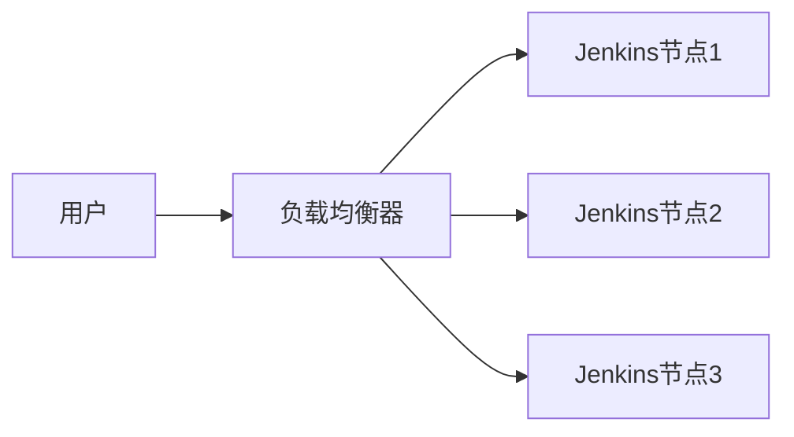

# Jenkins 高可用性

在现代软件开发中，持续集成和持续交付（CI/CD）是至关重要的。Jenkins作为最流行的CI/CD工具之一，其高可用性（High Availability, HA）配置是确保系统稳定性和可靠性的关键。本文将详细介绍如何实现Jenkins的高可用性，并通过实际案例展示其应用场景。

## 什么是Jenkins高可用性？

高可用性是指系统在出现故障时仍能继续运行的能力。对于Jenkins来说，高可用性意味着即使某个Jenkins节点或服务器出现故障，整个CI/CD流程也不会中断。这通常通过配置多个Jenkins节点、使用负载均衡器以及数据备份等方式来实现。

## 实现Jenkins高可用性的步骤

### 1. 配置多个Jenkins节点

首先，您需要配置多个Jenkins节点（也称为代理节点）。这些节点可以分布在不同的物理服务器或虚拟机上，以确保在某个节点出现故障时，其他节点可以接管任务。

```bash
# 添加一个新的Jenkins节点
1. 登录Jenkins主控台。
2. 导航到“管理Jenkins” > “管理节点和云”。
3. 点击“新建节点”。
4. 输入节点名称并选择“永久代理”。
5. 配置节点的远程工作目录、标签等。
6. 保存并启动节点。
```

### 2. 使用负载均衡器

为了确保请求能够均匀分配到各个Jenkins节点，您可以使用负载均衡器。负载均衡器可以根据节点的负载情况，将请求分发到最合适的节点。



### 3. 数据备份与恢复

Jenkins的高可用性还依赖于数据的备份与恢复。您需要定期备份Jenkins的主目录（通常是`JENKINS_HOME`），以便在出现故障时能够快速恢复。

```bash
# 备份Jenkins主目录
tar -czvf jenkins_backup.tar.gz /var/lib/jenkins
```

### 4. 配置故障转移

故障转移是指在某个节点出现故障时，系统能够自动将任务转移到其他节点。您可以通过配置Jenkins的“故障转移策略”来实现这一点。

```bash
# 配置故障转移策略
1. 登录Jenkins主控台。
2. 导航到“管理Jenkins” > “管理节点和云”。
3. 选择需要配置的节点。
4. 在“故障转移策略”中选择“自动故障转移”。
5. 保存配置。
```

## 实际案例

假设您有一个大型的软件开发团队，每天需要运行数百个构建任务。为了确保这些任务能够顺利完成，您配置了三个Jenkins节点，并使用负载均衡器将请求分发到这些节点。此外，您还定期备份Jenkins的主目录，并配置了故障转移策略。

某天，其中一个节点由于硬件故障而宕机。由于您已经配置了故障转移策略，负载均衡器自动将请求分发到其他两个节点，构建任务得以继续运行。同时，您使用备份数据快速恢复了故障节点，确保系统的高可用性。

## 总结

Jenkins的高可用性配置是确保CI/CD流程稳定运行的关键。通过配置多个节点、使用负载均衡器、定期备份数据以及配置故障转移策略，您可以大大提高Jenkins系统的可靠性和稳定性。

## 附加资源与练习

- **练习**：尝试在您的Jenkins环境中配置多个节点，并使用负载均衡器进行请求分发。
- **资源**：阅读Jenkins官方文档中关于高可用性的章节，了解更多高级配置选项。

:::tip
提示：在配置高可用性时，务必测试故障转移策略，确保在真实故障发生时系统能够正常运行。
:::