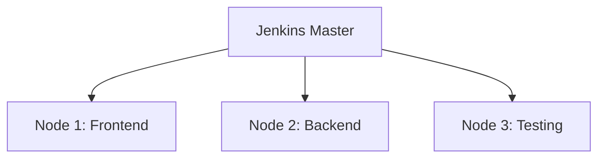

# Jenkins 负载均衡

在现代软件开发中，持续集成和持续交付（CI/CD）是至关重要的环节。Jenkins作为最流行的CI/CD工具之一，常常需要处理大量的构建任务。随着项目规模的扩大，单个Jenkins实例可能无法满足需求，这时就需要引入**负载均衡**来分担压力。

## 什么是Jenkins负载均衡？

负载均衡是一种将工作负载分配到多个计算资源（如服务器、节点等）的技术。在Jenkins中，负载均衡的主要目的是将构建任务分配到多个Jenkins节点（也称为代理节点），以避免单个节点过载，从而提高系统的性能和可靠性。

:::note
**注意**：Jenkins负载均衡通常通过配置多个代理节点（Agent）来实现，主节点（Master）负责调度任务。
:::

## 为什么需要Jenkins负载均衡？

1. **提高性能**：通过将任务分配到多个节点，可以显著减少单个节点的负载，从而加快构建速度。
2. **增强可靠性**：如果某个节点出现故障，其他节点可以继续处理任务，确保CI/CD流程不会中断。
3. **扩展性**：随着项目规模的扩大，可以轻松添加更多节点来应对增加的构建需求。

## 如何实现Jenkins负载均衡？

### 1. 配置Jenkins节点

首先，你需要在Jenkins中配置多个代理节点。以下是配置节点的步骤：

1. 登录Jenkins主节点。
2. 进入**Manage Jenkins** > **Manage Nodes and Clouds**。
3. 点击**New Node**，输入节点名称并选择**Permanent Agent**。
4. 配置节点的详细信息，如远程工作目录、启动方式等。
5. 保存配置并启动节点。

### 2. 使用标签分配任务

Jenkins允许你为节点分配标签（Label），然后通过标签将任务分配到特定的节点。例如，你可以为某些节点分配标签`linux`，为其他节点分配标签`windows`，然后在构建任务中指定使用哪个标签的节点。

```groovy
pipeline {
    agent {
        label 'linux'
    }
    stages {
        stage('Build') {
            steps {
                echo 'Building on a Linux node...'
            }
        }
    }
}
```

### 3. 使用Jenkins插件实现负载均衡

Jenkins提供了多种插件来帮助实现负载均衡。例如，**Load Balancer Plugin**可以根据节点的负载情况自动分配任务。

1. 安装**Load Balancer Plugin**。
2. 在Jenkins配置中启用负载均衡策略。
3. 配置负载均衡规则，如基于CPU使用率、内存使用率等。

## 实际案例

假设你有一个大型项目，每天需要运行数百个构建任务。单个Jenkins节点已经无法满足需求，导致构建队列过长，开发人员需要等待很长时间才能看到构建结果。

通过引入负载均衡，你可以将构建任务分配到多个节点上。例如，你可以配置3个节点，分别处理不同的构建任务：

- 节点1：处理前端构建任务
- 节点2：处理后端构建任务
- 节点3：处理测试任务

这样，每个节点的负载都得到了均衡，构建速度显著提升，开发人员可以更快地获得反馈。



## 总结

Jenkins负载均衡是提升CI/CD系统性能和可靠性的重要手段。通过合理配置多个节点和使用负载均衡策略，你可以显著减少构建时间，提高系统的稳定性。

:::tip
**提示**：在实际应用中，建议定期监控节点的负载情况，并根据需要调整负载均衡策略。
:::

## 附加资源

- [Jenkins官方文档](https://www.jenkins.io/doc/)
- [Load Balancer Plugin文档](https://plugins.jenkins.io/load-balancer/)
- [Jenkins节点配置指南](https://www.jenkins.io/doc/book/managing/nodes/)

## 练习

1. 在你的Jenkins实例中配置两个代理节点，并为其分配不同的标签。
2. 创建一个Pipeline任务，使用标签将任务分配到特定的节点。
3. 安装并配置Load Balancer Plugin，观察任务分配情况。
