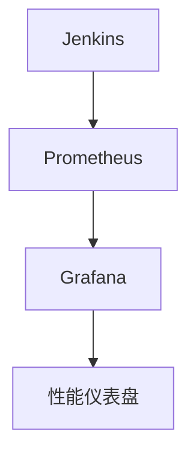

# Jenkins 性能调优

Jenkins是一个广泛使用的持续集成和持续交付（CI/CD）工具，但随着项目规模和复杂性的增加，Jenkins的性能可能会受到影响。为了确保Jenkins在高负载下仍能高效运行，性能调优是必不可少的。本文将介绍一些常见的性能调优策略，帮助你优化Jenkins的配置和资源管理。

## 1. 理解Jenkins性能瓶颈

在开始调优之前，首先需要了解Jenkins的性能瓶颈可能出现在哪些地方。常见的瓶颈包括：

- **硬件资源不足**：CPU、内存、磁盘I/O等资源不足会导致Jenkins运行缓慢。
- **插件过多或配置不当**：某些插件可能会占用大量资源，或者配置不当导致性能下降。
- **构建任务过多**：同时运行的构建任务过多会导致资源竞争，影响整体性能。
- **网络延迟**：如果Jenkins需要与远程仓库或外部服务频繁通信，网络延迟可能会成为瓶颈。

## 2. 优化硬件资源

### 2.1 增加内存

Jenkins是一个Java应用程序，因此内存管理对其性能至关重要。如果Jenkins运行缓慢，首先可以考虑增加JVM的内存分配。

```bash
# 在启动Jenkins时增加JVM内存分配
JAVA_OPTS="-Xmx2048m -Xms1024m"
```

:::note
`-Xmx` 参数设置最大堆内存，`-Xms` 参数设置初始堆内存。根据你的服务器配置，适当调整这些值。
:::

### 2.2 优化磁盘I/O

Jenkins的构建日志、工作空间和插件数据都会占用大量磁盘空间。确保使用高性能的存储设备，并定期清理不必要的构建日志和旧的工作空间。

```bash
# 定期清理旧的工作空间
find /var/lib/jenkins/workspace -type d -mtime +7 -exec rm -rf {} \;
```

## 3. 优化插件配置

### 3.1 禁用不必要的插件

Jenkins的插件生态系统非常丰富，但并非所有插件都是必需的。禁用或删除不必要的插件可以减少资源消耗。

```bash
# 禁用插件
jenkins-plugin-cli --disable-plugin <plugin-name>
```

### 3.2 更新插件

确保所有插件都是最新版本，因为新版本通常会修复性能问题和安全漏洞。

```bash
# 更新所有插件
jenkins-plugin-cli --update-all
```

## 4. 优化构建任务

### 4.1 并行构建

如果服务器有多个CPU核心，可以通过并行构建来充分利用硬件资源。

```groovy
pipeline {
    agent any
    stages {
        stage('Build') {
            parallel {
                stage('Build Module 1') {
                    steps {
                        sh './build-module1.sh'
                    }
                }
                stage('Build Module 2') {
                    steps {
                        sh './build-module2.sh'
                    }
                }
            }
        }
    }
}
```

### 4.2 限制并发构建数

过多的并发构建会导致资源竞争，影响整体性能。可以通过配置限制每个节点的并发构建数。

```bash
# 在Jenkins系统配置中设置并发构建数
jenkins.model.Jenkins.instance.setNumExecutors(4)
```

## 5. 监控与日志分析

### 5.1 使用监控工具

使用监控工具（如Prometheus、Grafana）来实时监控Jenkins的性能指标，如CPU使用率、内存使用率、磁盘I/O等。



### 5.2 分析日志

定期分析Jenkins的日志文件，查找潜在的性能问题或错误。

```bash
# 查看Jenkins日志
tail -f /var/log/jenkins/jenkins.log
```

## 6. 实际案例

假设你有一个大型项目，每天有数百个构建任务。随着项目的增长，Jenkins开始变得缓慢，构建任务经常超时。通过以下步骤进行性能调优：

1. **增加JVM内存**：将 `-Xmx` 设置为4096m，`-Xms` 设置为2048m。
2. **禁用不必要的插件**：禁用了10个不常用的插件。
3. **并行构建**：将构建任务拆分为多个并行任务，充分利用多核CPU。
4. **限制并发构建数**：将并发构建数限制为8个，避免资源竞争。

经过这些优化后，Jenkins的构建时间从平均30分钟减少到10分钟，系统稳定性也得到了显著提升。

## 7. 总结

Jenkins性能调优是一个持续的过程，需要根据实际使用情况不断调整和优化。通过优化硬件资源、插件配置、构建任务以及监控与日志分析，你可以显著提升Jenkins的性能，确保其在高负载下仍能高效运行。

## 8. 附加资源与练习

- **练习**：尝试在你的Jenkins实例中应用本文提到的优化策略，并记录性能变化。
- **资源**：
  - [Jenkins官方文档](https://www.jenkins.io/doc/)
  - [Jenkins性能调优指南](https://www.jenkins.io/doc/book/scaling/performance/)
  - [Prometheus与Grafana监控Jenkins](https://prometheus.io/docs/guides/jenkins/)

通过不断学习和实践，你将能够更好地掌握Jenkins性能调优的技巧，提升你的CI/CD流程效率。