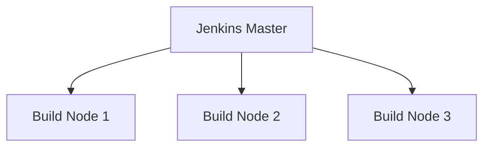

# Jenkins 故障排除

Jenkins是一个强大的持续集成和持续交付（CI/CD）工具，但在使用过程中可能会遇到各种问题。本文将帮助你了解如何识别和解决Jenkins中的常见故障，确保你的CI/CD管道能够稳定运行。

## 介绍

Jenkins的故障排除是一个重要的技能，尤其是在你负责维护一个复杂的CI/CD系统时。无论是构建失败、插件冲突，还是系统性能问题，掌握故障排除的技巧可以帮助你快速恢复系统的正常运行。

## 常见问题及解决方法

### 1. 构建失败

构建失败是Jenkins中最常见的问题之一。通常，构建失败的原因包括代码错误、依赖问题或配置错误。

#### 示例：构建日志分析

```bash
[ERROR] Failed to execute goal org.apache.maven.plugins:maven-compiler-plugin:3.8.1:compile (default-compile) on project my-app: Compilation failure
[ERROR] /path/to/my-app/src/main/java/com/example/MyApp.java:[10,17] error: ';' expected
```

在这个例子中，构建失败的原因是代码中缺少分号。通过查看构建日志，你可以快速定位问题并修复代码。

:::tip
**提示**：始终仔细阅读构建日志，它通常会提供有关失败原因的详细信息。
:::

### 2. 插件冲突

Jenkins的强大功能很大程度上依赖于插件。然而，插件之间的冲突可能会导致系统不稳定或功能失效。

#### 示例：插件冲突解决

如果你发现某个插件无法正常工作，可以尝试以下步骤：

1. 检查插件版本是否与Jenkins版本兼容。
2. 禁用最近安装的插件，看看问题是否解决。
3. 查看Jenkins日志，寻找与插件相关的错误信息。

```bash
Jenkins日志示例：
[WARNING] Failed to load plugin: some-plugin-name (version: 1.2.3)
[WARNING] java.lang.NoClassDefFoundError: some/class/name
```

在这个例子中，日志显示某个插件加载失败，可能是由于缺少依赖或版本不兼容。

:::caution
**注意**：在禁用或卸载插件之前，确保备份你的Jenkins配置。
:::

### 3. 系统性能问题

随着项目规模的增大，Jenkins可能会遇到性能问题，如构建队列过长、响应缓慢等。

#### 示例：优化构建节点

你可以通过以下方式优化Jenkins的性能：

1. 增加构建节点的数量。
2. 配置构建节点的资源限制。
3. 使用分布式构建来分担负载。



在这个图表中，Jenkins Master将构建任务分配给多个构建节点，从而提高了系统的整体性能。

:::warning
**警告**：在增加构建节点时，确保每个节点都有足够的资源来执行构建任务。
:::

## 实际案例

### 案例：构建队列过长

在一个大型项目中，Jenkins的构建队列变得非常长，导致开发人员需要等待很长时间才能看到构建结果。通过分析，发现构建节点的资源不足，导致构建任务积压。

**解决方案**：

1. 增加了两个新的构建节点。
2. 配置了构建节点的资源限制，确保每个节点不会过载。
3. 使用Jenkins的负载均衡功能，将构建任务均匀分配到各个节点。

经过这些优化，构建队列明显缩短，开发人员的等待时间大大减少。

## 总结

Jenkins的故障排除是一个需要耐心和细致的工作。通过分析构建日志、解决插件冲突和优化系统性能，你可以确保Jenkins的稳定运行。希望本文的内容能帮助你更好地理解和解决Jenkins中的常见问题。

## 附加资源

- [Jenkins官方文档](https://www.jenkins.io/doc/)
- [Jenkins插件管理指南](https://plugins.jenkins.io/)
- [Jenkins性能优化技巧](https://www.jenkins.io/doc/book/scaling/)

## 练习

1. 尝试在你的Jenkins实例中模拟一个构建失败，并分析构建日志。
2. 安装一个新插件，并检查它是否与现有插件冲突。
3. 配置一个分布式构建环境，并观察其对系统性能的影响。

通过完成这些练习，你将更深入地理解Jenkins的故障排除技巧。