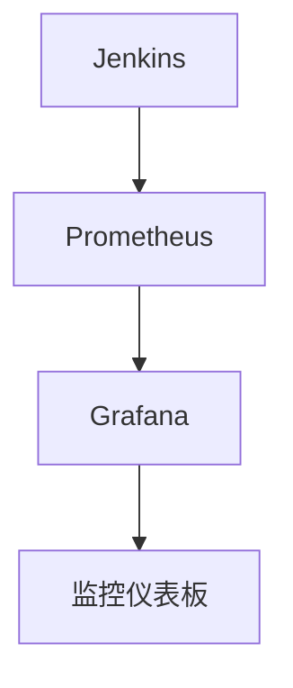

# Jenkins 主动监控

Jenkins是一个广泛使用的持续集成和持续交付（CI/CD）工具，能够自动化构建、测试和部署流程。然而，随着项目规模和复杂性的增加，Jenkins系统的稳定性和性能可能会受到影响。为了确保Jenkins始终高效运行，主动监控是必不可少的。

## 什么是主动监控？

主动监控是指通过定期检查和自动化工具，提前发现并解决潜在问题，而不是等到问题发生后再进行修复。对于Jenkins来说，主动监控可以帮助我们及时发现构建失败、资源耗尽或插件冲突等问题，从而避免系统崩溃或项目延误。

## 为什么需要主动监控？

1. **提高系统稳定性**：通过提前发现问题，减少系统崩溃的风险。
2. **优化性能**：监控资源使用情况，确保Jenkins在高负载下仍能高效运行。
3. **减少维护成本**：主动解决问题比被动修复更节省时间和资源。

## 如何实现Jenkins主动监控？

### 1. 使用Jenkins内置监控工具

Jenkins提供了一些内置的监控工具，可以帮助我们了解系统的运行状态。

#### 查看系统日志

Jenkins的系统日志记录了所有重要的操作和错误信息。通过定期检查系统日志，可以及时发现潜在问题。

```bash
# 查看Jenkins系统日志
tail -f /var/log/jenkins/jenkins.log
```

#### 使用Jenkins监控插件

Jenkins有许多插件可以帮助我们进行监控，例如：

- **Monitoring**：提供系统资源使用情况的实时图表。
- **Build Monitor View**：显示构建状态的仪表板。
- **Metrics Plugin**：收集和展示Jenkins的性能指标。

### 2. 配置外部监控工具

除了Jenkins内置的工具，我们还可以使用外部监控工具来更全面地监控Jenkins系统。

#### Prometheus + Grafana

Prometheus是一个开源的监控和警报工具，Grafana则是一个强大的数据可视化工具。结合使用这两个工具，可以创建详细的Jenkins监控仪表板。

```yaml
# Prometheus配置文件示例
global:
  scrape_interval: 15s

scrape_configs:
  - job_name: 'jenkins'
    metrics_path: '/prometheus'
    static_configs:
      - targets: ['localhost:8080']
```



#### Nagios

Nagios是另一个流行的监控工具，可以监控Jenkins的可用性和性能。

```bash
# Nagios配置文件示例
define service {
    use                 generic-service
    host_name           jenkins-server
    service_description Jenkins HTTP
    check_command       check_http!-H localhost -p 8080
}
```

### 3. 设置警报机制

监控的目的是为了在问题发生前及时采取措施。因此，设置警报机制是非常重要的。

#### 使用Jenkins的邮件通知

Jenkins可以配置邮件通知，当构建失败或系统资源不足时，自动发送邮件通知管理员。

```groovy
// Jenkinsfile示例
pipeline {
    agent any
    stages {
        stage('Build') {
            steps {
                sh 'make'
            }
        }
    }
    post {
        failure {
            mail to: 'admin@example.com',
                 subject: "Build Failed: ${currentBuild.fullDisplayName}",
                 body: "The build failed. Please check the logs."
        }
    }
}
```

#### 使用Prometheus Alertmanager

Prometheus的Alertmanager可以配置警报规则，当某些指标超出阈值时，自动发送通知。

```yaml
# Alertmanager配置文件示例
route:
  receiver: 'email-notifications'

receivers:
- name: 'email-notifications'
  email_configs:
  - to: 'admin@example.com'
```

## 实际案例

假设我们有一个大型项目，每天有数百个构建任务。为了确保Jenkins系统的稳定性，我们配置了Prometheus和Grafana来监控系统资源使用情况，并设置了警报机制。当CPU使用率超过80%时，Alertmanager会发送邮件通知管理员。通过这种方式，我们能够及时发现并解决资源瓶颈问题，避免系统崩溃。

## 总结

主动监控是确保Jenkins系统稳定性和性能的关键。通过使用Jenkins内置工具、外部监控工具和警报机制，我们可以提前发现并解决潜在问题，确保系统始终高效运行。

## 附加资源

- [Jenkins官方文档](https://www.jenkins.io/doc/)
- [Prometheus官方文档](https://prometheus.io/docs/)
- [Grafana官方文档](https://grafana.com/docs/)

## 练习

1. 配置Jenkins的邮件通知，当构建失败时发送邮件。
2. 使用Prometheus和Grafana创建一个Jenkins监控仪表板。
3. 设置一个警报规则，当Jenkins的内存使用率超过70%时发送通知。

通过完成这些练习，你将更深入地理解Jenkins主动监控的重要性，并掌握相关工具的使用方法。