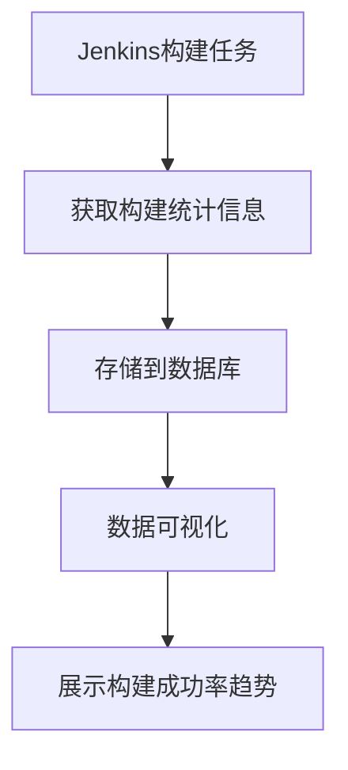

# Jenkins 构建统计

Jenkins是一个广泛使用的持续集成和持续交付（CI/CD）工具，它可以帮助开发团队自动化构建、测试和部署过程。构建统计是Jenkins中一个重要的功能，它可以帮助你监控和分析构建结果，从而优化你的持续集成流程。

## 什么是Jenkins构建统计？

Jenkins构建统计是指对Jenkins中构建任务的结果进行收集、分析和展示的过程。通过构建统计，你可以了解构建的成功率、失败率、平均构建时间等关键指标，从而帮助你更好地理解项目的健康状况。

## 为什么需要构建统计？

1. **监控构建健康状况**：通过构建统计，你可以实时监控构建的成功率和失败率，及时发现并解决问题。
2. **优化构建流程**：通过分析构建时间，你可以识别出构建过程中的瓶颈，从而优化构建流程。
3. **提高团队效率**：通过了解构建失败的原因，团队可以更快地修复问题，减少构建失败对开发进度的影响。

## 如何查看Jenkins构建统计？

Jenkins提供了多种方式来查看构建统计信息。以下是几种常见的方法：

### 1. Jenkins Dashboard

Jenkins Dashboard是查看构建统计的最直接方式。在Dashboard中，你可以看到每个构建任务的状态、构建次数、成功率等信息。

### 2. 构建历史

在每个构建任务的页面中，你可以查看构建历史。构建历史展示了每次构建的结果、构建时间、构建日志等信息。

### 3. 插件

Jenkins有许多插件可以帮助你更详细地分析构建统计信息。例如，**Build History Metrics Plugin** 可以展示构建的成功率、失败率、平均构建时间等指标。

## 使用Jenkins API获取构建统计

Jenkins提供了REST API，你可以通过API获取构建统计信息。以下是一个使用Python脚本获取构建统计信息的示例：

```python
import requests

# Jenkins 服务器的URL
jenkins_url = "http://your-jenkins-server"

# 构建任务的名称
job_name = "your-job-name"

# 获取构建统计信息的API端点
api_url = f"{jenkins_url}/job/{job_name}/api/json"

# 发送GET请求
response = requests.get(api_url)

# 检查请求是否成功
if response.status_code == 200:
    data = response.json()
    # 打印构建统计信息
    print(f"构建次数: {data['builds']}")
    print(f"成功率: {data['healthReport'][0]['score']}%")
else:
    print(f"请求失败，状态码: {response.status_code}")
```

### 输出示例

```plaintext
构建次数: 100
成功率: 95%
```

## 实际案例

假设你有一个名为`my-project`的Jenkins构建任务，你希望监控该任务的构建成功率。你可以使用Jenkins API定期获取构建统计信息，并将结果存储到数据库中。然后，你可以使用数据可视化工具（如Grafana）来展示构建成功率的变化趋势。



## 总结

Jenkins构建统计是持续集成流程中不可或缺的一部分。通过构建统计，你可以实时监控构建的健康状况，优化构建流程，并提高团队效率。无论是通过Jenkins Dashboard、构建历史，还是通过API获取构建统计信息，你都可以轻松地掌握项目的构建情况。

## 附加资源

- [Jenkins官方文档](https://www.jenkins.io/doc/)
- [Jenkins API文档](https://www.jenkins.io/doc/book/using/remote-access-api/)
- [Build History Metrics Plugin](https://plugins.jenkins.io/build-history-metrics-plugin/)

## 练习

1. 在你的Jenkins服务器上创建一个新的构建任务，并使用Jenkins Dashboard查看构建统计信息。
2. 使用Jenkins API编写一个脚本，获取某个构建任务的构建统计信息，并将结果输出到控制台。
3. 安装并配置一个Jenkins插件（如Build History Metrics Plugin），查看更详细的构建统计信息。

通过以上练习，你将更深入地理解Jenkins构建统计的功能和应用场景。