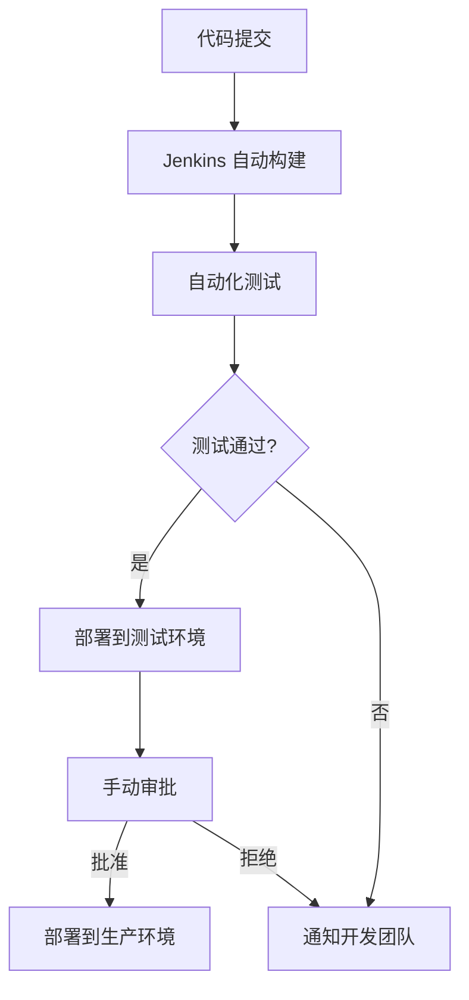

## 介绍

DevOps 是一种结合开发（Development）和运维（Operations）的文化和实践，旨在通过自动化和协作来缩短软件开发生命周期，同时提高交付质量和效率。Jenkins 是一个开源的自动化服务器，广泛用于实现持续集成（CI）和持续交付（CD），是 DevOps 工具链中的核心组件之一。

Jenkins 通过提供灵活的插件系统和强大的自动化能力，帮助团队实现从代码提交到生产部署的自动化流程。本文将深入探讨 Jenkins 如何支持 DevOps 理念，并通过实际案例展示其应用。

## Jenkins 在 DevOps 中的角色

Jenkins 的主要作用是自动化构建、测试和部署流程。它通过以下方式支持 DevOps 理念：

1. **持续集成（CI）**：Jenkins 可以自动构建和测试代码，确保每次代码提交都能快速反馈结果。
2. **持续交付（CD）**：Jenkins 可以自动化部署流程，将代码从开发环境推送到生产环境。
3. **协作与可见性**：Jenkins 提供了丰富的报告和日志功能，帮助开发团队和运维团队更好地协作。

### 持续集成示例

以下是一个简单的 Jenkins 持续集成配置示例：

```groovy
pipeline {
    agent any
    stages {
        stage('Build') {
            steps {
                echo 'Building the application...'
                sh 'mvn clean package'
            }
        }
        stage('Test') {
            steps {
                echo 'Running tests...'
                sh 'mvn test'
            }
        }
        stage('Deploy') {
            steps {
                echo 'Deploying the application...'
                sh 'scp target/myapp.war user@server:/var/lib/tomcat/webapps/'
            }
        }
    }
}
```

在这个示例中，Jenkins 会依次执行构建、测试和部署步骤。每次代码提交后，Jenkins 都会自动运行这个流水线，确保代码的质量和可部署性。

:::tip
**提示**：Jenkins 的流水线（Pipeline）功能允许你以代码的形式定义构建和部署流程，这种方式称为“Pipeline as Code”。
:::

## Jenkins 与 DevOps 实践的结合

### 1. 自动化测试

自动化测试是 DevOps 的核心实践之一。Jenkins 可以集成各种测试框架（如 JUnit、Selenium 等），并在每次代码提交后自动运行测试。这有助于及早发现和修复问题，减少生产环境中的故障。

### 2. 基础设施即代码（IaC）

Jenkins 可以与 Terraform、Ansible 等工具集成，实现基础设施的自动化管理。通过 Jenkins 流水线，团队可以自动化地创建、配置和管理基础设施。

```groovy
stage('Provision Infrastructure') {
    steps {
        echo 'Provisioning infrastructure with Terraform...'
        sh 'terraform init && terraform apply -auto-approve'
    }
}
```

### 3. 监控与反馈

Jenkins 可以与监控工具（如 Prometheus、Grafana）集成，实时监控应用程序的性能和健康状况。通过 Jenkins 的流水线，团队可以自动化地收集和分析监控数据，并根据反馈优化流程。

## 实际案例：电商网站的持续交付

假设我们正在开发一个电商网站，并希望通过 Jenkins 实现持续交付。以下是我们的 DevOps 流程：

1. **代码提交**：开发人员将代码提交到 Git 仓库。
2. **自动构建**：Jenkins 检测到代码提交后，自动触发构建流程。
3. **自动化测试**：Jenkins 运行单元测试、集成测试和 UI 测试。
4. **部署到测试环境**：如果测试通过，Jenkins 将应用部署到测试环境。
5. **手动审批**：运维团队在 Jenkins 中手动审批部署到生产环境的请求。
6. **部署到生产环境**：审批通过后，Jenkins 将应用部署到生产环境。



:::note
**注意**：在实际项目中，生产环境的部署通常需要手动审批，以确保安全性和稳定性。
:::

## 总结

Jenkins 是 DevOps 实践中不可或缺的工具，它通过自动化构建、测试和部署流程，帮助团队实现持续集成和持续交付。通过 Jenkins，团队可以更快地交付高质量的软件，同时减少人为错误和运维负担。

## 附加资源与练习

- **练习**：尝试在本地安装 Jenkins，并配置一个简单的流水线，实现代码的自动构建和测试。
- **资源**：
  - [Jenkins 官方文档](https://www.jenkins.io/doc/)
  - 《持续交付：发布可靠软件的系统方法》—— Jez Humble, David Farley

通过学习和实践 Jenkins，你将更好地理解 DevOps 理念，并为团队的高效协作和交付做出贡献。