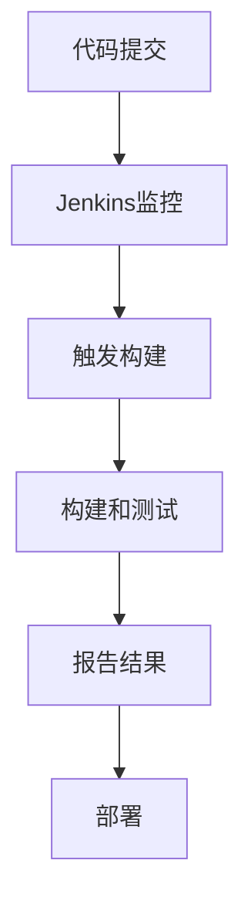

# Jenkins 持续集成

## 介绍

持续集成（Continuous Integration，简称CI）是一种软件开发实践，开发人员频繁地将代码集成到共享仓库中。每次集成都通过自动化构建和测试来验证代码的正确性，从而尽早发现并修复问题。Jenkins是一个开源的持续集成工具，广泛用于自动化构建、测试和部署。

Jenkins的核心目标是帮助团队更快地交付高质量的软件。通过自动化构建和测试，Jenkins可以减少人为错误，提高开发效率。

## Jenkins 持续集成的工作原理

Jenkins持续集成的工作流程通常包括以下几个步骤：

1. **代码提交**：开发人员将代码提交到版本控制系统（如Git）。
2. **触发构建**：Jenkins监控代码仓库的变化，当检测到新的提交时，自动触发构建。
3. **构建和测试**：Jenkins执行预定义的构建脚本，编译代码并运行测试。
4. **报告结果**：构建和测试完成后，Jenkins生成报告，通知开发人员构建结果。
5. **部署**：如果构建成功，Jenkins可以自动将代码部署到测试环境或生产环境。



## 实际案例

假设我们有一个简单的Java项目，使用Maven进行构建。我们将通过Jenkins实现持续集成。

### 1. 安装Jenkins

首先，你需要在服务器上安装Jenkins。可以通过以下命令在Ubuntu上安装Jenkins：

```bash
sudo apt update
sudo apt install openjdk-11-jdk
wget -q -O - https://pkg.jenkins.io/debian/jenkins.io.key | sudo apt-key add -
sudo sh -c 'echo deb http://pkg.jenkins.io/debian-stable binary/ > /etc/apt/sources.list.d/jenkins.list'
sudo apt update
sudo apt install jenkins
```

安装完成后，启动Jenkins服务：

```bash
sudo systemctl start jenkins
```

### 2. 配置Jenkins

访问Jenkins的Web界面（通常为`http://your-server-ip:8080`），按照提示完成初始配置。

### 3. 创建Jenkins任务

在Jenkins中创建一个新的任务，选择“自由风格项目”。在任务配置中，设置以下内容：

- **源码管理**：选择Git，并填写你的代码仓库URL。
- **构建触发器**：选择“轮询SCM”，设置轮询间隔为`* * * * *`（每分钟检查一次）。
- **构建**：添加构建步骤，选择“调用顶层Maven目标”，并填写`clean install`。

### 4. 运行构建

保存配置后，Jenkins会自动检测代码仓库的变化，并在每次提交后触发构建。你可以在Jenkins的构建历史中查看每次构建的结果。

:::tip
你可以通过Jenkins的插件系统扩展其功能，例如安装Git插件、Maven插件等，以满足不同的项目需求。
:::

## 总结

Jenkins持续集成是提高软件开发效率和质量的重要工具。通过自动化构建、测试和部署，Jenkins帮助团队更快地交付高质量的软件。本文介绍了Jenkins的基本概念、工作原理以及如何在实际项目中应用Jenkins实现持续集成。

## 附加资源

- [Jenkins官方文档](https://www.jenkins.io/doc/)
- [持续集成最佳实践](https://martinfowler.com/articles/continuousIntegration.html)
- [Jenkins插件库](https://plugins.jenkins.io/)

## 练习

1. 在你的本地环境中安装Jenkins，并配置一个简单的Java项目进行持续集成。
2. 尝试为你的项目添加自动化测试，并在Jenkins中配置测试报告。
3. 探索Jenkins的插件系统，安装并使用一个你感兴趣的插件。

通过实践，你将更深入地理解Jenkins持续集成的强大功能，并能够在实际项目中灵活应用。