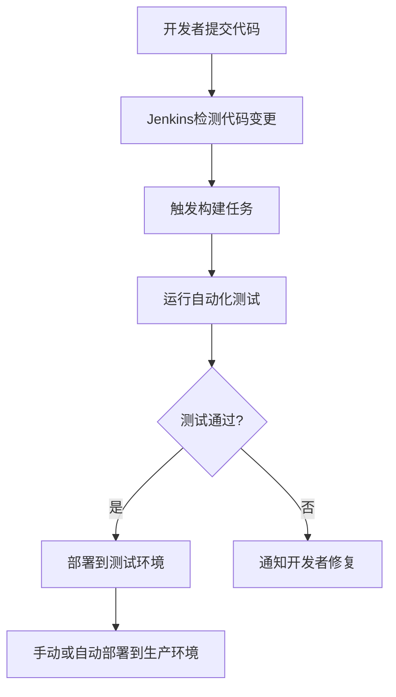

# Jenkins 敏捷集成

在现代软件开发中，**敏捷集成**（Agile Integration）是一种通过持续集成（CI）和持续交付（CD）来加速开发流程的方法。Jenkins作为最流行的开源自动化服务器，是实现敏捷集成的核心工具之一。本文将带你了解Jenkins在敏捷集成中的作用，并通过实际案例展示其应用。

## 什么是敏捷集成？

敏捷集成是一种软件开发实践，旨在通过频繁地将代码集成到共享仓库中，快速发现并修复问题。它强调自动化测试、持续集成和持续交付，以确保代码质量和快速发布。

Jenkins作为自动化工具，能够帮助团队实现以下目标：
- **自动化构建**：自动编译代码并生成可执行文件。
- **自动化测试**：运行单元测试、集成测试等，确保代码质量。
- **持续交付**：将代码自动部署到测试环境或生产环境。

## Jenkins 敏捷集成的基本流程

以下是Jenkins在敏捷集成中的典型工作流程：



### 1. 配置Jenkins Job

首先，我们需要在Jenkins中创建一个Job来监控代码仓库的变更。以下是一个简单的Jenkins Job配置示例：

```groovy
pipeline {
    agent any
    stages {
        stage('Build') {
            steps {
                echo 'Building the application...'
                sh 'mvn clean package'
            }
        }
        stage('Test') {
            steps {
                echo 'Running tests...'
                sh 'mvn test'
            }
        }
        stage('Deploy') {
            steps {
                echo 'Deploying to test environment...'
                sh 'scp target/myapp.war user@test-server:/var/lib/tomcat/webapps/'
            }
        }
    }
}
```

### 2. 触发构建

当开发者将代码推送到Git仓库时，Jenkins会自动检测到变更并触发构建任务。构建任务包括编译代码、运行测试和生成构建产物。

### 3. 运行自动化测试

Jenkins会运行项目中配置的自动化测试（如单元测试、集成测试）。如果测试失败，Jenkins会通知开发者修复问题。

### 4. 部署到测试环境

如果所有测试通过，Jenkins会将构建产物部署到测试环境，供QA团队进行进一步测试。

### 5. 部署到生产环境

在测试环境验证通过后，可以手动或自动将代码部署到生产环境。

:::tip
为了确保代码质量，建议在Jenkins中配置代码质量检查工具（如SonarQube）和代码风格检查工具（如Checkstyle）。
:::

## 实际案例：Jenkins在电商项目中的应用

假设我们正在开发一个电商网站，以下是Jenkins在该项目中的具体应用场景：

1. **代码提交**：开发者将新功能代码推送到Git仓库。
2. **自动构建**：Jenkins检测到代码变更，触发构建任务，编译代码并生成WAR文件。
3. **自动化测试**：Jenkins运行单元测试和集成测试，确保新功能不会破坏现有功能。
4. **部署到测试环境**：测试通过后，Jenkins将WAR文件部署到测试环境，供QA团队测试。
5. **部署到生产环境**：QA团队确认无误后，Jenkins将代码部署到生产环境。

:::note
在实际项目中，建议使用Jenkins的Pipeline功能，将整个流程定义为代码（Pipeline as Code），以便更好地管理和维护。
:::

## 总结

Jenkins是实现敏捷集成的强大工具，能够帮助团队自动化构建、测试和部署流程，从而提升开发效率和代码质量。通过本文的学习，你应该已经掌握了Jenkins在敏捷集成中的基本概念和应用方法。

## 附加资源与练习

- **练习**：尝试在你的本地环境中配置一个简单的Jenkins Job，监控一个Git仓库并自动构建一个Java项目。
- **资源**：
  - [Jenkins官方文档](https://www.jenkins.io/doc/)
  - 《持续交付：发布可靠软件的系统方法》——Jez Humble, David Farley

通过不断实践和学习，你将能够更好地利用Jenkins实现敏捷集成，为团队创造更大的价值。