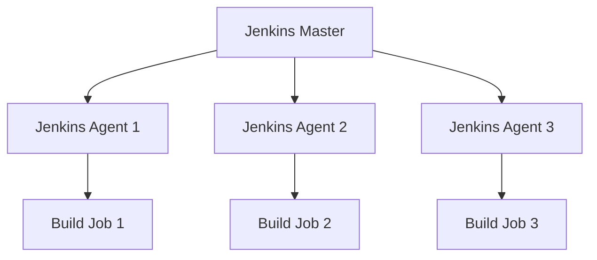

## 介绍

Jenkins 是一个广泛使用的开源自动化服务器，用于实现持续集成（CI）和持续交付（CD）。随着 DevOps 实践的普及，评估您的 Jenkins DevOps 成熟度变得至关重要。成熟度评估帮助您了解当前实践的现状，识别改进领域，并制定优化策略。

本文将引导您了解 Jenkins DevOps 成熟度评估的关键方面，并提供实际案例和代码示例，帮助您逐步提升 DevOps 实践。

## 什么是 DevOps 成熟度评估？

DevOps 成熟度评估是一种系统化的方法，用于衡量组织在 DevOps 实践中的成熟度水平。它通常包括以下几个维度：

1. **文化与实践**：团队协作、沟通和 DevOps 文化的普及程度。
2. **自动化**：构建、测试、部署等流程的自动化程度。
3. **监控与反馈**：系统监控、日志管理和反馈机制的完善程度。
4. **工具与基础设施**：使用的工具链和基础设施的现代化程度。

通过评估这些维度，您可以确定当前实践的成熟度，并制定改进计划。

## Jenkins DevOps 成熟度评估的关键维度

### 1. 文化与实践

DevOps 不仅仅是工具和流程，更是一种文化。评估您的团队是否具备以下特质：

- **跨职能协作**：开发、运维和 QA 团队是否紧密合作？
- **持续改进**：团队是否定期回顾并改进流程？
- **共享责任**：团队是否共同承担交付和运维的责任？

:::tip
**建议**：定期组织跨职能团队的回顾会议，促进沟通和协作。
:::

### 2. 自动化

自动化是 DevOps 的核心。评估您的 Jenkins 流水线是否实现了以下自动化：

- **构建自动化**：每次代码提交后是否自动触发构建？
- **测试自动化**：是否自动运行单元测试、集成测试和端到端测试？
- **部署自动化**：是否实现了自动部署到测试环境和生产环境？

以下是一个简单的 Jenkins 流水线示例，展示了构建和测试的自动化：

```groovy
pipeline {
    agent any
    stages {
        stage('Build') {
            steps {
                sh 'mvn clean package'
            }
        }
        stage('Test') {
            steps {
                sh 'mvn test'
            }
        }
    }
}
```

:::note
**输入**：代码提交到版本控制系统（如 Git）。<br />
**输出**：构建和测试结果，成功或失败的报告。
:::

### 3. 监控与反馈

监控和反馈机制帮助您快速发现和解决问题。评估您的 Jenkins 实践是否包括以下内容：

- **实时监控**：是否实时监控构建和部署的状态？
- **日志管理**：是否集中管理日志并易于查询？
- **反馈机制**：是否及时通知团队构建或部署失败？

以下是一个 Jenkins 流水线示例，展示了失败时的通知机制：

```groovy
pipeline {
    agent any
    stages {
        stage('Build') {
            steps {
                sh 'mvn clean package'
            }
        }
        stage('Test') {
            steps {
                sh 'mvn test'
            }
        }
    }
    post {
        failure {
            mail to: 'team@example.com', subject: 'Build Failed', body: 'The build has failed. Please check the logs.'
        }
    }
}
```

:::caution
**注意**：确保通知机制不会过于频繁，以免造成信息过载。
:::

### 4. 工具与基础设施

现代化的工具和基础设施是高效 DevOps 实践的基础。评估您的 Jenkins 环境是否具备以下特点：

- **可扩展性**：Jenkins 是否能够轻松扩展以支持更多项目和团队？
- **高可用性**：Jenkins 是否具备高可用性，避免单点故障？
- **安全性**：Jenkins 是否配置了适当的安全措施，如身份验证和授权？

以下是一个 Jenkins 高可用性架构的示例：



:::warning
**警告**：确保 Jenkins 主节点和代理节点之间的通信安全，避免潜在的安全风险。
:::

## 实际案例

### 案例：从手动部署到自动化部署

一家中小型企业的开发团队最初采用手动部署方式，每次发布都需要运维人员手动操作，导致发布周期长且容易出错。通过引入 Jenkins 和 DevOps 实践，团队逐步实现了自动化部署。

1. **初始阶段**：手动构建和部署，发布周期为两周。
2. **改进阶段**：引入 Jenkins 流水线，实现构建和测试的自动化，发布周期缩短到一周。
3. **成熟阶段**：进一步优化流水线，实现自动部署到生产环境，发布周期缩短到一天。

通过成熟度评估，团队识别了自动化不足的问题，并逐步改进，最终实现了高效的 DevOps 实践。

## 总结

Jenkins DevOps 成熟度评估是提升持续集成和持续交付能力的关键步骤。通过评估文化与实践、自动化、监控与反馈、工具与基础设施等维度，您可以识别改进领域并制定优化策略。

## 附加资源与练习

- **资源**：
  - [Jenkins 官方文档](https://www.jenkins.io/doc/)
  - [DevOps 成熟度模型](https://www.devopsinstitute.com/devops-maturity-model/)
- **练习**：
  - 为您的 Jenkins 流水线添加自动化测试阶段。
  - 配置 Jenkins 的监控和通知机制，确保团队及时收到构建和部署状态。

通过不断评估和改进，您的 Jenkins DevOps 实践将逐步成熟，为您的团队和组织带来更大的价值。