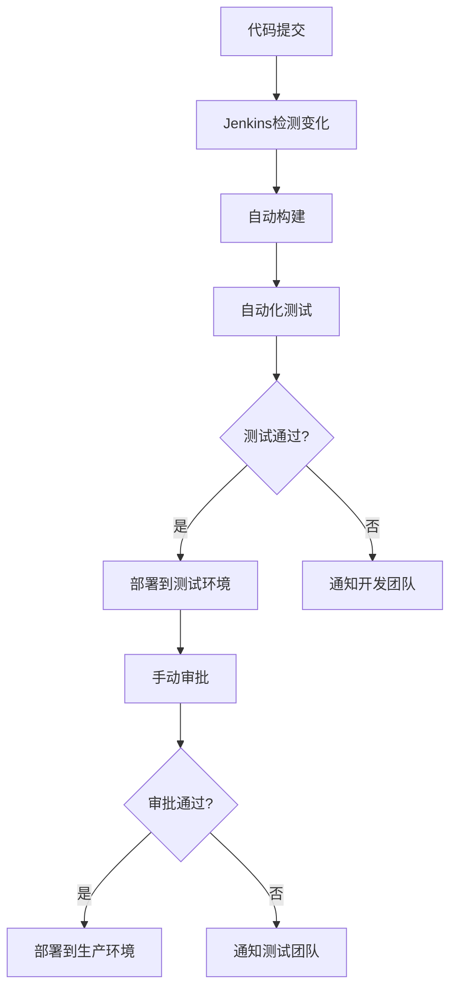

# Jenkins 持续交付

持续交付（Continuous Delivery，简称CD）是现代DevOps实践中的核心概念之一。它旨在通过自动化流程，确保软件能够快速、可靠地发布到生产环境。Jenkins作为最流行的开源自动化服务器，是实现持续交付的强大工具。本文将带你从基础概念入手，逐步掌握如何使用Jenkins实现持续交付。

## 什么是持续交付？

持续交付是一种软件开发实践，它通过自动化构建、测试和部署流程，确保软件始终处于可发布状态。与持续集成（Continuous Integration，简称CI）不同，持续交付不仅关注代码的集成和测试，还关注如何将代码快速、安全地交付到生产环境。

:::note
**持续交付 vs 持续部署**  
持续交付强调软件始终处于可发布状态，但实际发布可能需要手动触发。而持续部署则更进一步，自动将代码部署到生产环境。
:::

## Jenkins 在持续交付中的作用

Jenkins是一个开源的自动化服务器，广泛用于构建、测试和部署软件。它通过插件系统支持各种工具和框架，能够灵活地适应不同的开发流程。在持续交付中，Jenkins的主要作用包括：

1. **自动化构建**：从代码库拉取代码并构建可执行文件。
2. **自动化测试**：运行单元测试、集成测试等，确保代码质量。
3. **自动化部署**：将构建好的应用程序部署到测试环境或生产环境。

## 实现Jenkins持续交付的步骤

### 1. 安装和配置Jenkins

首先，你需要在服务器上安装Jenkins。可以通过以下命令在Ubuntu上安装Jenkins：

```bash
sudo apt update
sudo apt install openjdk-11-jdk
wget -q -O - https://pkg.jenkins.io/debian/jenkins.io.key | sudo apt-key add -
sudo sh -c 'echo deb http://pkg.jenkins.io/debian-stable binary/ > /etc/apt/sources.list.d/jenkins.list'
sudo apt update
sudo apt install jenkins
```

安装完成后，启动Jenkins服务并访问 `http://your-server-ip:8080` 进行初始配置。

### 2. 创建Jenkins Pipeline

Jenkins Pipeline是一种定义持续交付流程的方式。它使用Groovy脚本描述构建、测试和部署的各个阶段。以下是一个简单的Pipeline示例：

```groovy
pipeline {
    agent any

    stages {
        stage('Build') {
            steps {
                echo 'Building the application...'
                sh 'mvn clean package'
            }
        }
        stage('Test') {
            steps {
                echo 'Running tests...'
                sh 'mvn test'
            }
        }
        stage('Deploy') {
            steps {
                echo 'Deploying the application...'
                sh 'scp target/myapp.jar user@production-server:/opt/myapp/'
            }
        }
    }
}
```

在这个Pipeline中，我们定义了三个阶段：`Build`、`Test` 和 `Deploy`。每个阶段都包含一些步骤，例如使用Maven构建项目、运行测试以及将构建结果部署到生产服务器。

### 3. 配置代码库触发器

为了实现真正的持续交付，我们需要在代码库发生变化时自动触发Pipeline。Jenkins支持多种代码库（如GitHub、GitLab等），并可以通过Webhook实现自动触发。

在Jenkins中配置GitHub Webhook的步骤如下：

1. 在GitHub仓库中，进入 `Settings -> Webhooks`。
2. 添加一个新的Webhook，URL为 `http://your-jenkins-server/github-webhook/`。
3. 在Jenkins中，配置Pipeline的触发器为 `GitHub hook trigger for GITScm polling`。

### 4. 监控和优化Pipeline

持续交付的关键在于快速反馈和持续改进。Jenkins提供了丰富的监控工具，帮助你分析Pipeline的执行情况。你可以通过以下方式优化Pipeline：

- **并行执行**：将独立的测试任务并行化，减少整体执行时间。
- **缓存依赖**：缓存构建依赖项，避免重复下载。
- **失败重试**：为不稳定的测试任务配置重试机制。

## 实际案例：电商网站的持续交付

假设你正在开发一个电商网站，以下是使用Jenkins实现持续交付的典型流程：

1. **代码提交**：开发人员将代码推送到GitHub仓库。
2. **自动构建**：Jenkins检测到代码变化，触发Pipeline进行构建。
3. **自动化测试**：Pipeline运行单元测试、集成测试和UI测试。
4. **部署到测试环境**：如果所有测试通过，Pipeline将应用程序部署到测试环境。
5. **手动审批**：测试团队验证应用程序的功能和性能。
6. **部署到生产环境**：测试通过后，手动触发生产环境部署。



## 总结

通过本文，你已经了解了如何使用Jenkins实现持续交付。从安装和配置Jenkins，到创建Pipeline和优化流程，持续交付的核心在于自动化、快速反馈和持续改进。Jenkins的强大功能和灵活性使其成为实现持续交付的理想工具。

## 附加资源

- [Jenkins官方文档](https://www.jenkins.io/doc/)
- 《持续交付：发布可靠软件的系统方法》——Jez Humble, David Farley
- [GitHub Webhook配置指南](https://docs.github.com/en/developers/webhooks-and-events/webhooks)

## 练习

1. 在本地或云服务器上安装Jenkins，并配置一个简单的Pipeline。
2. 尝试将Pipeline与GitHub仓库集成，实现代码提交后自动触发构建。
3. 优化Pipeline，添加并行测试任务和缓存依赖项的功能。

希望本文能帮助你掌握Jenkins持续交付的核心概念和实践方法。祝你学习愉快！