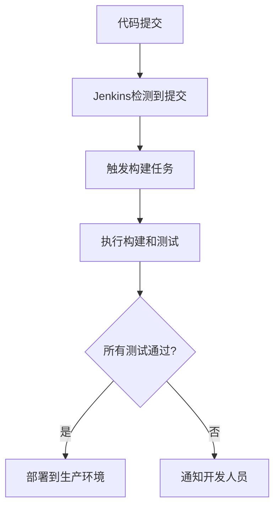

# Jenkins 持续部署

持续部署（Continuous Deployment，简称CD）是现代DevOps实践中的关键环节。它允许开发团队在代码通过所有自动化测试后，自动将应用程序部署到生产环境。Jenkins作为一款流行的开源自动化服务器，可以帮助你轻松实现持续部署。

本文将逐步讲解如何使用Jenkins实现持续部署，并通过实际案例展示其应用场景。

## 什么是持续部署？

持续部署是持续集成（Continuous Integration，简称CI）的延伸。在持续集成中，代码的每次提交都会触发自动化构建和测试流程。而持续部署则更进一步，在代码通过所有测试后，自动将其部署到生产环境。

:::note
持续部署与持续交付（Continuous Delivery）有所不同。持续交付是指代码通过测试后，随时可以手动部署到生产环境，而持续部署则是自动完成这一过程。
:::

## Jenkins 持续部署的基本流程

Jenkins持续部署的基本流程包括以下几个步骤：

1. **代码提交**：开发人员将代码提交到版本控制系统（如Git）。
2. **触发构建**：Jenkins检测到代码提交后，触发构建任务。
3. **构建和测试**：Jenkins执行构建脚本，运行单元测试、集成测试等。
4. **部署到生产环境**：如果所有测试通过，Jenkins自动将应用程序部署到生产环境。



## 配置Jenkins持续部署

### 1. 安装Jenkins

首先，确保你已经安装了Jenkins。如果还没有安装，可以参考[Jenkins官方文档](https://www.jenkins.io/doc/book/installing/)进行安装。

### 2. 创建Jenkins任务

在Jenkins中创建一个新的任务，选择“构建一个自由风格的软件项目”。

### 3. 配置源代码管理

在“源代码管理”部分，选择你的版本控制系统（如Git），并配置仓库URL和分支。

```bash
Repository URL: https://github.com/your-username/your-repo.git
Branch Specifier: main
```

### 4. 配置构建触发器

在“构建触发器”部分，选择“GitHub hook trigger for GITScm polling”以在每次代码提交时触发构建。

### 5. 配置构建步骤

在“构建”部分，添加构建步骤。例如，如果你使用Maven构建Java项目，可以添加以下步骤：

```bash
mvn clean install
```

### 6. 配置部署步骤

在“构建后操作”部分，添加部署步骤。例如，如果你使用SSH将应用程序部署到远程服务器，可以添加以下步骤：

```bash
scp target/your-app.jar user@your-server:/path/to/deploy
ssh user@your-server "systemctl restart your-app"
```

## 实际案例：部署一个简单的Web应用

假设我们有一个简单的Spring Boot Web应用，我们将使用Jenkins实现持续部署。

### 1. 创建Jenkins任务

按照上述步骤创建一个Jenkins任务，配置Git仓库和构建触发器。

### 2. 配置构建步骤

在“构建”部分，添加以下Maven构建步骤：

```bash
mvn clean package
```

### 3. 配置部署步骤

在“构建后操作”部分，添加以下SSH部署步骤：

```bash
scp target/demo-0.0.1-SNAPSHOT.jar user@your-server:/var/www/demo.jar
ssh user@your-server "systemctl restart demo"
```

### 4. 测试持续部署

提交代码到Git仓库，Jenkins将自动触发构建和部署流程。如果一切顺利，你的Web应用将自动部署到生产环境。

## 总结

通过Jenkins实现持续部署，可以显著提高开发效率和软件质量。自动化构建、测试和部署流程减少了人为错误，并加快了发布速度。

:::tip
在实际生产环境中，建议结合使用Docker和Kubernetes等容器化技术，以进一步提高部署的灵活性和可靠性。
:::

## 附加资源

- [Jenkins官方文档](https://www.jenkins.io/doc/)
- [持续交付与持续部署的区别](https://martinfowler.com/bliki/ContinuousDelivery.html)
- [Maven官方文档](https://maven.apache.org/guides/)

## 练习

1. 尝试在Jenkins中配置一个简单的Java项目，实现持续部署。
2. 探索如何在Jenkins中使用Docker进行容器化部署。
3. 研究如何在Jenkins中集成更多的测试工具，如Selenium或JUnit。

通过以上步骤和练习，你将能够掌握Jenkins持续部署的基本概念和实践方法。祝你学习愉快！