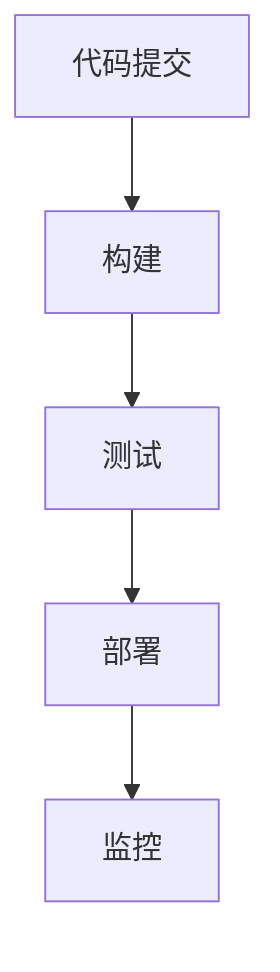

# Jenkins 价值流图

## 介绍

在 DevOps 实践中，**价值流图**（Value Stream Mapping, VSM）是一种可视化工具，用于分析和优化软件交付流程。它帮助团队识别流程中的瓶颈、浪费和改进机会。Jenkins 作为一款流行的持续集成和持续交付（CI/CD）工具，提供了对价值流图的支持，使团队能够更好地理解和管理他们的交付流程。

本文将介绍 Jenkins 价值流图的基本概念、如何创建和使用它，以及它在实际 DevOps 项目中的应用。

## 什么是价值流图？

价值流图是一种流程图，用于描述从代码提交到软件交付的整个流程。它通常包括以下阶段：

1. **代码提交**：开发人员将代码推送到版本控制系统（如 Git）。
2. **构建**：代码被编译、打包或构建成可部署的工件。
3. **测试**：运行自动化测试以确保代码质量。
4. **部署**：将构建好的工件部署到目标环境（如开发、测试或生产环境）。
5. **监控**：监控部署后的应用程序性能和稳定性。

通过可视化这些阶段，团队可以识别流程中的瓶颈、延迟和浪费，从而优化交付流程。

## 如何在 Jenkins 中创建价值流图

Jenkins 提供了插件和工具来帮助团队创建价值流图。以下是创建价值流图的步骤：

### 1. 安装必要的插件

首先，确保 Jenkins 安装了以下插件：

- **Pipeline**：用于定义和管理 CI/CD 流水线。
- **Blue Ocean**：提供更直观的流水线可视化界面。
- **Value Stream Mapping**：用于生成价值流图。

### 2. 定义 Jenkins 流水线

在 Jenkins 中，流水线是通过 `Jenkinsfile` 定义的。以下是一个简单的流水线示例：

```groovy
pipeline {
    agent any

    stages {
        stage('Checkout') {
            steps {
                git 'https://github.com/your-repo.git'
            }
        }
        stage('Build') {
            steps {
                sh 'mvn clean package'
            }
        }
        stage('Test') {
            steps {
                sh 'mvn test'
            }
        }
        stage('Deploy') {
            steps {
                sh 'kubectl apply -f k8s/deployment.yaml'
            }
        }
    }
}
```

### 3. 生成价值流图

在 Jenkins 的 Blue Ocean 界面中，你可以查看流水线的执行情况，并生成价值流图。价值流图将显示每个阶段的持续时间、成功或失败的状态，以及阶段之间的依赖关系。



### 4. 分析价值流图

通过价值流图，你可以识别以下问题：

- **瓶颈**：某个阶段耗时过长，导致整体流程延迟。
- **浪费**：某些阶段没有增加价值，可以优化或删除。
- **失败率**：某个阶段的失败率较高，需要改进。

## 实际案例

假设你正在开发一个 Web 应用程序，并使用 Jenkins 进行持续集成和持续交付。你发现部署阶段经常失败，导致整体交付延迟。通过价值流图，你发现部署阶段的失败率高达 30%，并且每次失败后需要手动干预。

通过分析，你发现部署脚本中存在一些硬编码的配置，导致在不同环境中部署时失败。你决定将配置外部化，并使用环境变量来管理不同环境的配置。改进后，部署阶段的失败率降低到 5%，整体交付时间缩短了 20%。

## 总结

Jenkins 价值流图是一个强大的工具，帮助团队可视化、分析和优化软件交付流程。通过识别瓶颈和浪费，团队可以显著提高交付效率和质量。

:::tip
**小贴士**：定期审查和更新你的价值流图，以确保它始终反映当前的交付流程。
:::

## 附加资源

- [Jenkins 官方文档](https://www.jenkins.io/doc/)
- [Blue Ocean 插件指南](https://plugins.jenkins.io/blueocean/)
- [价值流图最佳实践](https://www.atlassian.com/devops/frameworks/value-stream-mapping)

## 练习

1. 在你的 Jenkins 实例中创建一个简单的流水线，并生成价值流图。
2. 分析价值流图，识别一个潜在的瓶颈或浪费，并提出改进建议。
3. 尝试使用环境变量或配置文件来优化你的部署阶段。

通过实践这些步骤，你将更好地理解 Jenkins 价值流图的价值，并能够在实际项目中应用它。