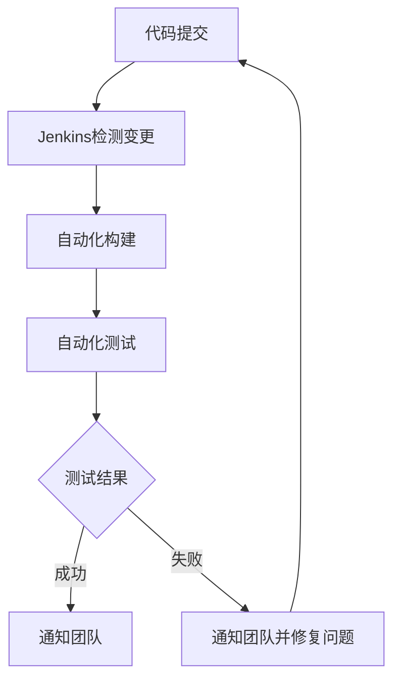

# Jenkins 反馈循环

在DevOps实践中，反馈循环是一个至关重要的概念。它指的是在软件开发过程中，通过自动化工具（如Jenkins）快速获取代码变更的结果，并将这些结果反馈给开发团队，以便及时调整和改进。Jenkins作为一款流行的持续集成和持续交付（CI/CD）工具，能够帮助团队建立高效的反馈循环。

## 什么是反馈循环？

反馈循环是指从代码提交到最终部署的整个过程中，开发团队能够快速获取关于代码质量、构建状态、测试结果等信息，并根据这些信息进行调整和改进的机制。反馈循环的核心目标是缩短反馈时间，从而加快开发迭代速度，减少错误积累。

在Jenkins中，反馈循环通常包括以下几个阶段：

1. **代码提交**：开发人员将代码提交到版本控制系统（如Git）。
2. **自动化构建**：Jenkins检测到代码变更后，自动触发构建任务。
3. **自动化测试**：构建完成后，Jenkins运行自动化测试（如单元测试、集成测试等）。
4. **结果反馈**：测试结果通过邮件、Slack或其他通知工具反馈给开发团队。
5. **问题修复**：如果测试失败，开发人员根据反馈快速修复问题并重新提交代码。

## Jenkins 反馈循环的实现

### 1. 配置Jenkins Job

首先，我们需要在Jenkins中创建一个Job来监控代码仓库的变更。以下是一个简单的Jenkins Job配置示例：

```groovy
pipeline {
    agent any
    stages {
        stage('Checkout') {
            steps {
                git 'https://github.com/your-repo/your-project.git'
            }
        }
        stage('Build') {
            steps {
                sh 'mvn clean package'
            }
        }
        stage('Test') {
            steps {
                sh 'mvn test'
            }
        }
    }
    post {
        success {
            echo 'Build and tests passed!'
        }
        failure {
            echo 'Build or tests failed!'
        }
    }
}
```

在这个示例中，Jenkins会从指定的Git仓库拉取代码，然后使用Maven进行构建和测试。如果构建或测试失败，Jenkins会在`post`阶段发送通知。

### 2. 设置通知机制

为了让开发团队及时获取反馈，我们可以配置Jenkins在构建完成后发送通知。以下是一个使用Slack通知的示例：

```groovy
pipeline {
    agent any
    stages {
        stage('Checkout') {
            steps {
                git 'https://github.com/your-repo/your-project.git'
            }
        }
        stage('Build') {
            steps {
                sh 'mvn clean package'
            }
        }
        stage('Test') {
            steps {
                sh 'mvn test'
            }
        }
    }
    post {
        success {
            slackSend channel: '#dev-team', message: 'Build and tests passed!'
        }
        failure {
            slackSend channel: '#dev-team', message: 'Build or tests failed!'
        }
    }
}
```

在这个示例中，Jenkins会在构建成功或失败时，向Slack的`#dev-team`频道发送通知。

### 3. 可视化反馈循环

为了更好地理解反馈循环的工作流程，我们可以使用Mermaid绘制一个简单的流程图：



这个流程图展示了从代码提交到反馈的完整过程。如果测试失败，开发团队会收到通知并修复问题，然后重新提交代码，形成一个闭环。

## 实际案例

假设我们有一个Web应用项目，开发团队每天都会提交多次代码。为了确保代码质量，我们使用Jenkins配置了以下反馈循环：

1. **代码提交**：开发人员将代码提交到GitHub仓库。
2. **自动化构建**：Jenkins检测到代码变更后，自动触发构建任务，使用Maven进行构建。
3. **自动化测试**：构建完成后，Jenkins运行单元测试和集成测试。
4. **结果反馈**：如果测试通过，Jenkins向Slack频道发送成功通知；如果测试失败，Jenkins发送失败通知，并附上详细的错误日志。
5. **问题修复**：开发人员根据Slack通知中的错误日志，快速定位问题并修复代码，然后重新提交。

通过这个反馈循环，开发团队能够在几分钟内获取代码变更的结果，并及时修复问题，从而大大提高了开发效率。

## 总结

Jenkins反馈循环是DevOps实践中不可或缺的一部分。通过自动化构建、测试和通知机制，开发团队能够快速获取代码变更的结果，并根据反馈进行调整和改进。这不仅提高了代码质量，还加快了开发迭代速度。

### 附加资源

- [Jenkins官方文档](https://www.jenkins.io/doc/)
- [Maven官方文档](https://maven.apache.org/guides/)
- [Slack API文档](https://api.slack.com/)

### 练习

1. 在你的Jenkins实例中创建一个新的Pipeline Job，配置从Git仓库拉取代码并运行构建和测试。
2. 配置Jenkins在构建成功或失败时发送Slack通知。
3. 尝试在项目中引入更多的自动化测试，并观察反馈循环的效果。

通过以上练习，你将更深入地理解Jenkins反馈循环的工作原理，并能够在实际项目中应用这一机制。