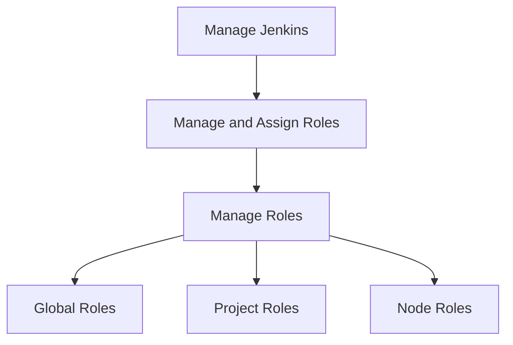

# Jenkins 团队协作

在现代软件开发中，团队协作是成功的关键。Jenkins作为一款流行的持续集成和持续交付（CI/CD）工具，提供了多种功能来支持团队协作。本文将详细介绍如何在Jenkins中实现团队协作，包括权限管理、共享流水线和协作工具的使用。

## 介绍

Jenkins团队协作的核心在于如何让多个开发人员、测试人员和运维人员在同一平台上高效地工作。通过合理的权限管理、共享流水线和协作工具的使用，团队可以更好地协同工作，提高开发效率。

## 权限管理

在Jenkins中，权限管理是团队协作的基础。通过配置权限，可以确保每个团队成员只能访问和操作他们需要的资源。

### 安装Role Strategy插件

首先，需要安装Role Strategy插件来管理用户权限。可以通过Jenkins的插件管理界面进行安装。

```bash
# 安装Role Strategy插件
Manage Jenkins -> Manage Plugins -> Available -> 搜索 "Role Strategy" -> 安装
```

### 配置角色和权限

安装插件后，可以在`Manage Jenkins -> Manage and Assign Roles`中配置角色和权限。



1. **Global Roles**：全局角色，适用于所有项目和节点。
2. **Project Roles**：项目角色，适用于特定项目。
3. **Node Roles**：节点角色，适用于特定节点。

### 分配角色

在`Assign Roles`中，可以将角色分配给用户或用户组。

```bash
# 分配角色
Manage Jenkins -> Manage and Assign Roles -> Assign Roles
```

## 共享流水线

共享流水线是团队协作的另一个重要方面。通过共享流水线，团队成员可以复用相同的构建和部署流程，减少重复工作。

### 创建共享库

Jenkins支持通过共享库（Shared Libraries）来共享流水线代码。共享库可以存储在Git仓库中，并在多个项目中引用。

```groovy
// Jenkinsfile
@Library('my-shared-library') _
pipeline {
    agent any
    stages {
        stage('Build') {
            steps {
                echo 'Building...'
            }
        }
        stage('Test') {
            steps {
                echo 'Testing...'
            }
        }
    }
}
```

### 配置共享库

在`Manage Jenkins -> Configure System -> Global Pipeline Libraries`中配置共享库。

```bash
# 配置共享库
Manage Jenkins -> Configure System -> Global Pipeline Libraries
```

## 协作工具

Jenkins还支持与其他协作工具集成，如Slack、Jira等，以便团队成员及时获取构建和部署的状态。

### 集成Slack

通过安装Slack插件，可以将Jenkins的构建状态通知发送到Slack频道。

```bash
# 安装Slack插件
Manage Jenkins -> Manage Plugins -> Available -> 搜索 "Slack Notification" -> 安装
```

### 配置Slack通知

在`Manage Jenkins -> Configure System -> Slack`中配置Slack通知。

```bash
# 配置Slack通知
Manage Jenkins -> Configure System -> Slack
```

## 实际案例

假设一个开发团队正在开发一个Web应用，团队成员包括开发人员、测试人员和运维人员。通过Jenkins的权限管理，开发人员可以访问和操作构建流水线，测试人员可以访问测试流水线，运维人员可以访问部署流水线。通过共享库，团队成员可以复用相同的构建和部署流程。通过Slack集成，团队成员可以及时获取构建和部署的状态。

## 总结

Jenkins提供了强大的团队协作功能，包括权限管理、共享流水线和协作工具的使用。通过合理配置这些功能，团队可以更好地协同工作，提高开发效率。

## 附加资源

- [Jenkins官方文档](https://www.jenkins.io/doc/)
- [Role Strategy插件文档](https://plugins.jenkins.io/role-strategy/)
- [Slack插件文档](https://plugins.jenkins.io/slack/)

## 练习

1. 安装Role Strategy插件，并配置一个全局角色和一个项目角色。
2. 创建一个共享库，并在多个项目中引用。
3. 集成Slack，并配置构建状态通知。
