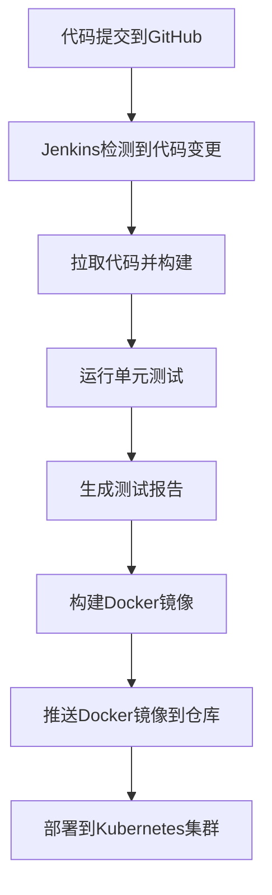

## 介绍

在现代软件开发中，持续集成和持续交付（CI/CD）是确保代码质量、快速交付和高效协作的关键。Jenkins作为最流行的开源自动化服务器，能够与多种DevOps工具集成，形成一个强大的工具链。本文将详细介绍如何将Jenkins与其他工具集成，并展示实际应用场景。

## 什么是Jenkins工具链集成？

Jenkins工具链集成是指将Jenkins与其他DevOps工具（如版本控制系统、构建工具、测试框架、部署工具等）无缝连接，实现从代码提交到生产环境部署的自动化流程。通过工具链集成，团队可以更高效地协作，减少手动操作，提高软件交付的速度和质量。

## Jenkins 工具链集成的核心组件

### 1. 版本控制系统（VCS）

Jenkins通常与Git、GitHub、GitLab或Bitbucket等版本控制系统集成，以便在代码提交时自动触发构建和测试。

#### 示例：Jenkins与GitHub集成

```groovy
pipeline {
    agent any
    triggers {
        pollSCM('H/5 * * * *') // 每5分钟检查一次GitHub仓库
    }
    stages {
        stage('Checkout') {
            steps {
                git branch: 'main', url: 'https://github.com/your-repo/your-project.git'
            }
        }
        stage('Build') {
            steps {
                sh 'mvn clean package'
            }
        }
    }
}
```

### 2. 构建工具

Jenkins支持多种构建工具，如Maven、Gradle、Ant等。通过集成这些工具，Jenkins可以自动化构建过程。

#### 示例：Jenkins与Maven集成

```groovy
pipeline {
    agent any
    stages {
        stage('Build') {
            steps {
                sh 'mvn clean package'
            }
        }
    }
}
```

### 3. 测试框架

Jenkins可以与JUnit、TestNG、Selenium等测试框架集成，自动运行测试并生成报告。

#### 示例：Jenkins与JUnit集成

```groovy
pipeline {
    agent any
    stages {
        stage('Test') {
            steps {
                sh 'mvn test'
            }
            post {
                always {
                    junit '**/target/surefire-reports/*.xml'
                }
            }
        }
    }
}
```

### 4. 部署工具

Jenkins可以与Docker、Kubernetes、Ansible等部署工具集成，实现自动化部署。

#### 示例：Jenkins与Docker集成

```groovy
pipeline {
    agent any
    stages {
        stage('Build Docker Image') {
            steps {
                sh 'docker build -t your-image:latest .'
            }
        }
        stage('Push Docker Image') {
            steps {
                sh 'docker push your-image:latest'
            }
        }
    }
}
```

## 实际案例：Jenkins工具链集成的完整流程

以下是一个完整的Jenkins工具链集成案例，展示了从代码提交到生产环境部署的自动化流程。



### 1. 代码提交到GitHub

开发人员将代码提交到GitHub仓库。

### 2. Jenkins检测到代码变更

Jenkins通过Webhook或定期轮询检测到代码变更，并触发构建流程。

### 3. 拉取代码并构建

Jenkins从GitHub拉取代码，并使用Maven进行构建。

### 4. 运行单元测试

Jenkins运行JUnit单元测试，并生成测试报告。

### 5. 构建Docker镜像

Jenkins使用Dockerfile构建Docker镜像。

### 6. 推送Docker镜像到仓库

Jenkins将构建好的Docker镜像推送到Docker Hub或私有仓库。

### 7. 部署到Kubernetes集群

Jenkins使用Kubernetes插件将Docker镜像部署到Kubernetes集群。

## 总结

通过将Jenkins与其他DevOps工具集成，可以构建一个完整的CI/CD工具链，实现从代码提交到生产环境部署的自动化流程。这不仅提高了开发效率，还确保了软件的质量和稳定性。

## 附加资源

- [Jenkins官方文档](https://www.jenkins.io/doc/)
- [GitHub Webhook配置指南](https://docs.github.com/en/developers/webhooks-and-events/webhooks)
- [Docker官方文档](https://docs.docker.com/)
- [Kubernetes官方文档](https://kubernetes.io/docs/)

## 练习

1. 配置Jenkins与GitHub的Webhook集成，实现代码提交时自动触发构建。
2. 使用Jenkins Pipeline脚本，实现从代码构建到Docker镜像推送的完整流程。
3. 尝试将Jenkins与Kubernetes集成，实现自动化部署。

:::tip
在实践过程中，如果遇到问题，可以参考相关工具的官方文档或社区论坛，获取帮助和支持。
:::