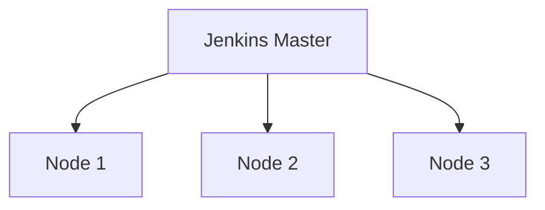

# Jenkins 企业级扩展

Jenkins是一个强大的持续集成和持续交付（CI/CD）工具，广泛应用于软件开发中。然而，随着项目规模和复杂性的增加，企业需要扩展Jenkins的功能和性能，以满足更高的需求。本文将介绍Jenkins企业级扩展的核心概念、方法和实际应用场景。

## 什么是Jenkins企业级扩展？

Jenkins企业级扩展是指通过插件、共享库、分布式架构等方式，增强Jenkins的功能、性能和可维护性，以支持大规模、复杂的开发环境。这些扩展可以帮助企业更好地管理CI/CD流程，提高开发效率，并确保系统的稳定性和安全性。

## Jenkins 扩展的核心方法

### 1. 使用插件扩展功能

Jenkins拥有丰富的插件生态系统，可以通过安装插件来扩展其功能。以下是一些常用的企业级插件：

- **Pipeline插件**：支持使用Groovy脚本定义复杂的CI/CD流程。
- **Role Strategy插件**：提供基于角色的访问控制（RBAC），增强安全性。
- **Blue Ocean插件**：提供直观的用户界面，简化Pipeline的创建和管理。

#### 示例：安装Pipeline插件

```groovy
// Jenkinsfile示例
pipeline {
    agent any
    stages {
        stage('Build') {
            steps {
                echo 'Building the application...'
            }
        }
        stage('Test') {
            steps {
                echo 'Running tests...'
            }
        }
        stage('Deploy') {
            steps {
                echo 'Deploying the application...'
            }
        }
    }
}
```

### 2. 使用共享库提高代码复用性

共享库（Shared Libraries）允许将通用的Pipeline代码存储在版本控制系统中，并在多个项目中复用。这有助于减少重复代码，提高维护效率。

#### 示例：定义共享库

```groovy
// vars/myCustomStep.groovy
def call(String message) {
    echo "Custom step: ${message}"
}
```

在Jenkinsfile中使用共享库：

```groovy
@Library('my-shared-library') _
pipeline {
    agent any
    stages {
        stage('Custom Step') {
            steps {
                myCustomStep('Hello from shared library!')
            }
        }
    }
}
```

### 3. 分布式架构提升性能

对于大型企业，单台Jenkins服务器可能无法满足需求。通过分布式架构，可以将任务分配到多个节点上执行，从而提高性能和可扩展性。

#### 示例：配置Jenkins节点

1. 在Jenkins管理界面中，导航到“Manage Nodes and Clouds”。
2. 点击“New Node”创建一个新的节点。
3. 配置节点的名称、远程工作目录和启动方式（如SSH或JNLP）。



## 实际应用场景

### 场景1：多团队协作

在一个大型企业中，多个开发团队可能同时使用Jenkins。通过角色策略插件，可以为每个团队分配不同的权限，确保他们只能访问和操作自己的项目。

### 场景2：跨地域部署

对于全球分布的企业，可以使用分布式架构将Jenkins节点部署在不同地区，以减少网络延迟并提高构建速度。

### 场景3：自动化测试

通过集成测试框架（如JUnit、Selenium）和Pipeline插件，可以实现自动化测试流程，确保每次代码提交都经过全面的测试。

## 总结

Jenkins企业级扩展是满足大规模、复杂开发需求的关键。通过插件、共享库和分布式架构，企业可以显著提升Jenkins的功能、性能和可维护性。希望本文的内容能帮助你更好地理解和应用这些扩展方法。

## 附加资源与练习

- **练习1**：尝试安装并配置一个Jenkins插件，如Blue Ocean，并创建一个简单的Pipeline。
- **练习2**：创建一个共享库，并在多个项目中复用其中的步骤。
- **资源**：访问[Jenkins官方文档](https://www.jenkins.io/doc/)了解更多关于插件和共享库的详细信息。

:::tip
如果你在扩展Jenkins时遇到问题，可以查阅官方文档或加入Jenkins社区寻求帮助。
:::