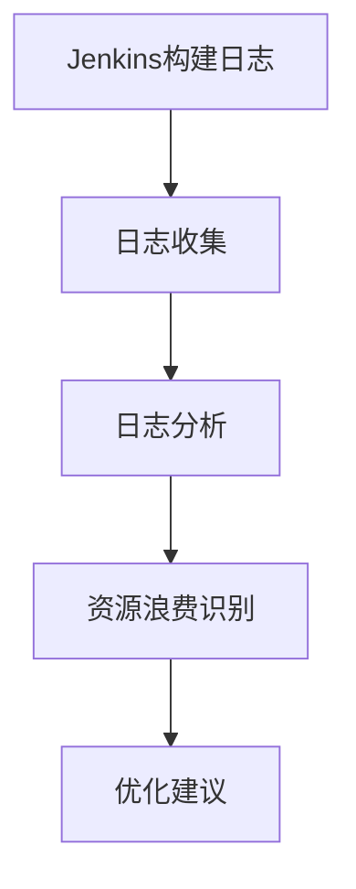

# Jenkins 成本优化

在现代软件开发中，持续集成和持续交付（CI/CD）是确保高效交付高质量软件的关键。Jenkins作为最流行的CI/CD工具之一，广泛应用于企业环境中。然而，随着项目规模和复杂性的增加，Jenkins的资源消耗和成本也可能显著上升。本文将探讨如何通过优化Jenkins配置和资源使用来降低成本，同时保持高效的工作流程。

## 什么是Jenkins成本优化？

Jenkins成本优化是指通过合理配置Jenkins服务器、优化构建流程、减少资源浪费等方式，降低企业在CI/CD流程中的总体成本。这包括硬件资源、云服务费用、维护成本等方面的优化。

## 为什么需要Jenkins成本优化？

1. **资源浪费**：未优化的Jenkins配置可能导致资源浪费，例如空闲的构建节点、不必要的并行构建等。
2. **成本上升**：随着项目规模的扩大，Jenkins的资源需求可能迅速增加，导致硬件或云服务成本上升。
3. **性能瓶颈**：不合理的资源配置可能导致性能瓶颈，影响构建速度和开发效率。

## Jenkins 成本优化的策略

### 1. 优化构建节点

构建节点是Jenkins执行构建任务的核心资源。优化构建节点的使用可以显著降低成本。

- **动态节点管理**：使用云服务（如AWS、GCP）的动态节点管理功能，按需启动和停止构建节点，避免资源闲置。
- **节点标签**：通过为节点添加标签，确保构建任务只在合适的节点上运行，避免资源浪费。

```groovy
pipeline {
    agent {
        label 'linux'
    }
    stages {
        stage('Build') {
            steps {
                sh 'mvn clean install'
            }
        }
    }
}
```

### 2. 并行构建优化

并行构建可以提高构建速度，但过多的并行构建可能导致资源竞争和成本上升。

- **限制并行构建数量**：通过Jenkins的`throttle-concurrents`插件限制并行构建数量，避免资源过度消耗。
- **优先级管理**：为重要构建任务设置更高的优先级，确保关键任务优先执行。

```groovy
pipeline {
    agent any
    options {
        throttleConcurrents(2) // 限制并行构建数量为2
    }
    stages {
        stage('Build') {
            steps {
                sh 'mvn clean install'
            }
        }
    }
}
```

### 3. 构建缓存和依赖管理

构建过程中频繁下载依赖项可能导致网络带宽和时间的浪费。通过缓存和依赖管理，可以减少重复下载。

- **本地缓存**：使用Nexus或Artifactory等工具管理依赖项，减少重复下载。
- **构建缓存**：使用Docker镜像缓存或Jenkins的`workspace`缓存，减少构建时间。

```groovy
pipeline {
    agent any
    stages {
        stage('Build') {
            steps {
                sh 'mvn clean install -Dmaven.repo.local=/path/to/local/repo'
            }
        }
    }
}
```

### 4. 监控和日志分析

通过监控和日志分析，可以及时发现资源浪费和性能瓶颈。

- **监控工具**：使用Prometheus、Grafana等工具监控Jenkins的资源使用情况。
- **日志分析**：定期分析构建日志，识别资源浪费和性能瓶颈。



## 实际案例

### 案例1：动态节点管理

某企业使用AWS EC2作为Jenkins的构建节点。通过配置动态节点管理，企业仅在需要时启动EC2实例，构建完成后自动停止实例。这一优化措施使企业的云服务成本降低了30%。

### 案例2：并行构建优化

某开发团队在Jenkins上运行多个并行构建任务，导致资源竞争和构建失败率上升。通过限制并行构建数量并设置优先级，团队成功降低了构建失败率，同时减少了资源浪费。

## 总结

Jenkins成本优化是确保企业CI/CD流程高效运行的关键。通过优化构建节点、并行构建、构建缓存和依赖管理，以及监控和日志分析，企业可以显著降低Jenkins的资源消耗和成本。希望本文的内容能帮助您更好地理解和应用Jenkins成本优化的策略。

## 附加资源

- [Jenkins官方文档](https://www.jenkins.io/doc/)
- [Jenkins插件库](https://plugins.jenkins.io/)
- [Prometheus监控工具](https://prometheus.io/)
- [Grafana可视化工具](https://grafana.com/)

## 练习

1. 在您的Jenkins环境中配置动态节点管理，并记录资源使用情况的变化。
2. 使用`throttle-concurrents`插件限制并行构建数量，观察构建失败率的变化。
3. 配置本地依赖缓存，并比较构建时间的变化。

:::tip
在进行任何优化之前，请确保备份您的Jenkins配置，以防止意外情况发生。
:::