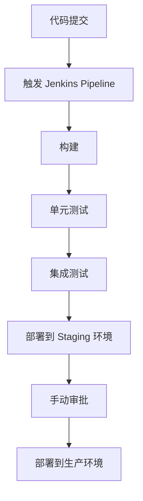

## 介绍

Jenkins 是一个开源的持续集成和持续交付（CI/CD）工具，广泛应用于企业开发环境中。它能够自动化构建、测试和部署流程，帮助团队更快地交付高质量的软件。然而，在企业环境中使用 Jenkins 时，遵循最佳实践至关重要，以确保系统的稳定性、可扩展性和安全性。

本文将介绍 Jenkins 在企业中的最佳实践，涵盖从配置管理到安全性、性能优化等多个方面，帮助初学者快速上手并避免常见陷阱。

---

## 1. 使用版本控制管理 Jenkins 配置

在企业环境中，Jenkins 的配置（如任务定义、插件设置等）应该通过版本控制系统（如 Git）进行管理。这样可以确保配置的可追溯性，并方便团队协作。

### 实践方法：
- 使用 Jenkins 的 **Job DSL** 或 **Pipeline as Code** 功能，将任务定义为代码。
- 将 Jenkinsfile 存储在项目的代码仓库中，与应用程序代码一起管理。

#### 示例：Jenkinsfile
```groovy
pipeline {
    agent any
    stages {
        stage('Build') {
            steps {
                echo 'Building the application...'
                sh 'mvn clean package'
            }
        }
        stage('Test') {
            steps {
                echo 'Running tests...'
                sh 'mvn test'
            }
        }
        stage('Deploy') {
            steps {
                echo 'Deploying the application...'
                sh 'kubectl apply -f deployment.yaml'
            }
        }
    }
}
```

:::tip
通过将 Jenkinsfile 与代码一起管理，可以确保每次代码变更时，CI/CD 流程也能同步更新。
:::

---

## 2. 使用 Pipeline 代替自由风格任务

自由风格任务（Freestyle Jobs）虽然简单易用，但在企业环境中缺乏灵活性和可维护性。推荐使用 **Pipeline** 来定义复杂的构建流程。

### 优势：
- 支持多阶段构建（如构建、测试、部署）。
- 可以通过代码管理，便于版本控制和复用。
- 提供更好的可视化和日志记录。

#### 示例：多阶段 Pipeline
```groovy
pipeline {
    agent any
    stages {
        stage('Build') {
            steps {
                echo 'Building the application...'
                sh 'mvn clean package'
            }
        }
        stage('Test') {
            steps {
                echo 'Running unit tests...'
                sh 'mvn test'
            }
        }
        stage('Integration Test') {
            steps {
                echo 'Running integration tests...'
                sh 'mvn verify -Pintegration'
            }
        }
        stage('Deploy') {
            steps {
                echo 'Deploying to staging...'
                sh 'kubectl apply -f staging.yaml'
            }
        }
    }
}
```

:::note
Pipeline 提供了更强大的功能，如并行执行、条件判断等，适合复杂的构建流程。
:::

---

## 3. 安全性最佳实践

在企业环境中，Jenkins 的安全性至关重要。以下是一些关键的安全实践：

### 3.1 启用身份验证和授权
- 使用 Jenkins 的内置用户数据库或集成 LDAP/Active Directory 进行身份验证。
- 配置基于角色的权限管理（Role-Based Access Control, RBAC），限制用户对敏感操作的访问。

### 3.2 保护凭据
- 使用 Jenkins 的 **Credentials Plugin** 管理敏感信息（如 API 密钥、密码等）。
- 避免在 Jenkinsfile 中硬编码凭据。

#### 示例：使用凭据插件
```groovy
pipeline {
    agent any
    stages {
        stage('Deploy') {
            steps {
                withCredentials([usernamePassword(credentialsId: 'aws-creds', usernameVariable: 'AWS_USER', passwordVariable: 'AWS_PASS')]) {
                    sh 'echo "Deploying with user ${AWS_USER}"'
                }
            }
        }
    }
}
```

:::caution
硬编码凭据会导致安全风险，务必使用凭据插件管理敏感信息。
:::

---

## 4. 性能优化

随着项目规模的增长，Jenkins 的性能可能成为瓶颈。以下是一些优化建议：

### 4.1 分布式构建
- 使用 Jenkins 的 **Agent** 功能，将构建任务分发到多个节点执行。
- 配置动态代理（如 Kubernetes 插件），根据负载自动扩展构建节点。

### 4.2 清理旧构建
- 定期清理旧的构建记录，避免占用过多磁盘空间。
- 使用 **Discard Old Builds** 插件自动删除过时的构建。

---

## 5. 实际案例：企业级 CI/CD 流程

以下是一个典型的企业级 CI/CD 流程示例：



:::note
通过 Pipeline 实现多阶段构建和部署，确保每次代码变更都经过完整的测试流程。
:::

---

## 总结

在企业环境中使用 Jenkins 时，遵循最佳实践可以显著提升 CI/CD 流程的效率和可靠性。本文介绍了配置管理、Pipeline 使用、安全性、性能优化等方面的最佳实践，并通过实际案例展示了如何将这些实践应用到真实场景中。

---

## 附加资源与练习

### 资源：
- [Jenkins 官方文档](https://www.jenkins.io/doc/)
- [Pipeline 语法参考](https://www.jenkins.io/doc/book/pipeline/syntax/)

### 练习：
1. 创建一个 Jenkins Pipeline，包含构建、测试和部署阶段。
2. 使用凭据插件管理敏感信息，并在 Pipeline 中调用。
3. 配置 Jenkins 的分布式构建，尝试在多个节点上运行任务。

通过实践这些最佳实践，你将能够更好地管理和优化企业中的 Jenkins 环境。