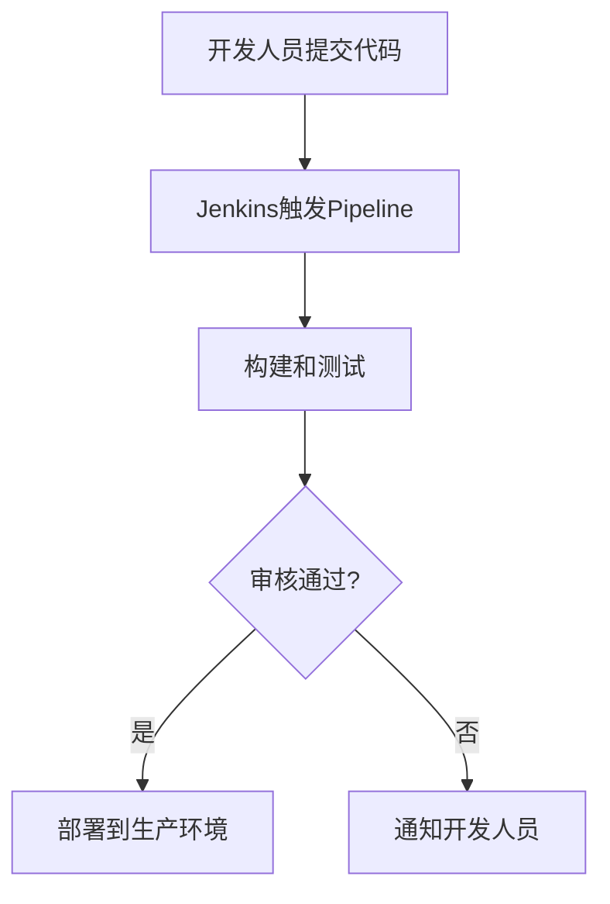

# Jenkins 变更管理

在现代软件开发中，持续集成和持续交付（CI/CD）是确保代码质量和快速交付的关键。Jenkins作为最流行的CI/CD工具之一，提供了强大的功能来管理代码变更。本文将详细介绍Jenkins中的变更管理，帮助初学者理解如何通过Jenkins实现高效的变更管理。

## 什么是变更管理？

变更管理是指在软件开发过程中，对代码、配置或环境的变更进行跟踪、审核和实施的过程。在Jenkins中，变更管理通常涉及以下几个方面：

- **代码变更**：开发人员提交的代码变更。
- **配置变更**：Jenkins任务或管道的配置变更。
- **环境变更**：部署环境的变更，如服务器配置、依赖库更新等。

有效的变更管理可以确保每次变更都经过充分的测试和验证，从而减少生产环境中的问题。

## Jenkins 中的变更管理

Jenkins提供了多种工具和插件来帮助实现变更管理。以下是几种常见的方法：

### 1. 使用Jenkins Pipeline

Jenkins Pipeline是一种将构建、测试和部署过程定义为代码的方式。通过Pipeline，您可以清晰地定义每个步骤，并确保每次变更都经过相同的流程。

```groovy
pipeline {
    agent any
    stages {
        stage('Build') {
            steps {
                echo 'Building...'
                sh 'mvn clean package'
            }
        }
        stage('Test') {
            steps {
                echo 'Testing...'
                sh 'mvn test'
            }
        }
        stage('Deploy') {
            steps {
                echo 'Deploying...'
                sh 'mvn deploy'
            }
        }
    }
}
```

在这个示例中，Pipeline定义了三个阶段：构建、测试和部署。每次代码变更都会触发这个Pipeline，确保变更经过完整的测试和验证。

### 2. 使用Jenkins插件

Jenkins社区提供了许多插件来增强变更管理的能力。以下是一些常用的插件：

- **Git Plugin**：用于从Git仓库拉取代码变更。
- **Pipeline: GitHub**：与GitHub集成，自动触发Pipeline。
- **Blue Ocean**：提供更直观的Pipeline可视化界面。

### 3. 变更审核

在Jenkins中，您可以通过配置审核流程来确保每次变更都经过审核。例如，您可以使用`Jenkins Job DSL`插件来定义审核步骤：

```groovy
job('example-job') {
    steps {
        shell('echo "Building..."')
    }
    publishers {
        extendedEmail {
            triggers {
                beforeBuild()
                failure()
                fixed()
            }
        }
    }
}
```

在这个示例中，`extendedEmail`插件会在构建前、构建失败或修复后发送邮件通知，确保相关人员了解变更的状态。

## 实际案例

假设您正在开发一个Web应用程序，并使用Jenkins进行CI/CD。以下是一个典型的变更管理流程：

1. **开发人员提交代码**：开发人员将代码提交到Git仓库。
2. **Jenkins触发Pipeline**：Jenkins检测到代码变更，自动触发Pipeline。
3. **构建和测试**：Pipeline执行构建和测试步骤，确保代码变更不会引入新的问题。
4. **审核和部署**：如果构建和测试通过，Pipeline会等待审核人员的批准，然后将代码部署到生产环境。



## 总结

Jenkins提供了强大的工具和插件来帮助实现高效的变更管理。通过使用Pipeline、插件和审核流程，您可以确保每次变更都经过充分的测试和验证，从而减少生产环境中的问题。

:::tip
建议初学者从简单的Pipeline开始，逐步引入插件和审核流程，以更好地理解Jenkins中的变更管理。
:::

## 附加资源

- [Jenkins官方文档](https://www.jenkins.io/doc/)
- [Jenkins Pipeline语法指南](https://www.jenkins.io/doc/book/pipeline/syntax/)
- [Jenkins插件库](https://plugins.jenkins.io/)

## 练习

1. 创建一个简单的Jenkins Pipeline，包含构建、测试和部署阶段。
2. 配置Jenkins Job DSL，添加邮件通知功能。
3. 使用Blue Ocean插件可视化您的Pipeline。

通过以上练习，您将更好地掌握Jenkins中的变更管理。