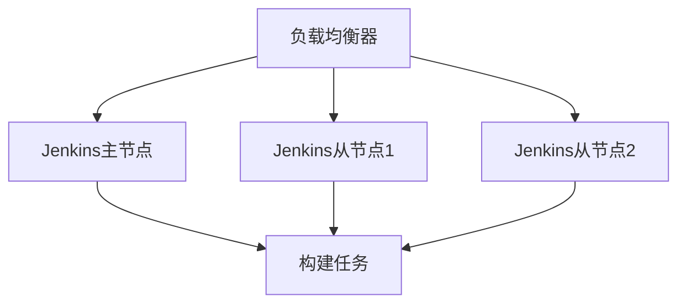

# Jenkins 业务连续性

在现代软件开发中，Jenkins作为持续集成和持续交付（CI/CD）的核心工具，扮演着至关重要的角色。为了确保开发流程的顺畅，Jenkins系统的业务连续性（Business Continuity）必须得到保障。本文将详细介绍Jenkins业务连续性的概念、实现方法以及实际应用场景。

## 什么是Jenkins业务连续性？

业务连续性是指系统在面临故障、灾难或其他中断事件时，能够快速恢复并继续提供服务的能力。对于Jenkins来说，业务连续性意味着即使在硬件故障、网络中断或软件错误的情况下，Jenkins仍能保持运行，确保开发团队的持续集成和交付流程不受影响。

## 实现Jenkins业务连续性的关键策略

### 1. 高可用性（High Availability, HA）

高可用性是通过冗余和故障转移机制来确保系统在部分组件失效时仍能正常运行。对于Jenkins，可以通过以下方式实现高可用性：

- **主从架构**：使用多个Jenkins节点（主节点和从节点），在主节点失效时，从节点可以接管工作负载。
- **负载均衡**：通过负载均衡器将请求分发到多个Jenkins实例，避免单点故障。

### 2. 数据备份与恢复

Jenkins的配置、作业历史和插件数据是至关重要的。定期备份这些数据可以确保在系统崩溃或数据丢失时能够快速恢复。

- **备份策略**：使用Jenkins的`thinBackup`插件或手动备份`JENKINS_HOME`目录。
- **恢复策略**：在灾难发生后，将备份数据恢复到新的Jenkins实例中。

:::tip
建议将备份数据存储在远程位置或云存储中，以防止本地存储设备故障导致的数据丢失。
:::

### 3. 灾难恢复计划

灾难恢复计划（Disaster Recovery Plan, DRP）是一套详细的步骤，用于在重大故障或灾难后恢复系统。对于Jenkins，灾难恢复计划应包括：

- **识别关键组件**：确定哪些组件（如主节点、数据库、插件）对系统运行至关重要。
- **恢复优先级**：确定恢复的优先级，确保关键功能首先恢复。
- **测试恢复流程**：定期测试恢复流程，确保在实际灾难发生时能够顺利执行。

## 实际案例：Jenkins业务连续性的应用

### 案例1：电商平台的持续交付

某电商平台使用Jenkins进行持续集成和交付。在一次硬件故障中，Jenkins主节点失效，但由于采用了高可用性架构，从节点立即接管了工作负载，确保了开发团队的构建和部署流程未受影响。此外，定期备份的配置和数据使得系统在短时间内恢复了正常。

### 案例2：金融系统的灾难恢复

一家金融机构的Jenkins系统在一次网络攻击中遭受了严重破坏。由于事先制定了详细的灾难恢复计划，并定期备份了所有关键数据，团队能够在数小时内恢复系统，并将损失降到了最低。

## 总结

Jenkins业务连续性是确保开发流程不受中断的关键。通过高可用性架构、数据备份与恢复策略以及灾难恢复计划，可以有效提升Jenkins系统的稳定性和可靠性。对于初学者来说，理解并实施这些策略是迈向高效CI/CD流程的重要一步。

## 附加资源与练习

- **资源**：
  - [Jenkins官方文档](https://www.jenkins.io/doc/)
  - [thinBackup插件使用指南](https://plugins.jenkins.io/thinBackup/)
- **练习**：
  - 在你的Jenkins环境中配置一个从节点，并测试主节点失效时的故障转移。
  - 使用`thinBackup`插件备份你的Jenkins配置，并尝试恢复到一个新的Jenkins实例中。

通过以上内容的学习和实践，你将能够更好地理解和应用Jenkins业务连续性的相关策略，确保你的CI/CD流程更加稳定和可靠。