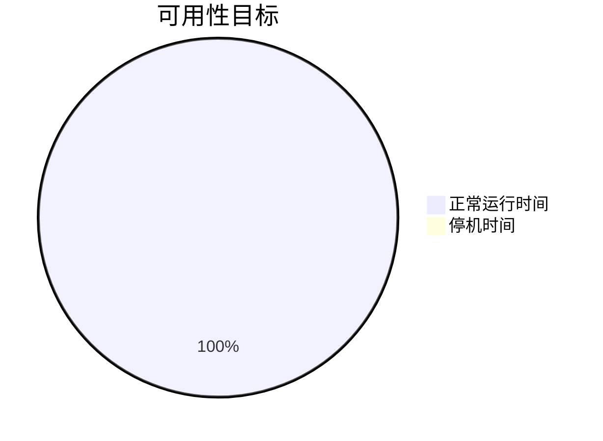

# Jenkins 服务级别协议

在现代软件开发中，持续集成和持续交付（CI/CD）是确保代码质量和快速交付的关键。Jenkins作为最流行的CI/CD工具之一，其稳定性和可靠性对团队的生产力至关重要。为了确保Jenkins服务的可用性和性能，许多企业会制定**服务级别协议（SLA）**。本文将详细介绍Jenkins SLA的概念、重要性以及如何在实际项目中应用它。

## 什么是服务级别协议（SLA）？

服务级别协议（SLA）是服务提供者与客户之间的一份正式协议，定义了服务的质量、可用性和性能标准。对于Jenkins来说，SLA通常包括以下内容：

- **可用性**：Jenkins服务在特定时间段内的正常运行时间百分比。
- **响应时间**：Jenkins处理请求的平均时间。
- **故障恢复时间**：Jenkins在发生故障后恢复正常运行的时间。

:::note
SLA不仅仅是技术指标，它还反映了团队对服务质量的承诺。
:::

## 为什么需要Jenkins SLA？

Jenkins SLA的重要性体现在以下几个方面：

1. **确保团队生产力**：如果Jenkins服务不可用，开发团队的构建和部署流程将中断，导致生产力下降。
2. **提高客户满意度**：稳定的Jenkins服务可以确保代码的快速交付，从而提高客户满意度。
3. **明确责任**：SLA明确了服务提供者和客户的责任，避免因服务中断而产生的纠纷。

## 如何定义Jenkins SLA？

定义Jenkins SLA时，需要考虑以下几个关键因素：

### 1. 可用性目标
可用性通常以百分比表示，例如99.9%的可用性意味着Jenkins服务在一年中最多只能有8.76小时的停机时间。



### 2. 响应时间
响应时间是指Jenkins处理请求所需的时间。例如，构建任务的平均响应时间应小于5分钟。

### 3. 故障恢复时间
故障恢复时间是指Jenkins在发生故障后恢复正常运行的时间。例如，故障恢复时间应小于30分钟。

## 实际案例：Jenkins SLA的应用

假设你是一家电商公司的DevOps工程师，负责管理Jenkins服务。以下是你在实际项目中应用Jenkins SLA的步骤：

### 1. 监控Jenkins服务
使用监控工具（如Prometheus）实时监控Jenkins的可用性和性能。

```bash
# 示例：使用Prometheus监控Jenkins
scrape_configs:
  - job_name: 'jenkins'
    metrics_path: '/prometheus'
    static_configs:
      - targets: ['jenkins.example.com:8080']
```

### 2. 设置告警
当Jenkins的可用性低于99.9%或响应时间超过5分钟时，触发告警。

```yaml
# 示例：Prometheus告警规则
groups:
- name: jenkins
  rules:
  - alert: JenkinsHighResponseTime
    expr: jenkins_response_time_seconds > 300
    for: 5m
    labels:
      severity: critical
    annotations:
      summary: "Jenkins响应时间过高"
      description: "Jenkins响应时间超过5分钟，请立即检查。"
```

### 3. 定期评估SLA
每月评估Jenkins的SLA指标，确保服务符合预期。如果未达到目标，分析原因并采取改进措施。

## 总结

Jenkins服务级别协议（SLA）是确保Jenkins服务稳定性和可靠性的重要工具。通过定义可用性、响应时间和故障恢复时间等关键指标，团队可以更好地管理Jenkins服务，确保开发流程的顺畅进行。

:::tip
在实际项目中，建议定期回顾和更新SLA，以适应不断变化的业务需求。
:::

## 附加资源

- [Jenkins官方文档](https://www.jenkins.io/doc/)
- [Prometheus监控指南](https://prometheus.io/docs/introduction/overview/)
- [SLA最佳实践](https://en.wikipedia.org/wiki/Service-level_agreement)

## 练习

1. 为你的Jenkins服务定义一个SLA，包括可用性、响应时间和故障恢复时间。
2. 使用Prometheus监控Jenkins服务，并设置相应的告警规则。
3. 每月评估Jenkins的SLA指标，并记录改进措施。

通过以上步骤，你将能够更好地管理和优化Jenkins服务，确保团队的持续集成和交付流程顺利进行。