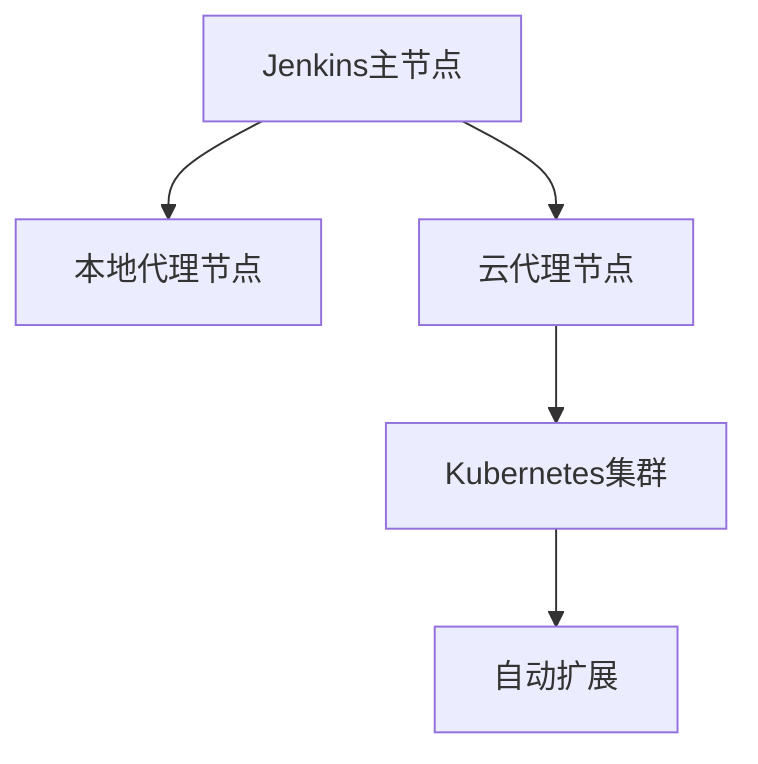

## 介绍

在现代软件开发中，持续集成和持续交付（CI/CD）是确保快速、可靠发布软件的关键。Jenkins作为最流行的开源CI/CD工具之一，支持多种部署方式，包括本地、云和混合云环境。混合云策略结合了本地基础设施和云服务的优势，为企业提供了灵活性、可扩展性和成本效益。

本文将详细介绍Jenkins混合云策略的概念、实现方法以及实际应用场景，帮助初学者理解如何在云原生环境中有效利用Jenkins。

## 什么是Jenkins混合云策略？

Jenkins混合云策略是指在本地基础设施和云服务之间动态分配资源，以优化CI/CD管道的性能和成本。通过混合云策略，企业可以在本地运行核心任务，同时在云中扩展资源以应对高峰需求。

:::tip
混合云策略的核心优势在于灵活性。企业可以根据需求动态调整资源，同时保留对敏感数据的控制。
:::

## 实现Jenkins混合云策略的步骤

### 1. 配置Jenkins主节点

首先，需要在本地或云中设置Jenkins主节点。主节点负责管理所有构建任务和代理节点。

```groovy
pipeline {
    agent any
    stages {
        stage('Build') {
            steps {
                echo 'Building the application...'
            }
        }
        stage('Test') {
            steps {
                echo 'Running tests...'
            }
        }
        stage('Deploy') {
            steps {
                echo 'Deploying the application...'
            }
        }
    }
}
```

### 2. 添加云代理节点

在混合云策略中，云代理节点用于扩展构建能力。可以通过Jenkins插件（如Kubernetes插件）动态创建云代理节点。

```groovy
pipeline {
    agent {
        kubernetes {
            label 'cloud-agent'
            yaml """
apiVersion: v1
kind: Pod
metadata:
  name: cloud-agent
spec:
  containers:
  - name: jnlp
    image: jenkins/inbound-agent:latest
"""
        }
    }
    stages {
        stage('Build') {
            steps {
                echo 'Building on cloud agent...'
            }
        }
    }
}
```

### 3. 配置动态资源分配

通过Jenkins的自动扩展功能，可以根据构建队列的长度动态调整云代理节点的数量。这可以通过Kubernetes集群的自动扩展功能实现。



### 4. 优化成本

混合云策略允许企业在本地运行常规任务，同时在云中运行高负载任务。通过合理配置，可以显著降低云资源的使用成本。

:::caution
确保监控云资源的使用情况，避免不必要的成本开销。
:::

## 实际应用场景

### 场景1：应对高峰构建需求

假设某企业在发布新版本时，构建任务数量激增。通过混合云策略，企业可以在云中动态创建代理节点，快速完成构建任务，而无需在本地扩展硬件资源。

### 场景2：敏感数据处理

某些企业需要处理敏感数据，这些数据不能存储在公有云中。通过混合云策略，企业可以在本地处理敏感数据，同时在云中运行非敏感任务。

## 总结

Jenkins混合云策略为现代软件开发提供了灵活、可扩展的CI/CD解决方案。通过结合本地和云资源，企业可以优化构建性能、降低成本，并确保数据安全。

## 附加资源

- [Jenkins官方文档](https://www.jenkins.io/doc/)
- [Kubernetes Jenkins插件指南](https://plugins.jenkins.io/kubernetes/)
- [云原生CI/CD最佳实践](https://cloud.google.com/solutions/continuous-integration)

## 练习

1. 在本地安装Jenkins并配置一个简单的CI/CD管道。
2. 使用Kubernetes插件在云中创建一个Jenkins代理节点。
3. 尝试配置动态资源分配，观察云代理节点的自动扩展行为。

通过以上步骤，您将能够掌握Jenkins混合云策略的基本概念和实现方法，为构建高效的云原生CI/CD管道打下坚实基础。